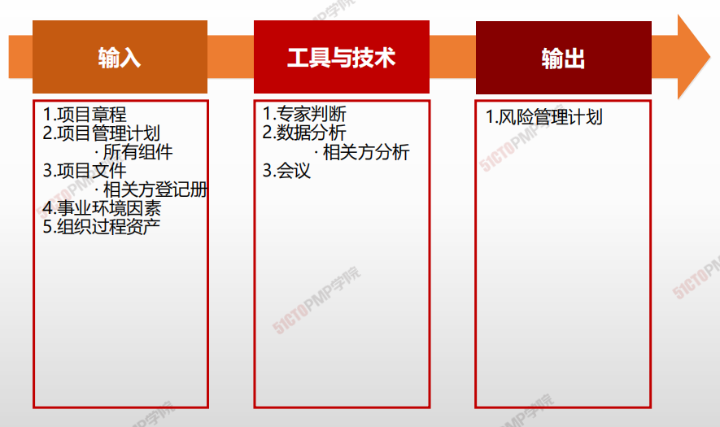
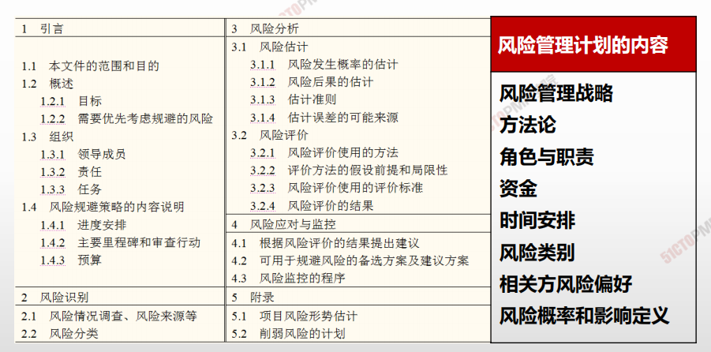

# 规划风险管理

### 风险管理规划应该明确的问题

* 有哪些项目风险
* 为什么承担或不承担这一风险对于项目目标很重要？
* 什么是具体的风险，风险的影响程度?
* 什么是风险减轻的可交付成果？
* 风险应对计划：风险如何被减轻？
* 谁是负责实施风险管理计划的人？
* 与减轻方法相关的里程碑事件何时会发生？
* 为减轻风险，需要多少资源？

## 4W1H

| 4W1H                | **规划风险管理**                                             |
| ------------------- | ------------------------------------------------------------ |
| what 做什么     | 规划风险管理是定义如何实施项目风险管理活动的过程。 作用：确保风险管理的水平、方法和可见度与项目风险程度，以及项目对组织和其他相关方的重要程度相匹配 |
| why 为什么做    | 确保风险管理的水平、方法和可见度与项目风险程度，以及项目对组织和其他相关方的重要程度相匹配。 |
| who 谁来做      | 风险管理计划可由项目经理、指定项目团队成员、关键相关方，或负责管理项目风险管理过程的团队成员合作制定 |
| when 什么时候做 | 项目早期，项目章程批准后，开始制定项目沟通管理计划本过程仅开展一次或仅在项目的预定义点开展。规划风险管理过程在项目构思阶段就应开始，并在项目早期完成。在项目生命周期的后期，可能有必要重新开展本过程。 |
| how 如何做      | 通过描述如何安排与实施风险管理活动来制定计划。**专家判断、数据收集、会议** |

## 输入/工具技术/输出

1. 输入

   1. 项目章程
   2. 项目管理计划
      - 所有组件
   3. 项目文件
      * 相关方登记册
   4. 事业环境因素
   5. 组织过程资产

2. 工具与技术

   1. 专家判断
   2. 数据分析
      - 分析相关方
   3. 会议

3. 输出

   1. 风险管理计划

   

   

   

## 风险管理计划

1. 规划风险管理是定义如何实施项目风险管理活动
的过程
2. 规划风险管理过程应该尽早展开，在项目构思阶
段就应开始，并在项目早期完成
3. 风险管理计划是项目管理计划的组成部分，描述
如何安排与实施风险管理活动