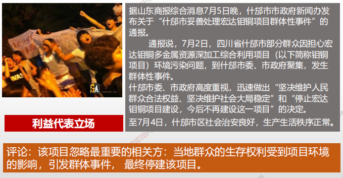

# 相关方管理概述

| 13.1 | 识别相关方 | 定期识别项目相关方，分析和记录他们的利益、参与度、相互依赖性、影响力和对项目成功的潜在影响的过程 |
| ---- | ------------ | ------------------------------------------------------------ |
|13.2 | 规划相关方参与 | 根据相关方的需求、期望、利益和对项目的潜在影响，<u>制定项目相关方参与项目的方法</u>的过程。 |
| 13.3 | 管理相关方参与 | 与相关方进行沟通和协作，以满足其需求与期望，处理问题，并促进<u>相关方合理参与</u>的过程 |
| 13.4 | 监督相关方参与 | 监督项目相关方关系，并通过修订参与<u>策略和计划</u>来引导相关方合理参与项目的过程。 |

## 如何获取相关方的支持

1. **一步做识别：尽早、尽量全部、持续开展**
2. **二步找策略（先分类，再定策略）** 
3. **三步做沟通（相关方参与项目—参与度）**
4. **四步做改进：策略和计划的改进**

