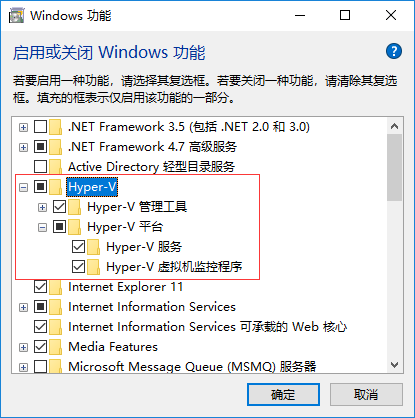
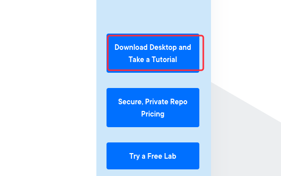
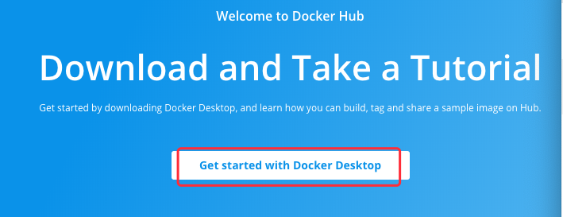
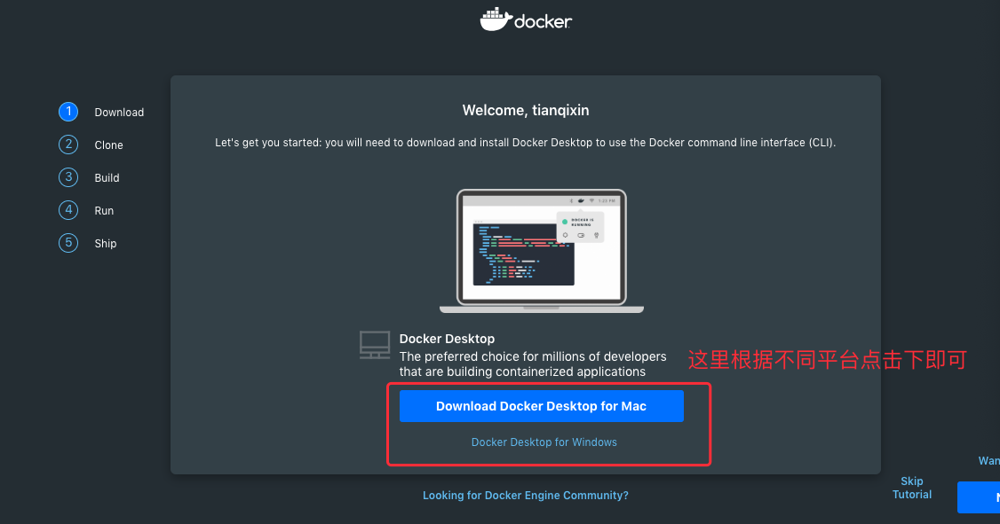
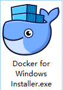
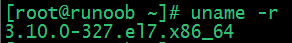
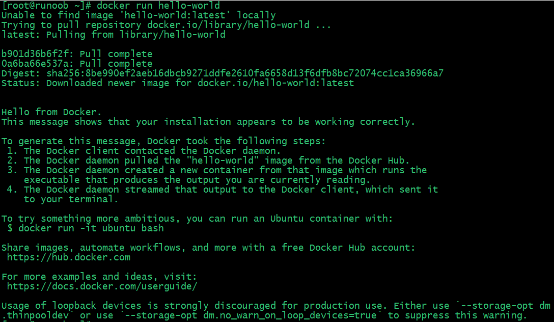
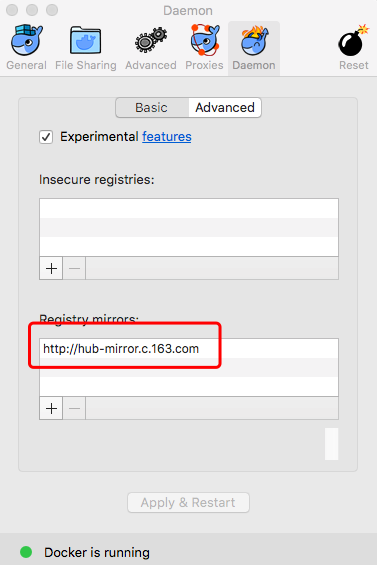

# Windows Docker 安装

------

## win7、win8 系统

win7、win8 等需要利用 docker toolbox 来安装，国内可以使用阿里云的镜像来下载，下载地址：http://mirrors.aliyun.com/docker-toolbox/windows/docker-toolbox/

docker toolbox 是一个工具集，它主要包含以下一些内容：

```
Docker CLI 客户端，用来运行docker引擎创建镜像和容器
Docker Machine. 可以让你在windows的命令行中运行docker引擎命令
Docker Compose. 用来运行docker-compose命令
Kitematic. 这是Docker的GUI版本
Docker QuickStart shell. 这是一个已经配置好Docker的命令行环境
Oracle VM Virtualbox. 虚拟机
```

下载完成之后直接点击安装，安装成功后，桌边会出现三个图标，入下图所示：


点击 Docker QuickStart 图标来启动 Docker Toolbox 终端。

如果系统显示 User Account Control 窗口来运行 VirtualBox 修改你的电脑，选择 Yes。


**$** 符号那你可以输入以下命令来执行。

```
$ docker run hello-world
 Unable to find image 'hello-world:latest' locally
 Pulling repository hello-world
 91c95931e552: Download complete
 a8219747be10: Download complete
 Status: Downloaded newer image for hello-world:latest
 Hello from Docker.
 This message shows that your installation appears to be working correctly.

 To generate this message, Docker took the following steps:
  1. The Docker Engine CLI client contacted the Docker Engine daemon.
  2. The Docker Engine daemon pulled the "hello-world" image from the Docker Hub.
     (Assuming it was not already locally available.)
  3. The Docker Engine daemon created a new container from that image which runs the
     executable that produces the output you are currently reading.
  4. The Docker Engine daemon streamed that output to the Docker Engine CLI client, which sent it
     to your terminal.

 To try something more ambitious, you can run an Ubuntu container with:
  $ docker run -it ubuntu bash

 For more examples and ideas, visit:
  https://docs.docker.com/userguide/
```

------

## Win10 系统

现在 Docker 有专门的 Win10 专业版系统的安装包，需要开启Hyper-V。

### 开启 Hyper-V


程序和功能


启用或关闭Windows功能


选中Hyper-V



### 1、安装 Toolbox

最新版 Toolbox 下载地址： https://www.docker.com/get-docker

点击 [Download Desktop and Take a Tutorial](https://www.runoob.com/wp-content/uploads/2016/05/70E63727-8DAD-4BBC-80D4-81E45963C8F3.png)，并下载 Windows 的版本，如果你还没有登录，会要求注册登录：







### 2、运行安装文件

双击下载的 Docker for Windows Installer 安装文件，一路 Next，点击 Finish 完成安装。




安装完成后，Docker 会自动启动。通知栏上会出现个小鲸鱼的图标，这表示 Docker 正在运行。

桌边也会出现三个图标，入下图所示：

我们可以在命令行执行 docker version 来查看版本号，docker run hello-world 来载入测试镜像测试。

如果没启动，你可以在 Windows 搜索 Docker 来启动：


启动后，也可以在通知栏上看到小鲸鱼图标：


------

## 镜像加速

鉴于国内网络问题，后续拉取 Docker 镜像十分缓慢，我们可以需要配置加速器来解决，我使用的是网易的镜像地址：**http://hub-mirror.c.163.com**。

新版的 Docker 使用 /etc/docker/daemon.json（Linux） 或者 %programdata%\docker\config\daemon.json（Windows） 来配置 Daemon。

请在该配置文件中加入（没有该文件的话，请先建一个）：

```
{
  "registry-mirrors": ["http://hub-mirror.c.163.com"]
}
```

# CentOS Docker 安装

Docker支持以下的CentOS版本：

* CentOS 7 (64-bit)
* CentOS 6.5 (64-bit) 或更高的版本

------

## 前提条件

目前，CentOS 仅发行版本中的内核支持 Docker。

Docker 运行在 CentOS 7 上，要求系统为64位、系统内核版本为 3.10 以上。

Docker 运行在 CentOS-6.5 或更高的版本的 CentOS 上，要求系统为64位、系统内核版本为 2.6.32-431 或者更高版本。

------

## 使用 yum 安装（CentOS 7下）

Docker 要求 CentOS 系统的内核版本高于 3.10 ，查看本页面的前提条件来验证你的CentOS 版本是否支持 Docker 。

通过 **uname -r** 

```
[root@runoob ~]# uname -r 
```



### 安装 Docker

从 2017 年 3 月开始 docker 在原来的基础上分为两个分支版本: Docker CE 和 Docker EE。

Docker CE 即社区免费版，Docker EE 即企业版，强调安全，但需付费使用。

本文介绍 Docker CE 的安装使用。

移除旧的版本：

```
$ sudo yum remove docker \
                  docker-client \
                  docker-client-latest \
                  docker-common \
                  docker-latest \
                  docker-latest-logrotate \
                  docker-logrotate \
                  docker-selinux \
                  docker-engine-selinux \
                  docker-engine
```

安装一些必要的系统工具：

```
sudo yum install -y yum-utils device-mapper-persistent-data lvm2
```

添加软件源信息：

```
sudo yum-config-manager --add-repo http://mirrors.aliyun.com/docker-ce/linux/centos/docker-ce.repo
```

更新 yum 缓存：

```
sudo yum makecache fast
```

安装 Docker-ce：

```
sudo yum -y install docker-ce
```

启动 Docker 后台服务

```
sudo systemctl start docker
```

测试运行 hello-world

```
[root@runoob ~]# docker run hello-world
```



由于本地没有hello-world这个镜像，所以会下载一个hello-world的镜像，并在容器内运行。

------

## 使用脚本安装 Docker

1、使用 `sudo` 或 `root` 权限登录 Centos。

2、确保 yum 包更新到最新。

```
$ sudo yum update
```

3、执行 Docker 安装脚本。

```
$ curl -fsSL https://get.docker.com -o get-docker.sh
$ sudo sh get-docker.sh
```

执行这个脚本会添加 `docker.repo` 源并安装 Docker。

4、启动 Docker 进程。

```
sudo systemctl start docker
```

5、验证 `docker` 是否安装成功并在容器中执行一个测试的镜像。

```
$ sudo docker run hello-world
docker ps
```

到此，Docker 在 CentOS 系统的安装完成。

------

## 镜像加速

鉴于国内网络问题，后续拉取 Docker 镜像十分缓慢，我们可以需要配置加速器来解决，我使用的是网易的镜像地址：**http://hub-mirror.c.163.com**。

新版的 Docker 使用 /etc/docker/daemon.json（Linux） 或者 %programdata%\docker\config\daemon.json（Windows） 来配置 Daemon。

请在该配置文件中加入（没有该文件的话，请先建一个）：

```
{
  "registry-mirrors": ["http://hub-mirror.c.163.com"]
}
```

------

## 删除 Docker CE

执行以下命令来删除 Docker CE：

```
$ sudo yum remove docker-ce
$ sudo rm -rf /var/lib/docker
```

# MacOS Docker 安装

## 使用 Homebrew 安装

macOS 我们可以使用 Homebrew 来安装 Docker。

Homebrew 的 Cask 已经支持 Docker for Mac，因此可以很方便的使用 Homebrew Cask 来进行安装：

```
$ brew cask install docker

==> Creating Caskroom at /usr/local/Caskroom
==> We'll set permissions properly so we won't need sudo in the future
Password:          # 输入 macOS 密码
==> Satisfying dependencies
==> Downloading https://download.docker.com/mac/stable/21090/Docker.dmg
######################################################################## 100.0%
==> Verifying checksum for Cask docker
==> Installing Cask docker
==> Moving App 'Docker.app' to '/Applications/Docker.app'.
&#x1f37a;  docker was successfully installed!
```

在载入 Docker app 后，点击 Next，可能会询问你的 macOS 登陆密码，你输入即可。之后会弹出一个 Docker 运行的提示窗口，状态栏上也有有个小鲸鱼的图标（）。

------

## 手动下载安装

如果需要手动下载，请点击以下链接下载 [Stable](https://download.docker.com/mac/stable/Docker.dmg) 或 [Edge](https://download.docker.com/mac/edge/Docker.dmg) 版本的 Docker for Mac。

如同 macOS 其它软件一样，安装也非常简单，双击下载的 .dmg 文件，然后将鲸鱼图标拖拽到 Application 文件夹即可。


从应用中找到 Docker 图标并点击运行。可能会询问 macOS 的登陆密码，输入即可。


点击顶部状态栏中的鲸鱼图标会弹出操作菜单。


第一次点击图标，可能会看到这个安装成功的界面，点击 "Got it!" 可以关闭这个窗口。


启动终端后，通过命令可以检查安装后的 Docker 版本。

```
$ docker --version
Docker version 17.09.1-ce, build 19e2cf6
```

## 镜像加速

鉴于国内网络问题，后续拉取 Docker 镜像十分缓慢，我们可以需要配置加速器来解决，我使用的是网易的镜像地址：**http://hub-mirror.c.163.com**。

在任务栏点击 Docker for mac 应用图标 -> Perferences... -> Daemon -> Registry mirrors。在列表中填写加速器地址即可。修改完成之后，点击 Apply & Restart 按钮，Docker 就会重启并应用配置的镜像地址了。



之后我们可以通过 docker info 来查看是否配置成功。

```
$ docker info
...
Registry Mirrors:
 http://hub-mirror.c.163.com
Live Restore Enabled: false
```