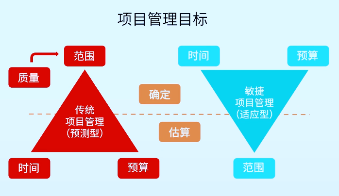
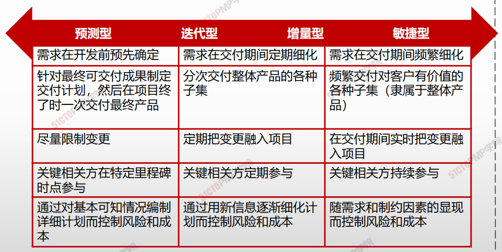

# 预测型与适应型生命周期比较

| 项目特点 | 预测型(瀑布) | 适应型(敏捷方法) |
| -------- | ------------ | ---------------- |
|        适用条件 |   需求明确、产品清晰、无需变更、风险较低       | 需求不清、产品模糊、频繁变更、风险较高          |
| 开发流程         |  依次进行设计、建造和测试，**一次交付完整产品**            |     每个迭代器都需设计、建造和测试，并交付产品原型；**经若干迭代期后，交付最终产品**             |
|  需求        |  明确            |      不明确            |
|  范围        |      清晰，一开始就明确整个项目的范围，且通常不变	        | 不清晰，依次明确各迭代期的项目范围；范围在一个迭代期内不变，在迭代期之间必变                 |
|   变更       |   不频繁           | 频繁                 |
|       产品   |  必须**整体交付**            | **部分交付有价值**                 |
|   干系人       | 只参与设计与验收             |  **频繁**参与原型设计与验收                |

## 项目生命周期的连续区间

> PMBOK 665页