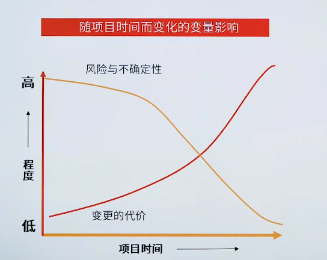

# 项目阶段与项目生命周期特征

> 越早的投入项目管理，获取成功的可能性越大，减少损失的可能性越大

| 项目管理要素       | 开始 | 执行阶段 | 结束     |
| ------------------ | ---- | -------- | -------- |
| 人力、成本         | 较低 | 逐渐升高 | 迅速下降 |
| 相关方的作用与影响 | 最高 | 逐渐降低 | 最低     |
| 风险、不确定性     | 最高 | 逐渐降低 | 最低     |
| 风险影响           | 最低 | 逐渐升高 | 最高     |

