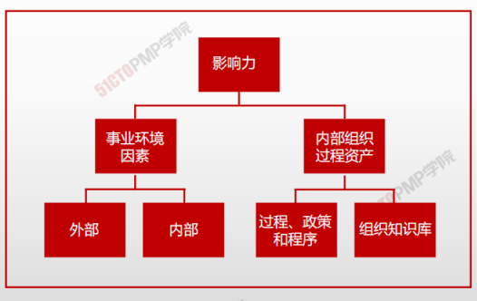
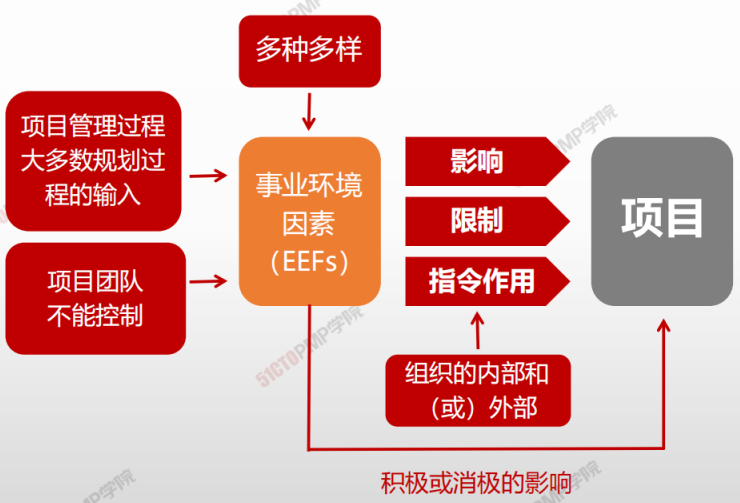
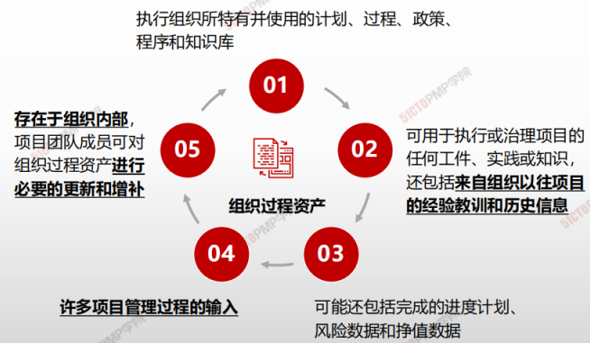
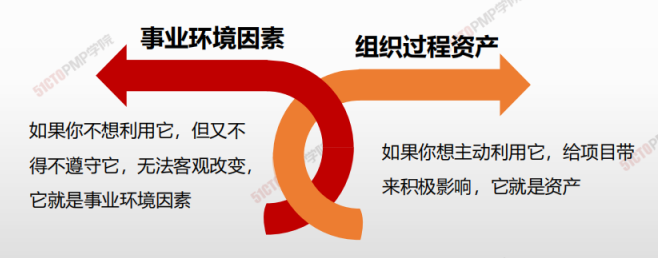

# 项目运行环境

## 项目运行环境概述

----------------------------------

除了事业环境因素和组织过程资产，**阻止系统**对项目生命周期页起着重要的作用。

**组织系统**进一步讨论了影响了组织系统内部人员的**权利，影响力、利益、技能和政治能力**的系统因素。

### 事业环境因素

源于项目外部（往往是企业外部）环境，事业环境因素可能对整个企业、项目组合、项目集或项目产生影响。

- **组织文化、结构和治理。**例如包含<u>愿景、使命、价值观、信念</u>、文化规范、领导风格、等级制度和职权关系、组织风格、道德和行为规范。
- **实施和资源的地理分布**。例如包括工厂的位置、虚拟团队、共享系统和云计算。
- **基础设施。**例如包括现有设施、设备、组织通讯渠道、信息技术硬件、可用性和功能。
- **信息技术软件**
- **资源可用性 **
- **员工能力**
- **市场条件**
- **社会和文化影响与问题**
- **法律限制**
- **商业数据库**
- **学术研究**
- **财务考虑因素**
- **物理环境因素**
- 

### 组织过程资产

源于企业内部，可能来自企业自身、项目组合、项目集、其他项目或这些组合。

### 过程、政策和程序

 第一类资产的更新通常不是项目工作的一部分，而是由**项目管理办公室 (PMO) 或项目以外的其他职能部门完成**。更新工作仅须遵循与过程、政策和程序更新相关的组织政策。有些组织鼓励团队裁剪项目的模板、生命周期和核对单。在这种情况下，项目管理团队应根据项目需求裁剪这些资产

### 知识库

第二类资产是在整个项目期间**结合项目信息而更新**的。例如，整个项目期间会持续更新与财务绩效、经验教训、绩效指标和问题以及缺陷相关的信息。

## 事业环境因素 VS 组织过程资产

> 事业环境因素和组织过程资产可以有一定程度的交叉和重合

