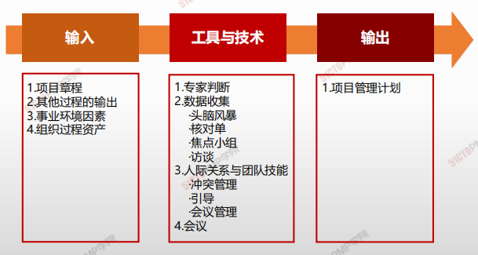
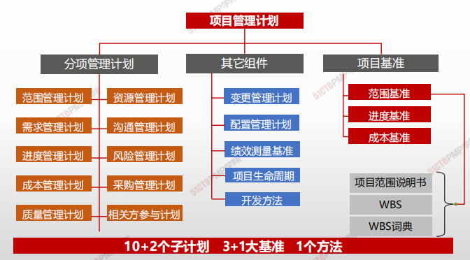
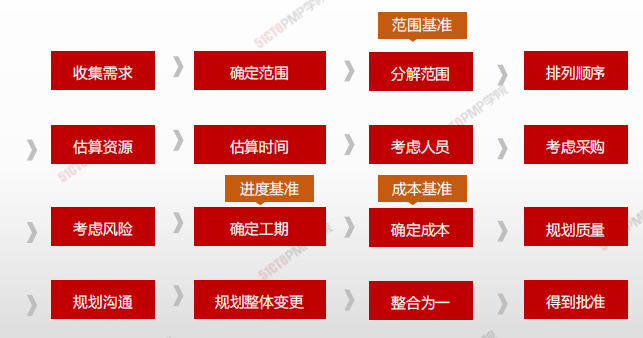

# 制定项目管理计划

> * **必须做什么？（范围确定）**
> * **什么时候来做？（进度管理）**
> * **有谁来做？（资源落实和保障）** 
> * **必须做的多好？（质量）**
> * **应该怎么做，怎么管，怎么控**

- **项目管理计划确定项目的执行、监控和收尾方式，其<u>内容会因项目所在的应用领域和复杂程度而异</u>。**
- **项目管理计划<u>可以是概括或详细的</u>。**
- **<u>项目管理计划应足够强大</u>，可以应对不断变化的项目环境。**
- **<u>项目管理计划应基准化</u>，即，至少应规定项目的范围、时间和成本方面的基准，以便据此考核项目执行情况和管理项目绩效。**
- **<u>在确定基准之前，可能要对项目管理计划进行多次更新</u>，且这些更新<u>无需遵循正式流程。</u>但是，一旦确定了基准，就只能通过实施整体变更控制过程进行更新。**
- **在项目收尾之前，<u>该计划需要通过不断更新来渐进明细</u>，并且这些更新需要得到控制和批准。**

## 4W1H

| 4W1H             | 制定项目章程                                                 |
| ---------------- | ------------------------------------------------------------ |
| what 做什么  | 定义、准备和协调项目计划的所有组成部分，并把它们整合为一份综合项目管理计划的过程。 <u>作用</u>：生成一份综合文件，用于确定所有项目工作的基础及其执行方式。 |
| why 为什么做 | 制定一个衡量项目的标尺，指导团队如何开展项目管理工作，每份子计划都说明了如何进行该知识领域的项目管理工作。 |
| who 谁来做   | 项目经理带领项目管理团队编写，除了项目进度表由项目经理即管理团队批准外，其它子计划和基准均需公司高管批准。 |
| how 如何做   | 项目管理计划可以是概括或详细的，而每个组成部分的详细程度取决于具体项目的要求。项目管理计划应基准化。对隶属于项目集或项目组合的项目，则应<该制定与项目集或项目组合管理计划相一致的项目管理计划。 专家判断、数据收集、人际关系与团队技能、会议 |

## 输入/工具技术/输出

1. 输入
   1. 项目章程
   2. 其他过程的输入
   3. 事业环境因素
   4. 组织过程资产
2. 工具与技术
   1. 专家判断
   2. 数据收集
      - 头脑风暴
      - 核对单
      - 焦点小组
      - 访谈
   3. 人际关系与团队技能
      - 冲突管理
      - 引导
      - 会议管理
   4. 会议

3. 输出
   1. 项目管理加护

### 输出

**需求收集 → 确定范围 → 分解范围 → 排列顺序 → 估算资源 → 估算时间 → 考虑人员 → 考虑采购 → 考虑风险 → 确定工期 → 确定成本 → 规划质量 → 规划沟通 → 规划整体变更 → 整合为一 → 得到批准**

