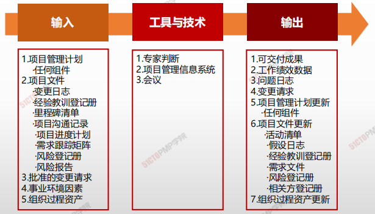
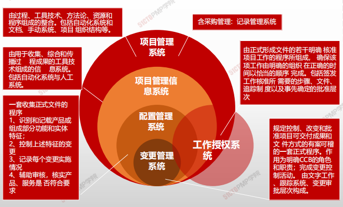
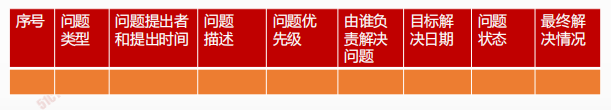

# 制定项目管理计划

> * 指导与管理项目工作包括制定计划的项目活动，以完成项目可交付成果并达成既定目标
> * 指导与管理项目工作还要求回顾所有项目变更的影响并实施已经批准的变更，包括纠正措施、预防措施和缺陷补救

## 4W1H

| 4W1H                | 制定项目章程                                                 |
| ------------------- | ------------------------------------------------------------ |
| what 做什么     | 为实现项目目标而领导和执行项目管理计划中所确定的工作，并实施已批准变更。 <u>**作用：**</u>对项目工作和可交付成果开展综合管理，以提高项目成功的可能性。 |
| why 为什么做    | 执行计划的项目活动，以完成项目可交付成果并达成既定目标。     |
| who 谁来做      | 项目经理与项目管理团队。                                     |
| when 什么时候做 | 计划制定后，按照计划执行。                                   |
| how 如何做      | 需要分配可用资源并管理其有效使用，也需要执行因分析工作绩效数据和信息而提出的项目计划变更。指导与管理项目工作过程会受项目所在应用领域的直接影响，按项目管理计划中的规定，开展相关过程，完成项目工作，并产出可交付成果。 <u>**专家判断、项目管理信息系统、会议**</u> |

## 输入/工具技术/输出

1. 输入
   1. 项目管理计划

      - 任何组件

   2. 项目文件

      - 变更日志

      - 经验教训登记册

      - 里程碑清单

      - 项目沟通记录
      - 项目进度计划
      - 需求跟踪矩阵
      - 风险登记册
      - 风险报告

   3. 批准的变更请求

   4. 事业环境因素

   5. 组织过程资产
2. 工具与技术
   1. 专家判断
   2. 项目管理信息系统
   3. 会议
   
3. 输出

   1. 可交付成果
   2. 工作绩效数据
   3. 问题日志
   4. 变更请求
   5. 项目管理计划更新
      - 任何组件
   6. 项目文件更新
      - 活动清单
      - 假设日志
      - 经验教训登记册
      - 相关方登记册
   7. 组织过程资产更新

### 工具与技术

### 输出

#### 可交付成果

在完成某一过程、阶段或项目是**必须产出**的任何**独特**的并**可核实**的产品、成果或服务能力。

> 可交付成果的形式也是多种多样的，有些是有形的，可直接验证的；而有些却是无形的，抽象的服务。

> * IT项目可交付成果
> * 一个IT项目的可交付成果可以是文档、端口、一个系统架构、一个完整的系统等等。

> 完成第一版是，就应该使用变更控制；
>
> 用配置管理工具和程序对可交付成果进行多版本控制；

#### 问题日志

问题日志可以帮助项目经理有效跟进和管理问题，确保得到调查和解决。

- 作为本过程的输出，问题日志首次被创建，尽管在项目期间任何时候都可能发生问题。

# 小结

1. 指导与管理项目工作过程执行的是项目管理计划和已批准的变更请求，并在过程中收集项目绩效数据

2. 项目的大多数预算和资源都耗费于此，投入最高

3. 项目管理信息系统PMIS的组成和作用

4. 可交付成果必须可核实，符合质量预期

5. 问题日志是一种记录和持续跟进所有问题的项目文件，**1.** 

  **管理项目知识是利用已有的组织知识来改进项目成果，**

  **并且使当前项目创造的知识可用于支持组织运营和未**

  **来的项目或阶段**

  **2.** 

  **知识的两种分类：显性和隐形知识**

  **3.** 

  **项目创造出新的知识应该随时记录到经验教训登记册**

  **4.** 

  **知识管理这个工具和技术主要是利用人际互动来管理**

  **隐形知识**

  **5.** 

  **信息管理这个工具和技术用于管理显性知识**

  **6.** 

  **加入互动功能，更有利于信息获取和分享**

  **7.** 

  **在项目或阶段结束时，把相关信息归入经验教训知识**

  **库，成为组织过程资产的一部分**应责任到人，落实到位