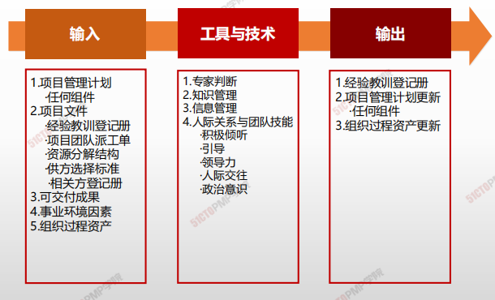
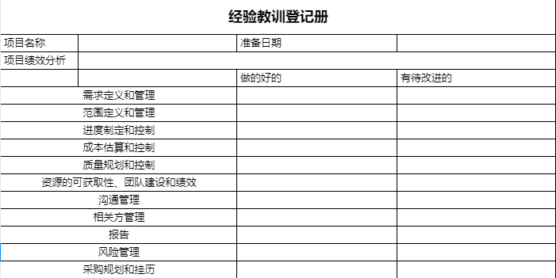

# 管理项目知识

> - 知识通常分为“显性知识”和“隐性知识”两种。
> - 知识管理指管理显性和隐性知识，旨在重复使用现有知识并生成新知识。有助于达成这两个目的的关键活动是知识分享和知识集成（不同领域的知识、情境知识和项目管理知识）。

> **显性知识：**
>
> **易使用文字、图片和数字进行编撰的知识**
>
> **隐性知识：**
>
> **个体知识以及难以明确表达的知识，如信念、洞察力、经验和“诀窍”**

> **如何分享知识？**
>
> 从组织的角度来看，知识管理指的是确保项目团队和其他相关方的技能、经验和专业知识在项目开始之前、开展期间和结束之后得到运用。
>
> **知识管理最重要的环节就是营造一种相互信任的氛围**，**激励人们分享知识或关注他人的知识**。
>
> 在实践中，联合使用知识管理工具和技术（用于人际互动）以及信息管理工具和技术（用于编撰显性知识）来分享知识。

## 4W1H

| 4W1H                | 制定项目章程                                                 |
| ------------------- | ------------------------------------------------------------ |
| what 做什么     | 使用现有知识并生成新知识，以实现项目目标，并且帮助组织学习的过程。 <u>**作用：**</u>利用已有的组织知识来创造或改进项目成果，并且使当前项目创造的知识可用于支持组织运营和未来的项目或阶段。 |
| why 为什么做    | 管理显性和隐性知识，旨在重复使用现有知识并生成新知识。有助于达成这两个目的的关键活动是知识分享和知识集成（不同领域的知识、情境知识和项目管理知识）。 |
| who 谁来做      | 项目经理与项目管理团队。                                     |
| when 什么时候做 | 本过程需要在整个项目期间开展                                 |
| how 如何做      | 在实践中，联合使用知识管理工具和技术（用于人际互动）以及信息管理工具和技术（用于编撰显性知识）来分享知识。 **专家判断、知识管理、信息管理、人际关系与团队技能** |

## 输入/工具技术/输出

1. 输入
   1. 项目管理计划

      - 任何组件

   2. 项目文件

      - 经验教训登记册
- 项目团队派工单
      - 项目分解结构
- 供方选择标准
      - 相关方登记册

   3. 可交付成果
   
   4. 事业环境因素
   
   5. 组织过程资产
2. 工具与技术
   1. 专家判断
   2. 知识管理
   3. 信息管理
   4. 人际关系与团队技能
      - 积极倾听
      - 引导
      - 领导力
      - 人际交往
      - 政治意识

3. 输出

   1. 经验教训登记册
   2. 项目管理计划更新
   3. 组织过程资产更新

## 文件实例

# 小结

1. 管理项目知识是利用已有的组织知识来改进项目成果，并且使当前项目创造的知识可用于支持组织运营和未来的项目或阶段
2. 知识的两种分类：显性和隐形知识
3. 项目创造出新的知识应该随时记录到经验教训登记册
4. 知识管理这个工具和技术主要是利用人际互动来管理隐形知识
5. 信息管理这个工具和技术用于管理显性知识
6. 加入互动功能，更有利于信息获取和分享
7. 在项目或阶段结束时，把相关信息归入经验教训知识库，成为组织过程资产的一部分