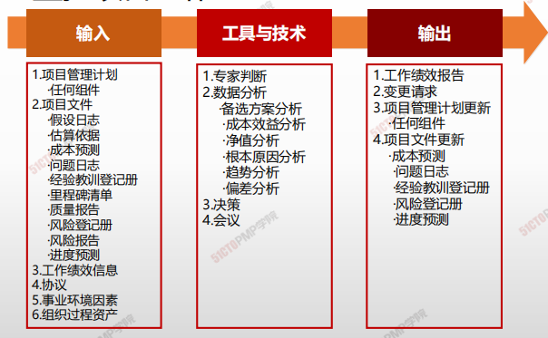
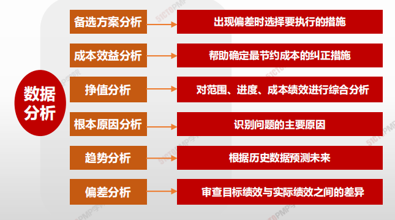
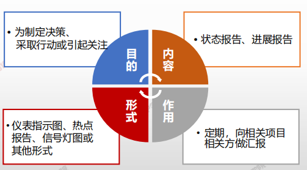

# 06.监控项目工作

## 制定项目管理计划

> * **监督是贯穿于整个项目**的项目管理活动之一，包括**收集、测量和分析**测量结果，以及 **预测**趋势，以便推动过程\*\*改进\*\*
> * 持续的监督使项目管理团队能洞察项目的健康状况，并识别须要特殊关注的任何方面。
> * 控制包括\*\*制定纠正**或**预防**措施或**重新规划\*\*，并跟踪行动计划的实施过程，以确保它们能有效解决问题

### 4W1H

| 4W1H                 | 制定项目章程                                                                                                                     |
| -------------------- | -------------------------------------------------------------------------------------------------------------------------- |
| 
what 做什么
   | 
跟踪、审查和报告整体项目进展，以实现项目管理计划中确定的绩效目标的过程。 <strong>作用：</strong>让相关方了解项目的当前状态并认可为处理绩效问题而采取的行动，以及通过成本和进度预测，让相关方了解未来项目状态。
 |
| 
why 为什么做
   | 持续的监督使项目管理团队能洞察项目的健康状况，并识别须特别关注的任何方面。                                                                                      |
| 
who 谁来做
    | 项目经理与项目管理团队。                                                                                                               |
| 
when 什么时候做
 | 本过程需要在整个项目期间开展。                                                                                                            |
| 
how 如何做
    | 
包括收集、测量和分析测量结果，以及预测趋势，以便推动过程改进。 <strong>专家判断、数据分析、决策、会议</strong>
                                                 |

### 输入/工具技术/输出

1. 输入
   1. 项目管理计划
      * 任何组件
2. 项目文件
   * 假设日志
   * 估算依据
   * 成本预测
   * 问题日志
   * 经验教训登记册
   * 里程碑清单
   * 质量报告
     * 风险等级册
     * 风险报告
     * 进度预测
   * 工作绩效信息
   * 协议
3. 事业环境因素 6. 组织过程资产
4. 工具与技术
   1. 专家判断
   2. 数据分析
      * 备选方案分析
      * 成本效益分析
      * 净值分析
      * 根本原因分析
      * 趋势分析
      * 偏差分析
   3. 决策
   4. 会议
5. 输出
   2. 工作绩效报告
   3. 变更请求
   4. 项目管理计划更新
      * 任何组件
   5. 项目文件更新
      * 成本预测
      * 问题日志
      * 经验教训登记册
      * 风险登记册
      * 进度预测
   6. 组织过程资产更新

#### 工具与技术

#### 输出

**工作绩效报告**

为制定决策、采取行动或引起关注而汇编工作绩效信息所形成的实物或电子项目文件。

*

## 小结

1. 监控覆盖全局：启动、规划、执行、收尾等
2. 偏差分析就是审查目标绩效与实际绩效之间的差异或偏差
3. 趋势分析就是根据以往结果预测未来绩效，如进度或成本
4. 偏差分析关注现在，趋势分析关注未来，趋势分析通常基于偏差分析
5. 各个子监控过程的工作绩效数据汇编成工作绩效报告
6. 监控项目工作过程的一项重要输出是变更请求
