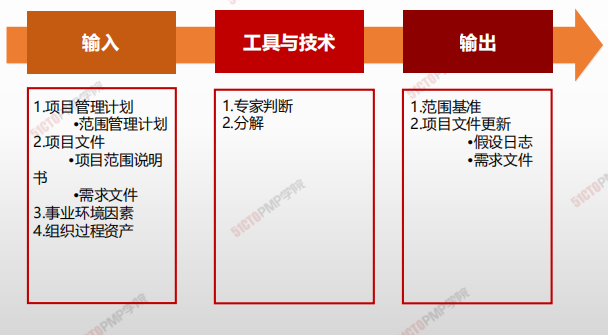
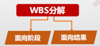
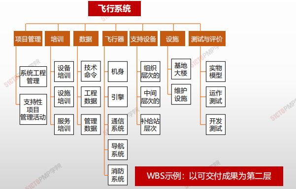
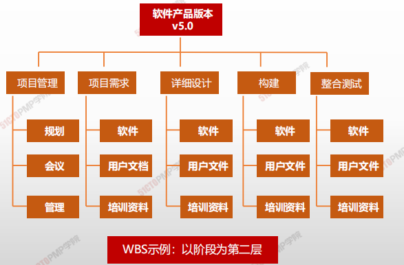
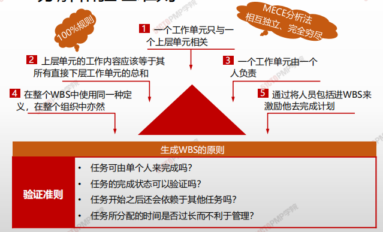
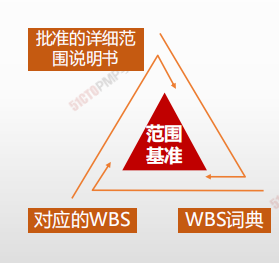

# 创建WBS

## 4W1H

| 4W1H                | **创建 WBS**                                                 |
| ------------------- | ------------------------------------------------------------ |
| what 做什么     | 把项目可交付成果和项目工作分解成较小、更易于管理的组件的过程。 作用：为所要交付的内容提供架构。 |
| why 为什么做    | WBS 是对项目团队为实现项目目标、创建所需可交付成果而需要实施的全部工作范围的层级分解。WBS 组织并定义了项目的总范围，代表着经批准的当前项目范围说明书中所规定的工作，可以针对WBS的工 作包安排进度、估算成本和实施监控。 |
| who 谁来做      | 项目管理团队                                                 |
| when 什么时候做 | 制定项目范围说明书后。                                       |
| how 如何做      | 工作包对相关活动进行归类。 <u>专家判断、分解</u>         |

## 输入/工具技术/输出

1. 输入
   2. 项目管理计划
      - 范围管理计划
   3. 项目文件
      - 项目范围说明书
      - 需求文件
   5. 事业环境因素
   6. 组织过程资产
2. 工具与技术
   1. 专家判断
   2. 分解
   
3. 输出
   1. 范围基准
   2. 项目文件更新
      - 假设日志
      - 需求文件

### 工具与技术

#### 分解

> - 分解就是把项目可交付成果划分为更小、更便于管理的组成部分，直到工作和可交付成果被定义到工作包的层次。工作包是分解结构的底层，是能够可靠的估算和管理工作成本和活动持续时间的位置。
> - 工作包的详细程度因项目大小和复杂度而异。

#### 工作分解结构（WBS）的意义

> 1. 确定工作范围
> 2. 配备人员
> 3. 编制资源预算
> 4. 监视进程
> 5. 明确阶段里程碑
> 6. 具体内容验证

* WBS是项目工作的“组织架构图”，WBS提供了一个逻辑关系图反映项目目标
* 工作分解结构保证了项目结构的**系统性和完整性**。
* 通过WBS建立完整的项目保证体系，便于执行和实现项目目标
* 通过WBS**使项目相关人员对项目一目了然**，方便跟踪费用，进度，绩效。
* 通过WBS能够明确项目相关方的界面，便于**责任划分**和落实
* 为**项目沟通提供依据，**可以用于与相关方沟通项目状态，提高项目整体团队沟通

#### 分解的步骤和形式

##### 分解的步骤

1. 识别和分析可交付成果及相关工作
2. 确定工作分解结构的结构与编排方法
3. 自上而下逐层细化分解
4. 为工作分解机构组成部分定制和分配标志编码
5. 核实工作分解的程度是必要且充分的。确保没有遗漏工作，也没有增加多余的工作

##### 分解的形式

1. 按照生命周期各个阶段进行分解；
2. 按产品或项目可交付成果分解；
3. 

##### 示例

##### WBS词典

WBS词典中的内容可
能包括（但不限于）：

* 账户编码标识
* 工作描述
* 假设条件和制约因素
* 负责的组织
* 进度里程碑
* 相关的进度活动
* 所需资源
* 成本估算
* 质量要求
* 验收标准

> 工作分解结构词典是在创建工作分解结构过程中产生并用于支持工作分解结构的文件。
>
> 工作分解结构词典对工作分解结构组成部分（包括工作包和控制账户）进行更详细的描述。

##### 控制账户/规划包/工作包视图

##### 分解和验证准则

##### 小结

* 范围基准是进度基准和成本基准的基础
* 工作包时间不宜超过2周或者80小时，层级不宜超过20层，小的项目4～6层就可以了
  应该让团队成员积极参与WBS的创建
* 一个WBS项只能由一个人负责，即使许多人都可能在其上工作，也只能由一个人负责，其他人只能是参与者

# 小结

1. WBS是以可交付成果为导向的工作层级分解
2. WBS可按照生命周期或成果进行分解
3. 控制账户是一个管理控制点，把范围、预算和进度
加以整合，并与挣值相比较，以测量绩效
4. 工作包位于WBS最底层
5. 规划包低于控制账户而高于工作包，未来会进一步
分解为工作包