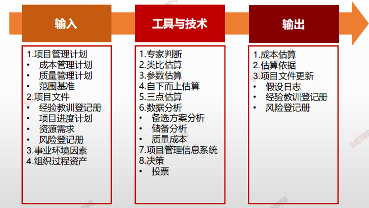

# 估算成本

## 4W1H

| 4W1H                | 规划成本管理                                                 |
| ------------------- | ------------------------------------------------------------ |
| what 做什么     | 估算成本是对完成项目工作所需资源成本进行近似估算的过程。 <u>作用：确定项目所需的资金。本过程应根据需要在整个项目期间定期开展。</u> |
| why 为什么做    | 成本预测，在估算成本时，需要识别和分析可用于启动与完成项目的备选成本方案；可以避免在通货膨胀等的风险。 |
| who 谁来做      | 本过程应根据需要在整个项目期间定期开展。                     |
| when 什么时候做 | 应该在项目规划阶段的早期就对成本管理工作进行规划，建立各成本管理过程的基本框架。 |
| how 如何做      | 通过规划输入输出，来确认项目成本管理的需求。 <u>专家判断、数据分析、会议</u> |

## 输入/工具技术/输出

1. 输入
   1. 项目管理计划
      - 成本管理计划
      - 质量管理计划
      - 范围基准
   2. 项目文件
      - 经验教训登记手册
      - 项目进度计划
      - 资源需求
      - 风险等级册
   3. 事业环境因素
   4. 组织过程资产
2. 工具与技术
   1. 专家判断
   2. 类比估算
   3. 参数估算
   4. 自下而上估算
   5. 三点估算
   6. 数据分析
      - 备选方案分析
      - 储备分析
      - 质量成本
   7. 项目管理信息系统
   8. 决策
      - 投票
3. 输出
   1. 成本估算
   2. 估算依据
   3. 项目文件更新
      - 假设日志
      - 经验教训登记册
      - 风险登记册

### 成本估算的方法

|              | 类比估算(自上而下)                                           | 自下而上                                                     | 参数估算                                                     |
| ------------ | ------------------------------------------------------------ | ------------------------------------------------------------ | ------------------------------------------------------------ |
| **定义**     | 对照已经完成的类似项目的实际成本，估算出新项目的总成本。这又被称之为自上而下法。是一种专家评定法。 | 基于WBS体系，先估算各个单位活动或工作包的独立成本然后将单个的估算自下而上层层进行汇总，得到项目整体成本。 | 讲项目特征用于数学模型来预测项目成本。                       |
| **优点**     | <u>方法简易，省时省力，计算成本低</u>                        | <u>成本估算比较准确，符合实际</u>                            | <u>信息采集量小，省事节约费用，易于使用</u>                  |
| **缺点**     | <u>信息量模糊，估算准确度低</u>                              | <u>信息采集量大，耗时费工成本高</u>                          | <u>不校验则准确性无法保证，无法适应变化</u>                  |
| **适用场景** | 在下述情况下非常可靠 1. 以前项目在事实上而不仅仅是在外表上相似 2. 进行估算的个人或团体具有所需要的专门知识 3. 费用最低，可靠性差 | 成本和精度受到单个活动或工作包大小复杂程度的制约，较小的活动在提高估算精度的同时将增加成本 | 在下述情况下非常可靠 1. 用于建立模型的历史信息是准确的 2. 在模型中使用的参数是很容易量化的 3. 模型可按比例调整 |

