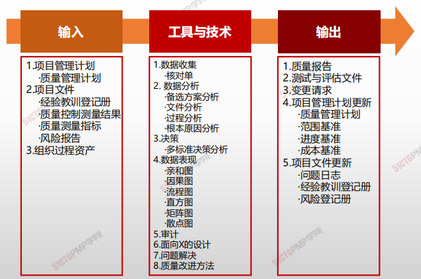
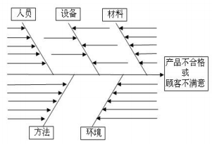
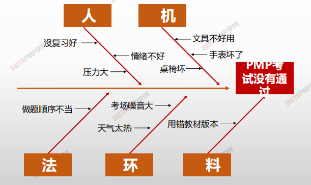
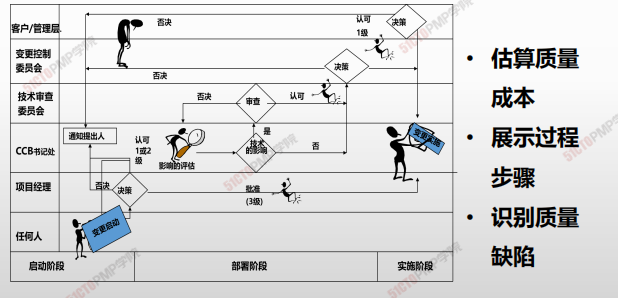
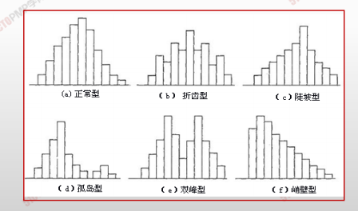
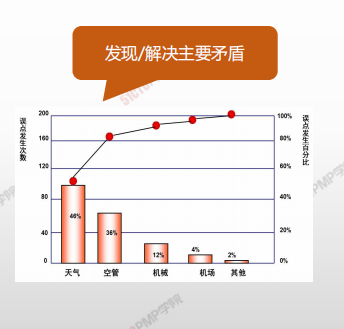
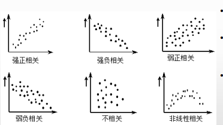
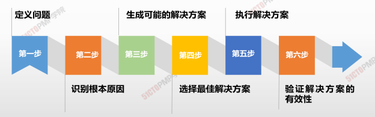

#  管理质量

- 管理质量是吧组织的质量政策用于项目，并将质量管理计划转化为可执行的质量活动过程。
- 本过程的主要作用是，提高实现质量目标的可能性，以及识别无效过程和导致质量低劣的原因。
- 管理质量使用控制质量过程的数据和结果向相关方展示项目的总体质量状态。
- <u>本过程需要在整个项目期间展开</u>
- 管理质量有时被称之为“质量保证”，但<u>”管理质量“的定义比”质量保证“更广，</u>因其可用于非项目工作。
- 在项目管理中，质量保证着着眼于项目使用的过程，旨在高效地执行项目过程，包括遵守和满足标准，向相关方保证最终产品可以满足他们的需求、期望和要求。
- <u>管理质量包括所有质量保证活动，还与产品设计和过程改进有关。</u>
- 管理质量的工作属于质量成本框架中的 <u>一致性工作</u>

## 4W1H

| 4W1H                | 质量管理                                                     |
| ------------------- | ------------------------------------------------------------ |
| what 做什么     | 把组织的质量政策用于项目，并将质量管理计划转化为可执行的质量活动的过程。 <u>作用</u>：提高实现质量目标的可能性，以及识别无效过程和导致质量低劣的原因。管理质量使用控制质量过程的数据和结果向相关方展示项目的总体质量状态 |
| why 为什么做    | 实现质量预防理念，构建一个框架体系，用过程/流程保证质量。    |
| who 谁来做      | 管理质量被认为是所有人的共同职责，包括项目经理、项目团队、项目发起人、执行组织的管理层，甚至是客户。 |
| when 什么时候做 | 规划制定后，执行全过程，持续开展保证活动。                   |
| how 如何做      | 项目经理和项目团队可以通过组织的质量保证部门或其他组织职能执行某些管理质量活动。质量保证部门在质量工具和技术的使用方面通常拥有跨组织经验，是良好的项目资源。 <u>数据收集、数据分析、决策、数据表现、审计、面向X的设计、问题解决、质量改进方法</u> |

## 输入/工具技术/输出

1. 输入

   2. 项目管理计划
      - 质量管理计划
   3. 项目文件
      - 经验教训登记册
      - 质量控制测量结果
      - 质量测量指标
      - 分析按报告
   5. 组织过程资产

2. 工具与技术

   2. 数据收集
      - 核对单
   3. 数据分析
      - 备选方案分析
      - 文件分析
      - 过程分析
      - 根本原因分析
   4. 决策
      - 多标准决策分析
   5. 数据表现
      - 亲和图
      - 因果图
      - 流程图
      - 直方图
      - 矩阵图
      - 散点图
   6. 审计
   6. 面向X的设计
   7. 问题解决
   8. 质量改进方法

3. 输出

   1. 质量报告
   2. 测试与评估文件
   3. 变更请求
   4. 项目管理计划更新
      - 质量管理计划
      - 范围基准
      - 进度基准
      - 成本基准
   5. 项目文件更新
      - 问题日志
      - 经验教训登记册
      - 风险登记册

   

## 因果分析图、石川图、鱼刺图

### 鱼刺图

### 流程图

> 用来显示在一个或多个输入转化成一个或多个输出的过程中，所需要的步骤顺序和可能的分支

### 方直图

- 描述产品质量分布
- 了解产品质量的波动情况及质量特性的分布规律
- 一种统计报告，可以显示在某个最小值和最大值之间值的等级或范围内值的出现频率

### 帕累托图

- 20%原因 造成 80%的错误
- 帕累托图中数据的重要性以下降的顺序排列
- 按优先顺序表示数据，并将注意力集中在关键数据上，一般来说，**关注在前两个到三个因素就可以解决大部分的问题**

### 散点图

- 显示两种质量特性数据之间的关系以及关系密切程度
- 散点图显示两个变量之间的关系和规律：积极地，消极的，还是两者毫无关系的
- 虽然散点图不能证明一个变量引起另一个变量的变化，但它有助于说明是否存在某种关系，也可以说明这种关系的强度

## 审计

用来确定活动是否遵循了组织和项目的政策、过程和程序的一种结构化的、独立的审查过程

- 5个目标：<u>识别良好做法、发现不足、分享经验、改进过程，总结经验</u>
- 可以由内部和外部人员进行

## 面向X的设计（DFX）

是产品设计期间可采用的一系列技术指南，旨在 <u>优化设计的特定方面。</u>

- “X”可以是产品开发的不同方面：如可靠性、调配、装配、制造、成本、服务、可用性、安全性和质量
- 可以降低成本、改进质量、提高绩效和客户满意度

## 问题解决

发现解决问题或应对挑战的解决方案。他包括收集其他信息、具有批判性思维、创造性的、量化的和/或逻辑性的解决方法；

## 质量报告

- 质量报告可能是图形、数据或定性文件，其中包含的信息可帮助其他过程和部门采取纠正措施，以实现目标质量的期望。
- 质量报告的信息可以包含团队上报的质量管理问题，针对过程、项目和产品的改善建议，纠正措施（包括返工、缺陷、漏洞不就、100%检查等），以及时控制质量过程中发现 的情况概述。