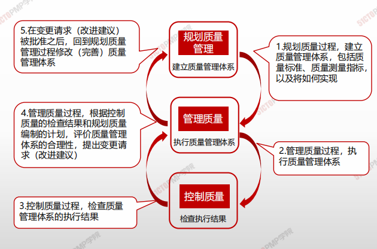
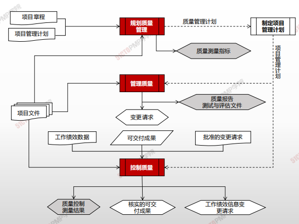

# 05.本章总结

***

**规划质量**

* 确定质量标准
* 描述如何达到这些质量标准
* 要发生在规划阶段
* 实施主体是项目管理团队
* 针对的是标准

***

**管理质量**

* 强调质量改善、过程改进，提高干系人对项目达到质量要求的信心_按照计划，做合格质量_
* 判断质量标准是否合适
* _编制测试文件和质量报告_
* 主要发生在规划和执行阶段
* \*实施主体是项目执行团队
* 针对的是过程

***

**控制质量**

* 检查管理工作的质量是否符合要求,提出变更请求
* 检查可交付成果的质量是否符合相关质量标准,提出变更请求
* _主要发生在执行、监控和收尾阶段_
* 实施主体是组织质量控制部门
* \*针对的是结果

***

