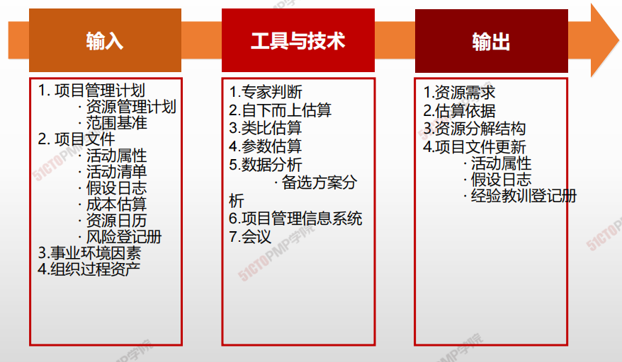
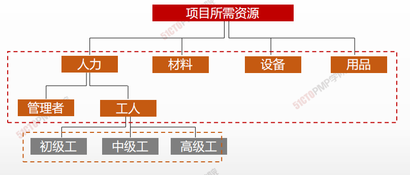
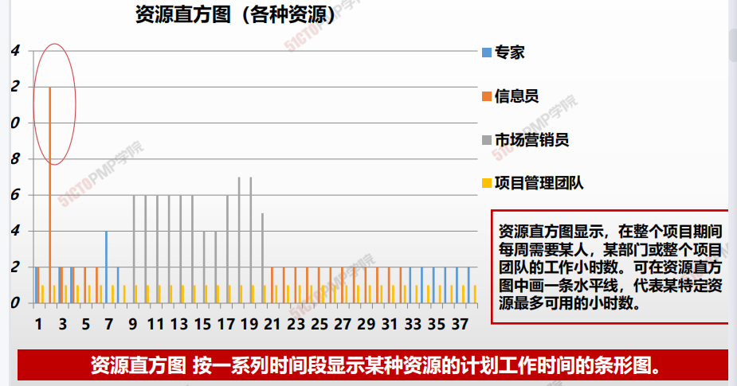

# 03.估算活动资源

## 4W1H

| 4W1H                 | 估算活动资源                                                                                   |
| -------------------- | ---------------------------------------------------------------------------------------- |
| 
what 做什么
   | 
估算执行项目所需的团队资源，以及材料、设备和用品的类型和数量的过程。 作用：明确完成项目所需的资源种类、数量和特性。本过程应根据需要在整个项目期间定期开展。
 |
| 
why 为什么做
   | 资源不同影响项目的进度也会不同，估算活动资源为了制定合理、符合实际情况的进度计划                                                 |
| 
who 谁来做
    | 项目管理团队。                                                                                  |
| 
when 什么时候做
 | 定义活动之后，排列活动顺序之后                                                                          |
| 
how 如何做
    | 
利用发布的估算数据，自下而上估算资源。专家判断、自下而上的估算、类比估算、参数估算、数据分析、 项目管理信息系统、会议
                    |

## 输入/工具技术/输出

1. 输入
   2. 项目管理计划
      * 质量管理计划
      * 范围基准
   3. 项目文件
      * 活动属性
      * 活动清单
      * 假设日志
      * 成本估算
      * 资源日历
      * 风险等级册
   4. 事业环境因素
   5. 组织过程资产
2. 工具与技术
   1. 专家判断
   2. 自下而上估算
   3. 类比估算
   4. 参数估算
   5. 数据分析
      * 备选方案分析
   6. 项目管理信息系统
   7. 会议
3. 输出
   1. 资源需求
   2. 估算依据
   3. 资源分解结构
   4. 项目文件更新
      * 活动属性
   5. 假设日志
      * 经验教训登记册

## 资源分解结构

资源分解结构是 资源依类别和类型的 层级展现。资源类别包括（但不限于）人力、材料、设备和用品，资源类型则包括技能水平、要求证书、等级水平或适用于项目的其他类型。

## 资源直方图

