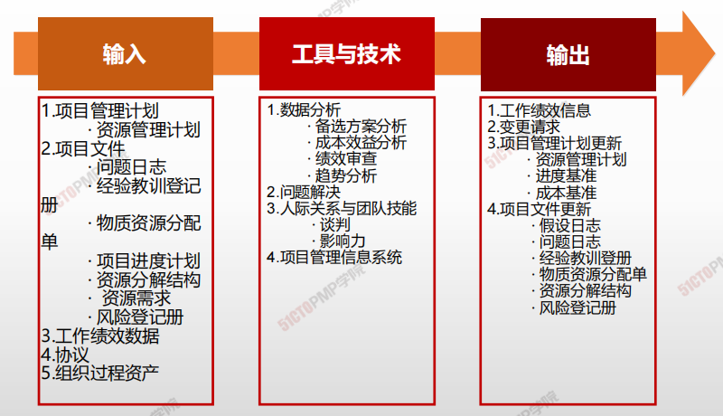
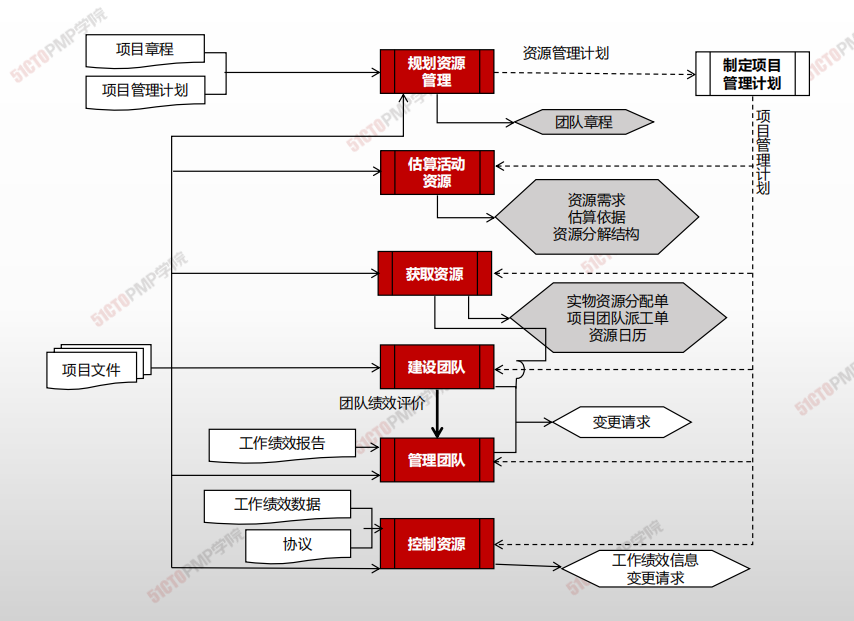

# 控制资源

## 4W1H

| 4W1H                | 控制资源                                                     |
| ------------------- | ------------------------------------------------------------ |
| what 做什么     | 是确保按计划为项目分配实物资源，以及根据资源使用计划监督资源实际使用情况，并采取必要纠正措施的过程。 作用：确保所分配的资源适时适地可用于项目，且在不再需要时被释放 |
| why 为什么做    | 应在所有项目阶段和整个项目生命周期期间持续开展控制资源过程，且适时、适地和适量地分配和释放资源，使项目能够毫无延误地向前推进。 |
| who 谁来做      | 高层领导、项目经理和团队成员                                 |
| when 什么时候做 | 本过程需要在整个项目期间开展。                               |
| how 如何做      | 适时、适地和适量地分配和释放资源，使项目能够持续进行。 <u>数据分析、问题解决、人际关系与团队技能、项目管理信息系统</u> |

## 输入/工具技术/输出

1. 输入

   1. 项目管理计划
      - 资源管理计划
   2. 项目文件
      - 问题日志
      - 经验教训登记册
      - 物质资源分配
      - 项目进度计划
      - 资源分解结构
      - 资源需求
      - 风险登记册
   3. 工作绩效评价
   4. 协议
   6. 组织过程资产
2. 工具与技术

   1. 数据分析
      - 备选方案分析
      - 成本效益分析
      - 绩效审查
      - 趋势分析
   2. 问题解决
   3. 人际关系与团队技能
      - 谈判
      - 影响力
   4. 项目管理信息系统
3. 输出
   1. 工作绩效信息
   2. 变更请求
   3. 项目管理计划更新
      - 资源管理计划
      - 进度基准
      - 成本基准
   4. 项目文件更新
      - 假设日志
      - 问题日志
      - 经验教训登记册
      - 物质资源分配单
      - 资源分解结构
      - 风险登记册

---

1. 控制资源是确保按计划为项目分配实物资源，以
及根据资源使用计划监督资源实际使用情况，并
采取必要纠正措施的过程
2. 控制资源过程关注实物资源，管理团队过程关注
团队成员
3. 巧妇难为无米之炊，只有适时、适地和适量地分
配和释放资源，才能使项目能够毫无延误地向前
推进

