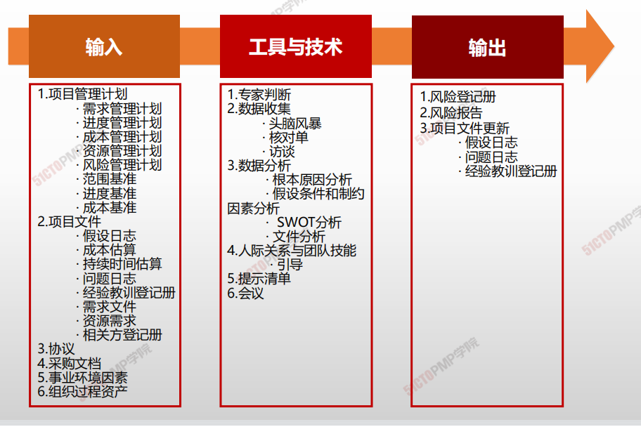
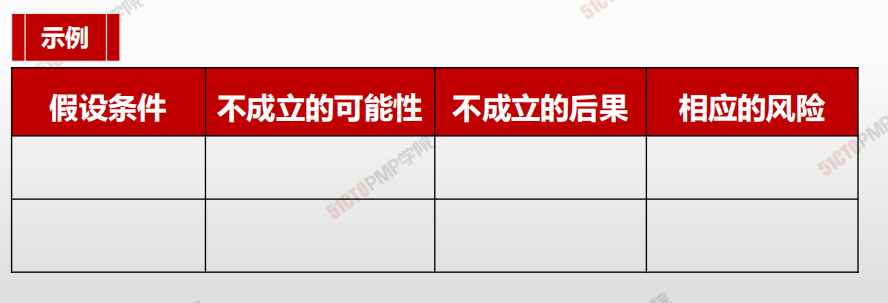
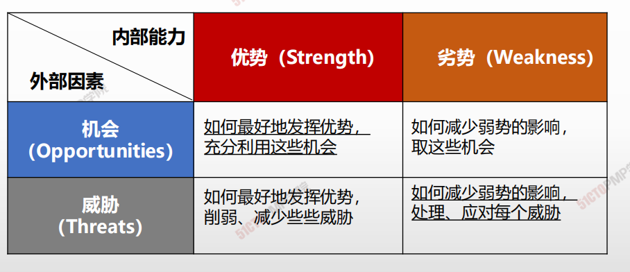
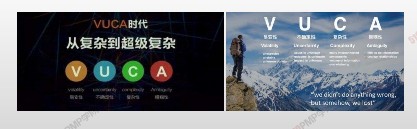
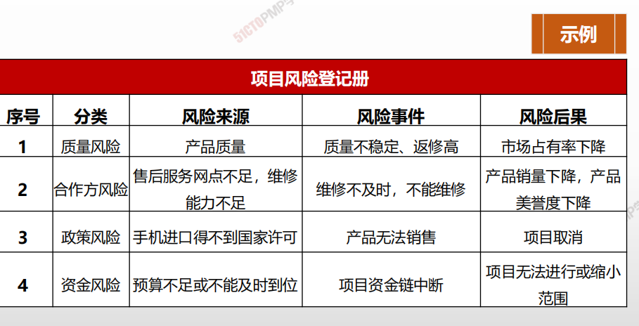
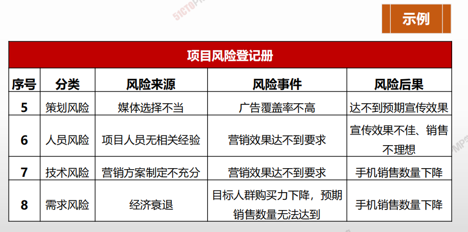
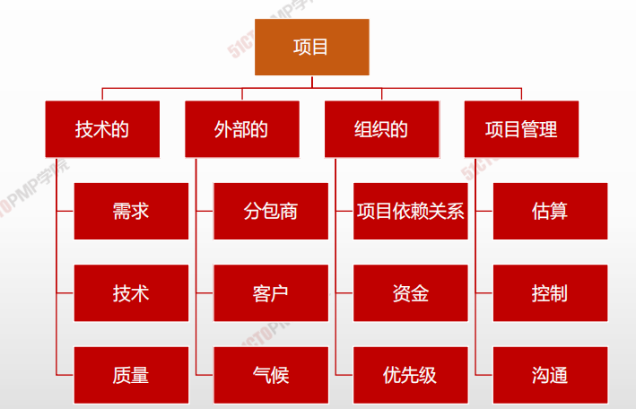

# 识别风险

### 风险管理规划应该明确的问题

* **风险识别就是采用系统化的方法，识别出项目中已知的和可预**

  **测到的风险。**

* **风险识别是一项反复的过程，**项目团队应该参与该过程。

* 风险识别包括确定风险的来源、风险产生的条件，描述风险特

  征和确定哪些风险事件有可能影响整个项目

* 风险识别分为三步进行

  1. **收集资料**
  2. **估计项目风险形势**
  3. **将潜在的风险识别出来**

## 4W1H

| 4W1H                | **识别风险**                                                 |
| ------------------- | :----------------------------------------------------------- |
| what 做什么     | 识别风险是识别单个项目风险以及整体项目风险的来源，并记录风险特征的过程。 作用：记录现有的单个项目风险，以及整体项目风险的来源；同时，汇集相关信息，以便项目团队能够恰当应对已识别的风险。 |
| why 为什么做    | 记录现有的单个项目风险，以及整体项目风险的来源；同时，汇集相关信息，以便项目团队能够恰当应对已识别的风险。 |
| who 谁来做      | 项目经理、项目团队成员、项目风险专家（若已指定）、客户、项目团队外部的主题专家、最终用户、其他项目经理、运营经理、相关方和组织内的风险管理专家。虽然这些人员通常是风险识别活动的关键参与者，但是还应鼓励所有项目相关方参与单个项目风险的识别工作 |
| when 什么时候做 | 本过程需要在整个项目期间开展。                               |
| how 如何做      | 通过审查文档，信息收集技术，核对表分析，图解技术，假设分析，SWOT分析和专家判断来识别风险 专家判断、数据收集、数据分析、人际关系与团队技能、提示清单、会议 |

## 输入/工具技术/输出

1. 输入
   1. 项目管理计划
      * 需求管理计划
      * 进度管理计划
      * 成本管理计划
      * 资源管理计划
      * 风险管理计划
      * 范围基准
      * 进度基准
      * 成本基准
   2. 项目文件
      - 假设文件
      - 成本估算
      - 持续时间估算
      - 问题日至
      - 经验教训登记册
      - 资源需求
      - 相关方登记册
   3. 协议
   4. 采购文件
   5. 事业环境因素
   6. 组织过程资产
2. 工具与技术
   1. 专家判断
   2. 数据和搜集
      - 头脑风暴
      - 核对单
      - 访谈
   3. 数据分析
      - 根本原因分析
      - 假设条件和制约因素分析
      - SWOT分析
      - 文件分析
   4. 人际关系与团队技能
      - 引导
   5. 提示清单
   6. 会议
3. 输出
   1. 风险登记册
   2. 风险报告
   3. 项目文件更新
      - 假设日志
      - 问题日志
      - 经验教训登记册

## 核对单

- 根据以往项目或其他渠道积累的**历史信息与知识**，编制风险识别核对单； 
- 列出过去项目中曾经和可能遇到的各种风险的清单
  - 优点：风险识别过程**快速简单**
  - 缺点：**不能包含所有情况、**限制思考
- 通常**按照风险类别**来组织
  - 可按风险的来源、风险影响的领域等分类
  - 风险分解结构：**RBS的最底层可作为风险核对单**
- **项目收尾过程中更新核对单。**

## 假设条件和制约因素分析

- 检验假设条件在项目中的有效性，并识别因其中的错误、变化、矛盾或片面性所致的项目风险

## SWOT分析

- 劣势
- 优势
- 机会
- 威胁

## 提示清单

**关于可能引发单个项目风险以及可作为整体项目风险来源的风险类别的预设清单**

**PESTLE：**政治、经济、社会、技术、法律、环境

**TECOP：**技术、环境、商业、运营、政治

**VUCA：**易变性、不确定性、复杂性、模糊性

## 风险登记册

- 风险登记册记录已识别单个项目风险的详细信息。
- 风险登记册的内容可能包括（但不限于）：
  - **已识别风险的清单** 在风险登记册中，每项单个项目风险都被赋予一个独特的标识号。要以所需的详细程度对已识别风险进行描述，确保明确理解。可以使用结构化的风险描述，来把风险本身与风险原因及风险影响区分开来。
  - **潜在风险责任人** 如果已在识别风险过程中识别出潜在的风险责任人，就要把该责任人记录到风险登记册中。随后将由实施定性风险分析过程进行确认。
  - **潜在风险应对措施清单** 如果已在识别风险过程中识别出某种潜在的风险应对措施，就要把它记录到风险登记册中。随后将由规划风险应对过程进行确认。
- 根据风险管理计划规定的风险登记册格式，可能还要记录关于每项已识别风险的其他数据

## 风险报告

- 风险报告提供关于整体项目风险的信息，以及关于已识别的单个项目风险的概述信息。
- 在项目风险管理过程中，风险报告的编制是一项渐进式的工作。
- 在完成识别风险过程时，风险报告的内容可能包括（但不限于）：
  - **整体项目风险的来源** 说明哪些是整体项目风险敞口的最重要驱动因素。
  - **关于已识别单个项目风险的概述信息** 例如，已识别的威胁与机会的数量、风险在风险类别中的分布情况、测量指标和发展趋势。

根据风险管理计划中规定的报告要求，风险报告中可能还包含其他信息

## 风险分解结构

>  **风险分解结构列出了一个典型项目中可能发生的风险分类和风险子分类。**提醒风险识别人员**风险产生的原因是多种多样的**

## 识别风险经验谈

#### **不要遗漏重要风险**

#### **不可能识别所有风险**

#### **风险识别的详尽程度与项目的预算有关**

#### **风险识别的详尽程度与项目的重要性有关**

1. 识别风险是识别单个项目风险以及整体项目风险
的来源，并记录风险特征的过程
2. 应该鼓励所有项目相关方特别是项目团队参与项
目风险的识别工作