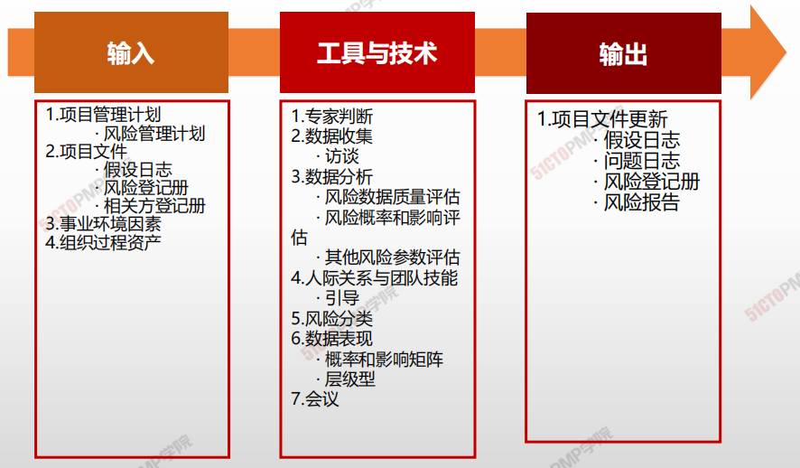
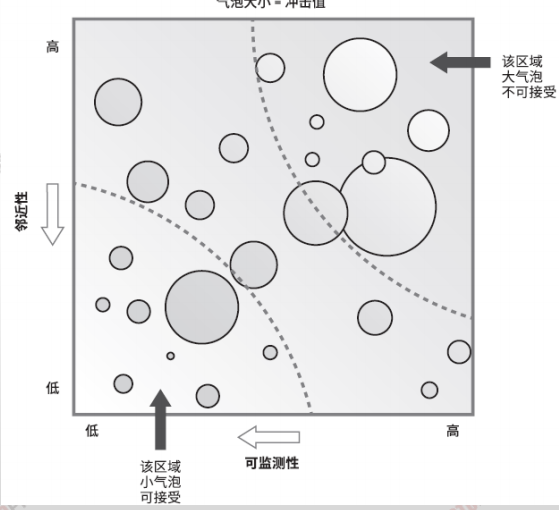
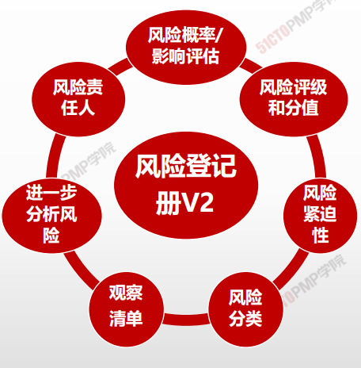
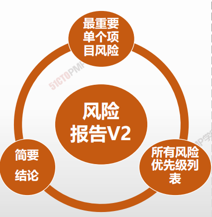

# 实施定性风险分析

## 概述

**<u>定性风险分析</u>：是指对已识别风险的影响和可能性大小的评估过程**

* 定性风险分析的关注重点是风险的**概率**和**影响**两个方面

* 该过程按风险对项目目标潜在影响的轻重缓急进行排序，并

为定量风险分析奠定了基础。

## 4W1H

| 4W1H                | **实施定性风险分析**                                         |
| ------------------- | :----------------------------------------------------------- |
| what 做什么     | 实施定性风险分析是通过评估单个项目风险发生的概率和影响以及其他特征，对风险进行优先级排序，从而为后续分析或行动提供基础的过程。 作用：重点关注高优先级的风险 |
| why 为什么做    | 实施定性风险分析，使用项目风险的发生概率、风险发生时对项目目标的相应影响以及其他因素，来评估已识别单个项目风险的优先级。这种评估基于项目团队和其他相关方对风险的感知度，从而具有主观性 |
| who 谁来做      | 项目经理与项目管理和项目外部资深人员。                       |
| when 什么时候做 | 本过程需要在整个项目期间开展                                 |
| how 如何做      | 根据风险管理计划的规定，在整个项目生命周期中要定期开展实施定性风险分析过程。在敏捷开发环境中，实施定性风险分析过程通常要在每次迭代开始前进行。 <u>专家判断、数据收集、数据分析、人际关系与团队技能、风险分类、数据表现、会议</u> |

## 输入/工具技术/输出

1. 输入
   1. 项目管理计划
      * 风险管理计划
   2. 项目文件
      - 假设日志
      - 风险登记册
      - 相关方登记册
   5. 事业环境因素
   6. 组织过程资产
2. 工具与技术
   1. 专家判断
   2. 数据收集
      - 访谈
   3. 数据分析
      - 风险数据质量评估
      - 风险概率和影响评估
      - 其他风险参数评估
   4. 人际关系与团队技能
      - 引导
   5. 风险分类
   6. 数据表现
      - 概率和影响矩阵
      - 层级型
   7. 会议
3. 输出
   3. 项目文件更新
      - 假设日志
      - 问题日志
      - 风险登记册
      - 风险报告

## 风险数据质量评估

- 评估风险数据对风险管理的**有用程度**的一种技术
  - 考察风险数据的**准确性、质量、可靠性**和**完整性**
  - 若无法接受数据的质量，则需**重新收集**更好的数据

## 层级型

## 项目文件更新

1. 实施定性风险分析是评估风险发生的概率和影响
以及其他特征，对风险进行优先级排序，从而为
后续分析或行动提供基础的过程
2. 要对每个已识别的单个项目风险进行概率和影响
评估
3. 概率和影响矩阵是把每个风险发生的概率和一旦
发生对项目目标的影响映射起来的表格，用于对
风险排序