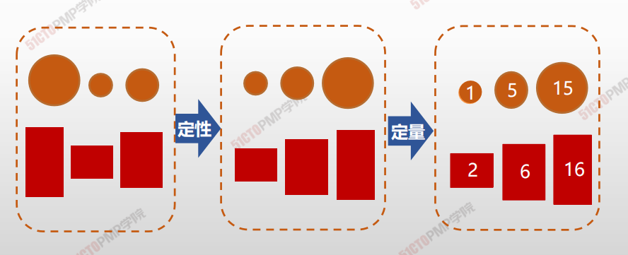
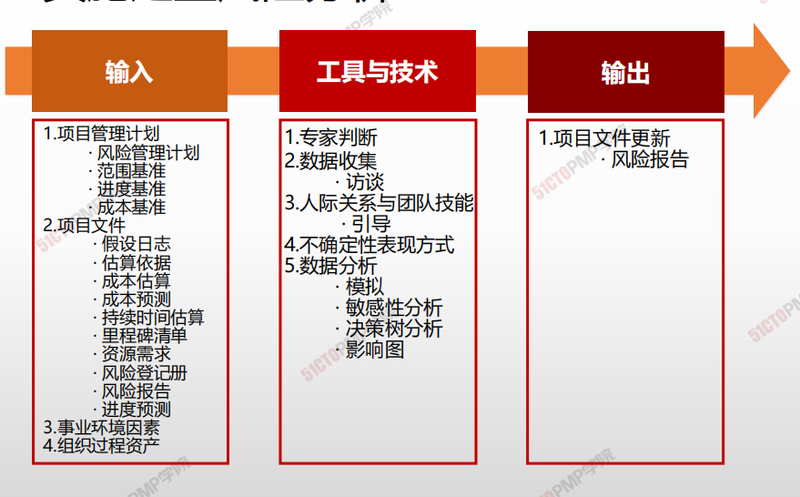
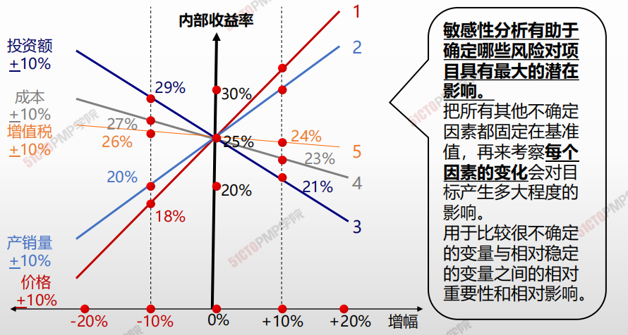
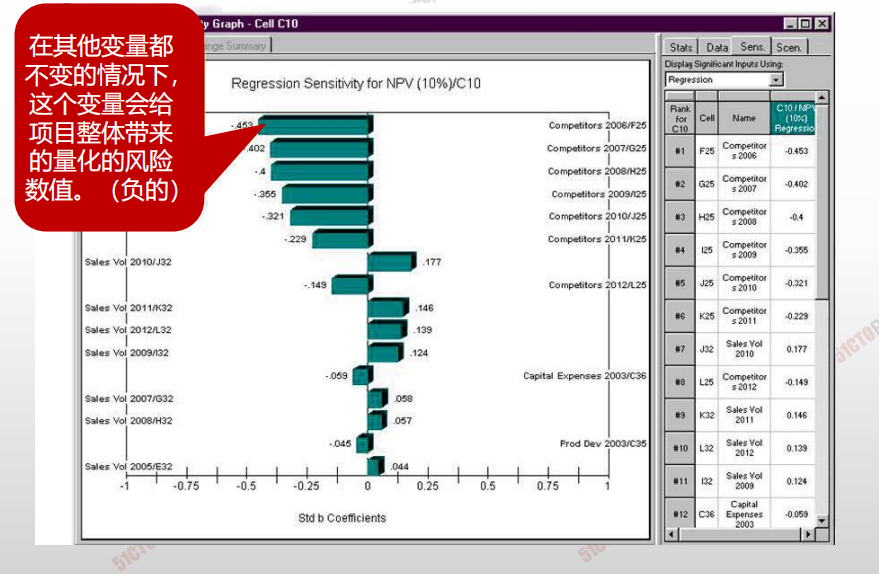
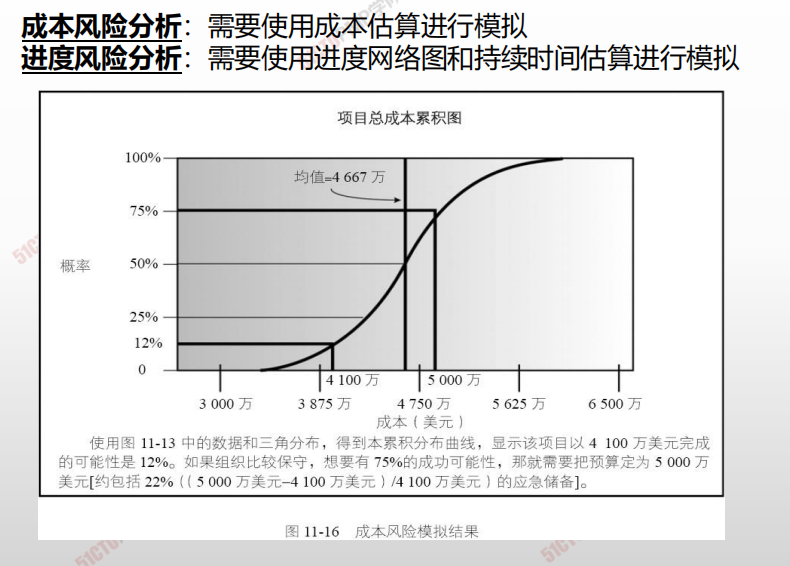

# 实施定性风险分析

## 定性风险分析vs.定量风险分析

- 定性风险分析：对**单个**风险进行**排序**。**主观**判断。
- 定量风险分析：对**整体**风险的影响进行**量化**估算。**客观**评价。

## 4W1H

| 4W1H                | **实施定量风险分析**                                         |
| ------------------- | :----------------------------------------------------------- |
| what 做什么     | 实施定量风险分析是就已识别的单个项目风险和不确定性的其他来源对整体项目目标的影响进行定量分析的过程。 <u>作用</u>：量化整体项目风险敞口，并提供额外的定量风险信息，以支持风险应对规划。 |
| why 为什么做    | 通过评估所有单个项目风险和其他不确定性来源对项目结果的综合影响，定量风险分析就成为评估整体项目风险的唯一可靠的方法。 |
| who 谁来做      | 项目经理与项目管理团队外加**一名熟练的引导者。**             |
| when 什么时候做 | 本过程并非每个项目必需，但如果采用，它会在整个项目期间持续 开展。 |
| how 如何做      | 实施定量风险分析过程的输出，则要用作规划风险应对过程的输入，特别是要据此为整体项目风险和关键单个项目风险推荐应对措施。定量风险分析也可以在规划风险应对过程之后开展，以分析已规划的应对措施对降低整体项目风险敞口的有效性。 <u>专家判断、数据收集、人际关系与团队技能、不确定性表现方式、数据分析</u> |

## 输入/工具技术/输出

1. 输入
   1. 项目管理计划
      * 风险管理计划
      * 范围基准
      * 进度基准
      * 成本基准
   2. 项目文件
      - 假设日志
      - 估算依据
      - 成本估算
      - 成本预测
      - 持续时间估算
      - 里程碑清单
      - 资源需求
      - 风险登记册
      - 风险报告
      - 进度预测
   5. 事业环境因素
   6. 组织过程资产
2. 工具与技术
   1. 专家判断
   2. 数据收集
      - 访谈
   4. 人际关系与团队技能
      - 引导
   5. 不确定性表现方式
   5. 数据分析
      - 模拟
      - 敏感性分析
      - 决策树分析
      - 影像图
3. 输出
   3. 项目文件更新
      - 风险报告

## 敏感性分析

**敏感性分析有助于确定哪些风险对项目具有最大的潜在影响。**
把所有其他不确定因素都固定在基准值，再来考察**每个因素的变化**会对目标产生多大程度的影响。
用于比较很不确定的变量与相对稳定的变量之间的相对重要性和相对影响。

## 龙卷风图

## 决策树分析

通常采用决策树图表进行分析，描述了每种可能的选择和这种情况发

生的概率

综合考虑每种选择的成本及其概率

通过决策树分析可以找出每种选择

的具体情况，包括成本、预期回报等定量分析

## 蒙特卡罗技术

---

1. 实施定量风险分析是就已识别的单个项目风险和
不确定性的其他来源对整体项目目标的影响进行
定量分析的过程
2. 一般先进行风险的定性分析，对风险相对清晰的
认识后，定量风险分析需要高质量的基础数据，
消耗比较大的人力、物力和时间，只有重要的风
险才进行定量分析
3. 可以利用决策树分析在若干备选行动方案中选择
一个最佳方案