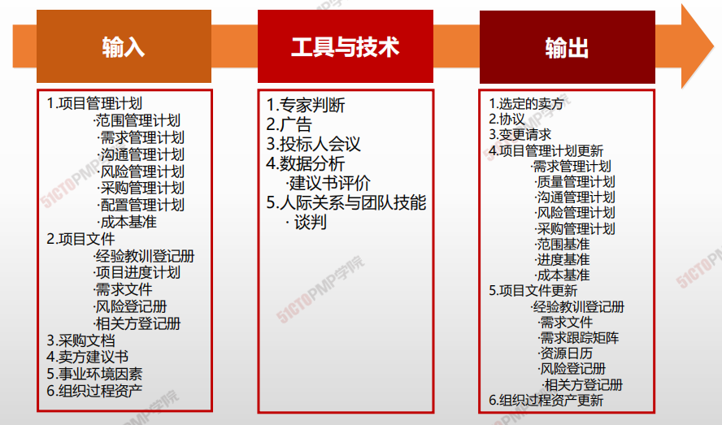
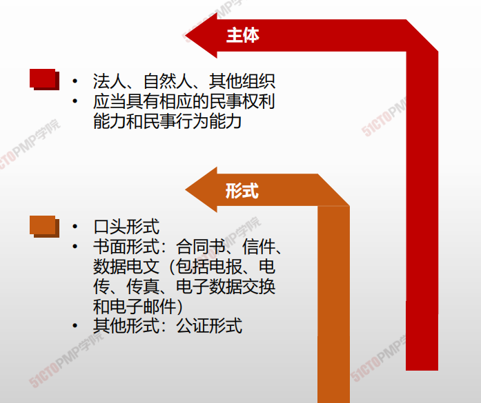
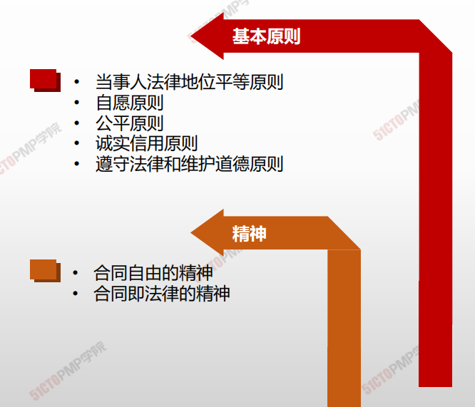
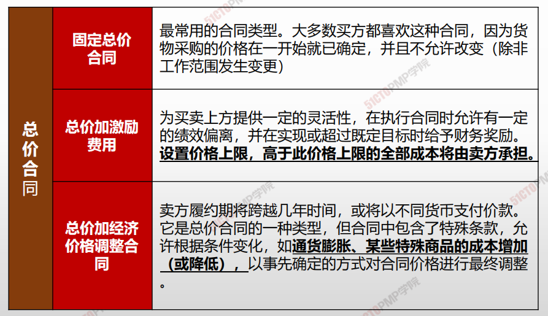
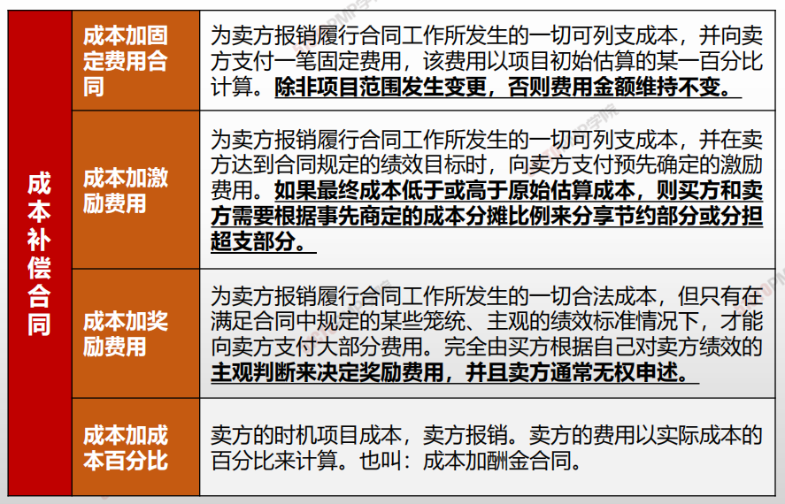
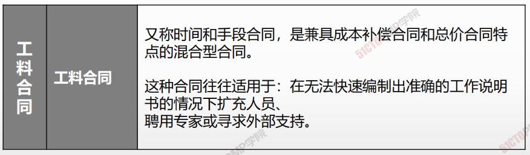
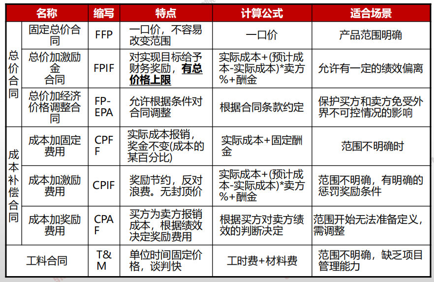
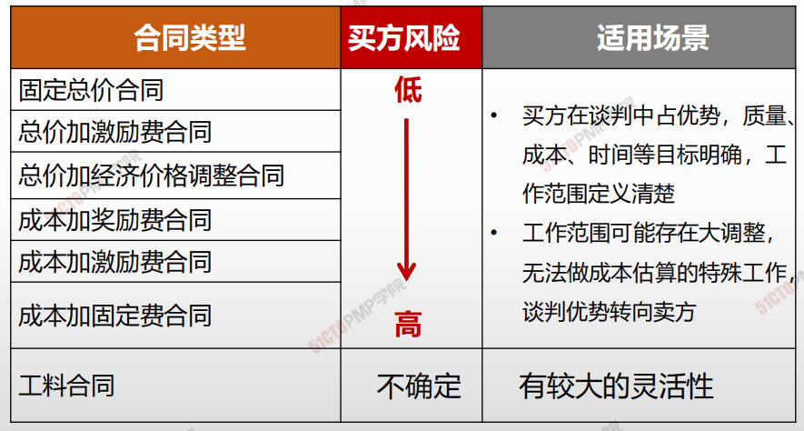

# 03.实施采购

## 实施采购

### 4W1H

| 4W1H                 | 实施采购                                                                               |
| -------------------- | ---------------------------------------------------------------------------------- |
| 
what 做什么
   | 
获取卖方应答、选择卖方并授予合同的过程。 作用：选定合格卖方并签署关于货物或服务交付的法律协议。
                         |
| 
why 为什么做
   | 实际进行采购                                                                             |
| 
who 谁来做
    | 组织中的职能部门或项目经理                                                                      |
| 
when 什么时候做
 | 执行时做                                                                               |
| 
how 如何做
    | 
采用投标人会议，建议书评价技术，独立估算，广告，因特网搜索，采购谈判和专家判断来采购。 专家判断、广告、投标人会议、数据分析、人际关系与团队技能
 |

### 输入/工具技术/输出

1. 输入
   3. 项目管理计划
      * 范围管理计划
      * 需求管理计划
      * 沟通管理计划
      * 风险管理计划
      * 采购管理计划
      * 配置管理计划
      * 成本基准
   4. 项目文件
      * 经验教训登记册
      * 项目进度计划
      * 需求文件
      * 风险登记册
      * 相关方登记册
   5. 采购文档
   6. 卖方建议书
   7. 事业环境因素
   8. 组织过程资产
2. 工具与技术
   1. 专家判断
   2. 广告
   3. 招标人会议
   4. 数据分析
      * 建议书评价
   5. 人际关系与 团队技能
      * 谈判
3. 输出
   1. 选定的卖方
   2. 协议
   3. 变更请求
   4. 项目管理计划更新
      * 需求管理计划
      * 质量管理计划
      * 沟通管理计划
      * 风险管理计划
      * 采购管理计划
      * 范围基准
      * 进度基准
      * 成本基准
   5. 项目文件更新
      * 经验教训登记册
      * 需求文件
      * 需求跟踪矩阵
      * 资源日历
      * 风险登记册
      * 相关方登记册
   6. 组织过程资产更新

## 采购谈判

* 采购谈判指在合同签署之前，对合同的结构、要求以及其他条款加以澄清，以取得一致意见。最终的合同措辞应该反映**双方达成的全部一致意见。**
* 谈判的内容应包括：责任、进行变更的权限、使用的条款和法律、技术和商务要求、所有权、合同融资、技术解决方案、总体进度计划、付款以及价格等。

### 协议

合同是对双方都有**约束力的协议**，它**强制卖方**提供规定的产品、

服务或成果，**强制买方**向卖方支付相应的报酬。

主要内容有（不限于）：

* 采购工作说明书或主要**可交付成果**
* **进度计划、里程碑，或进度计划中规定的**日期\*\*
* 绩效报告
* **定价和支付条款**
* 检查、质量和\*\*验收标准
* 激励和惩罚
* 保险和履约保函
* **终止条款和替代争议解决方法**
* ……

### 合同的基本原则和精神

### 合同类型

### 合同类型及其适用场景

### 合同类型与风险分摊

***

1. 实施采购是获取卖方应答，选择卖方并授予合 同的过程
2. 合同是对双方都有约束力的协议，它强制卖方 提供规定的产品、服务或成果，强制买方向卖 方支付相应的报酬
3. 实施采购过程将更新资源日历中资源的数量和 可用性，可能会影响进度计划
