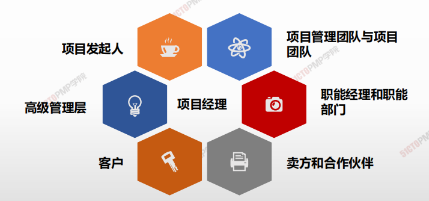
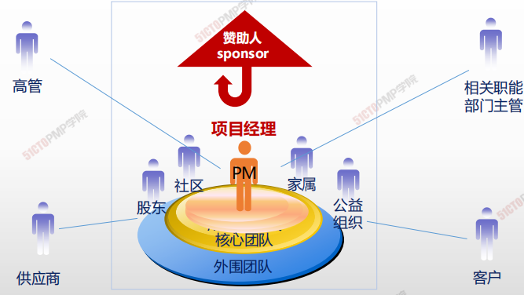
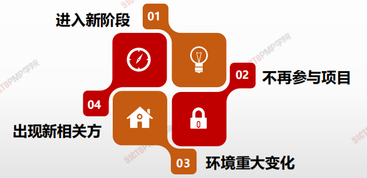
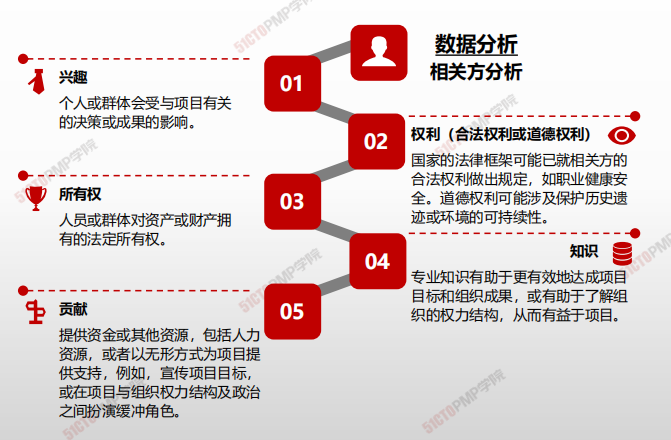
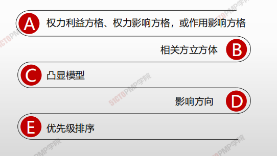
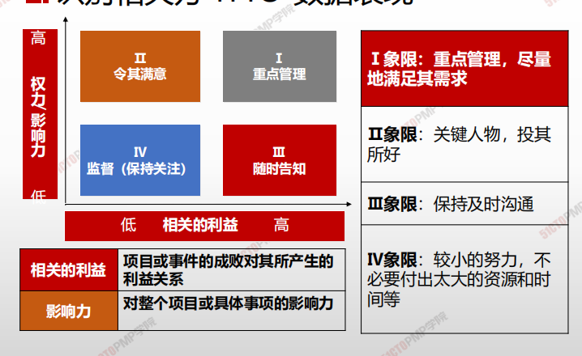
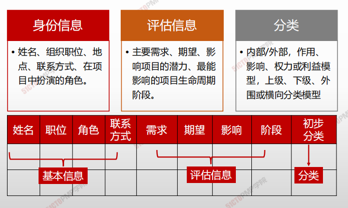

# 识别相关方

### 项目发起人

**项目发起人是为项目提供资金和其他重要资源的人**

- 项目发起人在提出项目的初步设想之后会组织专家开展项目商业论证，然后对可行的项目落实所需资金。
- 项目发起人亲自领导项目启动工作。
- 在项目正式启动之后，发起人应该授权项目经理管理项目，并充当项目最重要的高层支持者。 
- 发起人应该对项目及其成果提出一些原则性要求。
- 发起人可以亲自起草项目章程或授权项目经理代为起草。
- 发起人可以亲自签发项目章程或授权项目执行组织高级管理层签发。
- 发起人应该与其他重要项目相关方（如客户）一起验收项目成果
- 应该由项目发起人或其授权人员宣布项目正式关闭（结束）。

>  **知道谁是大BOSS特别重要！**

### 高级管理层

**高级管理层是项目执行组织中高于项目经理的全体管理者的集合。**

高级管理层又包括如下主要成员: 

- **项目治理委员会**：项目的高层决策机构。

- **项目组合经理**：负责确保项目与组织战略的一致性。

- **项目集经理**：负责管理项目集中的各个项目之间的横向联系。

- **项目管理办公室**：项目执行组织中负责管理项目管理工作的常设职能部门。

### 客户

**客户是项目成果的使用者，既包括直接使用者，也包括间接使用者。**

**一个项目可能有多种客户。**

- 必须在起草和签发项目章程时就明确谁是本项目的客户了解客户对项目的重要利益追求。
- 对于项目经理来讲，发起人或高级管理层本身也是客户，至少也是客户之

> 众多项目相关方之间有利益冲突，发起人、高级管理层或项目经理应该尽力协调相关方之间的利益冲突。如果实在无法协调，通常应该按有利于客户的原则进行处理。
>
> >  **客户利益至上！**

### 项目经理

- 项目发起人或高级管理层应该尽早指定项目经理。
- 项目经理尽早参与项目工作，有利于项目成功。
- 项目章程中赋予项目经理管理项目的权责，往往是职责大于职权。 
- 项目经理面没有足够的正式权力，用其他权力来弥补正式权力的不足，如专家权力、参照权力等，也要把项目做成功。 
- 项目经理应该积极主动地工作，而不是消极被动地工作。要主动预防问题的出现，并积极解决已经出现的问题。
- 项目经理作为项目管理专业人士，必须理解并遵守项目管理的职业要求（如职业道德）。
- 项目经理控制着项目，但不一定控制着资源。 
- 项目经理作为一个整合者，应该在更大程度上是一个通才而不是专才。

>  **人微责重 权小事多**

### 项目管理团队、职能经理、合作伙伴

---

**项目管理团队与项目团队**

项目经理应该把主要相关方都看成项目团队的组成部分。

---

**职能经理**

- 参与项目启动工作，参与制定项目目标，参与项目计划的编制和审批工作。
- 与项目经理就项目所需的资源进行协商，分派具体人员到项目上去。
- 就自己部门的专业领域，向项目提供技术支持

---

**卖方和合作伙伴**

通过合同为项目提供货物、服务或其他成果的人，就是

卖方。

---

### 相关方管理的核心概念

> > **识别相关方：要全面、要尽早、要迭代开展，关注变化，引导参与**

### 什么时候识别全部潜在相关方？

> > **尽早、全面开始识别相关方并引导相关方参与**
>
> > **相关方满意度应作为项目目标加以识别和管理**

### 如何360度识别全部潜在相关方？

> 由于涉及范围广泛，采用360度法来识别全部潜在的相关方，填入相关方登记表中。识别后应采用专家判断法进行筛选和确认

**后方相关方：**市场部、用户、审计部

**上方相关方**：赵副总经理

**左侧相关方**：广告公司、媒体、分销商、代言人、设备厂家、售后服务、设备代理商、 竞争对手

**右侧相关方**：财务部、人力资源部、公众客户部

**前方相关方**：公司内部专家及外部专家

**下方相关方**：钱进度主管、孙成本主管、 李质量主管

## 4W1H

| 4W1H                | **识别相关方**                                               |
| ------------------- | ------------------------------------------------------------ |
| what 做什么     | 识别相关方是定期识别项目相关方，分析和记录他们的利益、参与度、相互依赖性、影响力和对项目成功的潜在影响的过程。 <u>作用：</u>使项目团队能够建立对每个相关方或相关方群体的适度关注 |
| why 为什么做    | 每个项目都有相关方，他们会受项目的积极或消极影响，或者能对项目施加积极或消极的影响。有些相关方影响项目工作或成果的能力有限，而有些相关方可能对项目及其期望成果有重大影响。 |
| who 谁来做      | 本过程需在必要时重复开展，至少应在每个阶段开始时，以及项目或组织出现重大变化时重复开展。 |
| when 什么时候做 | 执行时做                                                     |
| how 如何做      | 每次重复开展本过程，都应通过查阅项目管理计划组件及项目文件，来识别有关的项目相关方。 <u>专家判断、数据收集、数据分析、数据表现、会议</u> |

## 输入/工具技术/输出

1. 输入

   1. 项目章程
   2. 商业文件
      - 商业论证
      - 效益管理计划
   3. 项目管理计划
      - 沟通管理计划
      - 相关方参与计划
   4. 项目文件
      - 变更日志
      - 问题日志
      - 需求文件
   5. 协议
   6. 事业环境因素
   7. 组织过程资产

2. 工具与技术

   1. 专家判断
   2. 数据收集
      - 问卷调查
      - 头脑风暴
   3. 数据分析
      - 相关方分析
      - 文件分析
   4. 数据表现
      - 相关方映射分析/表现
   5. 会议

3. 输出

   1. 相关方登记册
   2. 变更请求
   3. 项目管理计划更新
      - 需求管理计划
      - 沟通管理计划
      - 风险管理计划
      - 相关方参与计划
   4. 项目文件更新
      - 假设日志
      - 问题日志
      - 风险登记册

   

## 数据分析

## 数据表现

相关方映射分析和表现是一种利用不同方法对相关方进行分类的方法。对相关方进行分类有助于团队与已识别的项目相关方建立关系。

常见的分类方法包括：

## 相关方登记册

---

1. 识别相关方是定期识别项目相关方，分析和记
录他们的利益、参与度、相互依赖性、影响力
和对项目成功的潜在影响的过程
2. 《相关方登记册》是识别相关方过程的主要输
出，记录已识别相关方的身份信息、评估信息
和相关方分类
3. 应识别全部潜在项目相关方及其相关信息
4. 权力/利益方格就是根据相关方的职权大小以及
对项目结果的关注程度进行分组

