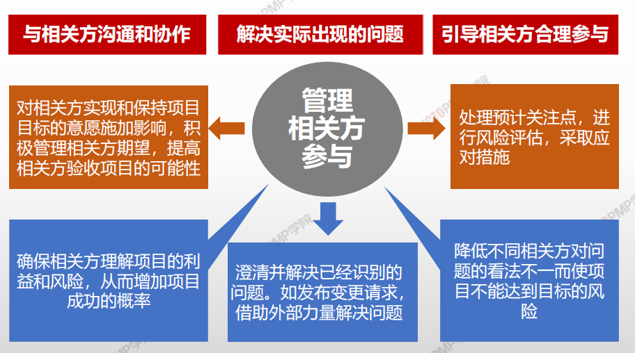
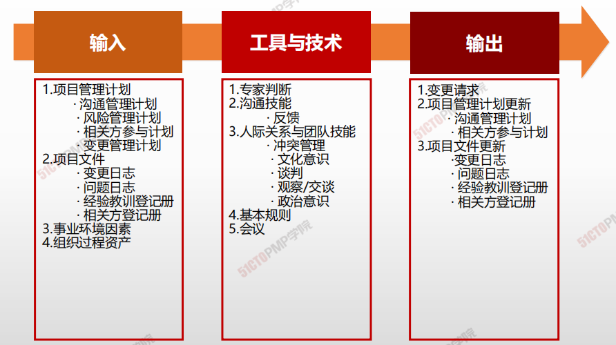

# 04.管理相关方参与

## 4W1H

| 4W1H                 | **管理相关方参与**                                                                                |
| -------------------- | ------------------------------------------------------------------------------------------ |
| 
what 做什么
   | 
管理相关方参与是与相关方进行沟通和协作以满足其需求与期望、处理问题，并促进相关方合理参与的过程。 作用：让项目经理能够提高相关方的支持，并尽可能降低相关方的抵制
 |
| 
why 为什么做
   | 有助于确保相关方明确了解项目目的、目标、收益和风险，以及他们的贡献将如何促进项目成功。                                                |
| 
who 谁来做
    | 项目管理团队                                                                                     |
| 
when 什么时候做
 | 计划制定后，按照计划执行。                                                                              |
| 
how 如何做
    | 
使用沟通方法，人际关系技能和管理技能 专家判断、沟通技能、人际关系与团队技能、基本规则、会议
                                   |

## 输入/工具技术/输出

1. 输入
   3. 项目管理计划
      * 资源管理计划
      * 风险管理计划
      * 相关方管理计划
      * 变更管理计划
   4. 项目文件
      * 变更日志
      * 问题日志
      * 经验教训登记册
      * 相关方登记册
   5. 事业环境因素
   6. 组织过程资产
2. 工具与技术
   1. 专家判断
   2. 沟通技能
      * 反馈
   3. 人际关系与团队技能
      * 冲突管理
      * 文化意识
      * 谈判
      * 观察/交谈
      * 政治意识
   4. 基本规则
   5. 会议
3.  输出

    1. 变更请求
    2. 项目管理计划更新
       * 沟通管理计划
       * 相关方参与计划
    3. 项目文件更新
       * 变更日志
       * 问题日志
       * 经验教训登记册
       * 相关方登记册

    ***

    1. 管理相关方参与是与相关方进行沟通和协作以 满足其需求与期望、处理问题，并促进相关方 合理参与的过程
    2. 管理相关方参与的目标是让项目经理能够提高 相关方的支持，并尽可能降低相关方的抵制
    3. 在开展管理相关方参与过程时，应根据沟通管 理计划，针对每个相关方制定相应的沟通方法
