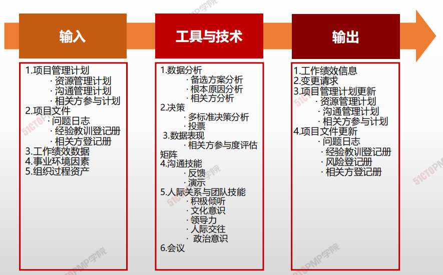
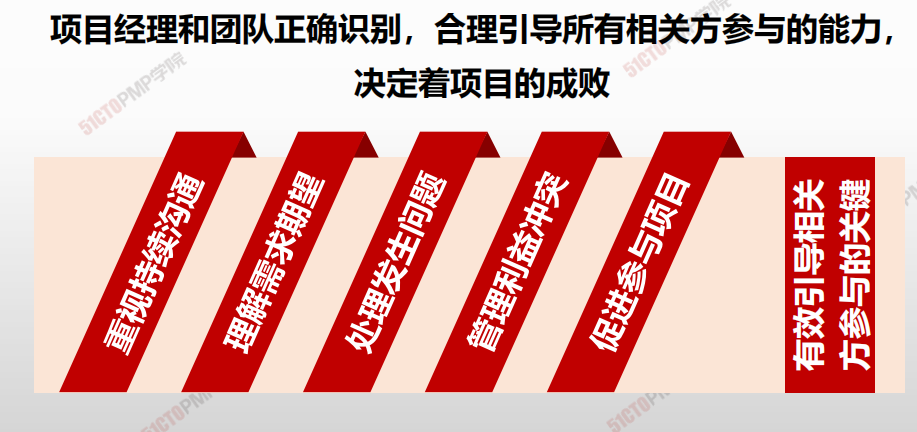

# 05.监督相关方参与

## 4W1H

| 4W1H                 | **监督相关方参与**                                                                                 |
| -------------------- | ------------------------------------------------------------------------------------------- |
| 
what 做什么
   | 
监督相关方参与是监督项目相关方关系，并通过修订参与策略和计划来引导相关方合理参与项目的过程。 作用：随着项目进展和环境变化，维持或提升相关方参与活动的效率和效果。
 |
| 
why 为什么做
   | 随着项目进展和环境变化，维持或提升相关方参与活动的效率和效果。                                                             |
| 
who 谁来做
    | 项目管理团队。                                                                                     |
| 
when 什么时候做
 | 本过程需要在整个项目期间开展                                                                              |
| 
how 如何做
    | 
关键绩效，关注参与度，灵活调整策略。 数据分析、决策 、数据表现、沟通技能、人际关系与团队技能、会议
                                |

## 输入/工具技术/输出

1. 输入
   3. 项目管理计划
      * 资源管理计划
      * 沟通管理计划
      * 相关方管理计划
   4. 项目文件
      * 问题日志
      * 经验教训登记册
      * 相关方登记册
   5. 工作绩效数据
   6. 事业环境因素
   7. 组织过程资产
2. 工具与技术
   1. 数据分析
      * 备选方案分析
      * 根本原因分析
      * 相关方分析
   2. 决策
      * 多标准决策分析
      * 投票
   3. 数据表现
      * 相关方参与度评估矩阵
   4. 沟通技能
      * 反馈
      * 演示
   5. 人际关系与团队技能
      * 积极倾听
      * 文化意识
      * 领导力
      * 人际交往
      * 政治意识
   6. 会议
3.  输出

    1. 工作绩效信息
    2. 变更请求
    3. 项目管理计划更新
       * 资源管理计划
       * 沟通管理计划
       * 相关方参与计划
    4. 项目文件更新

    ***

    1. 监督相关方参与是监督项目相关方关系，并通 过修订参与策略和计划来引导相关方合理参与 项目过程
    2. 通过获得反馈确保发送给相关方的信息被接收 和理解
    3. 通过积极倾听，减少理解错误和沟通错误
    4. 使用相关方参与度评估矩阵，来跟踪每个相关 方参与水平的变化，对相关方参与加以监督
    5. 工作绩效信息记录了相关方当前支持水平与期 望参与水平进行比较的结果

    

