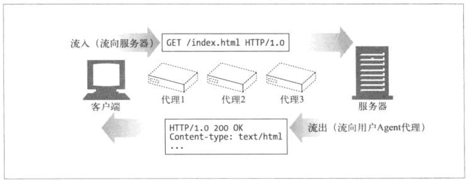
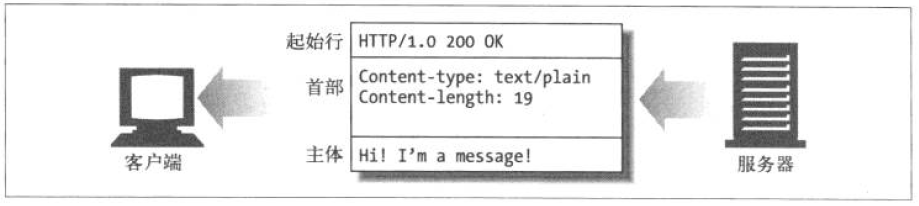
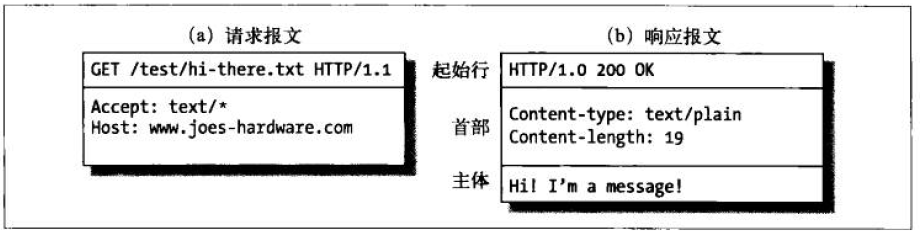
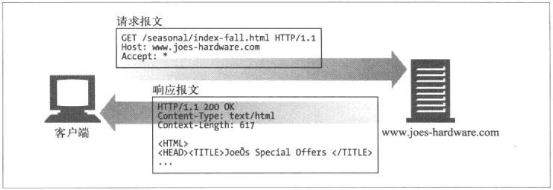
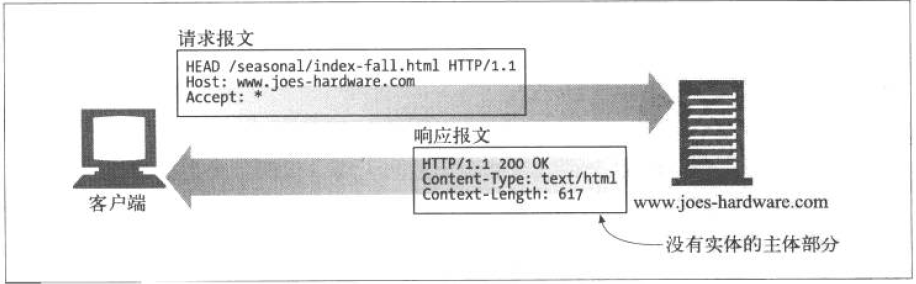
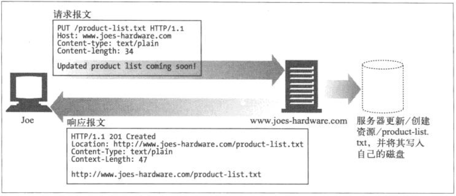
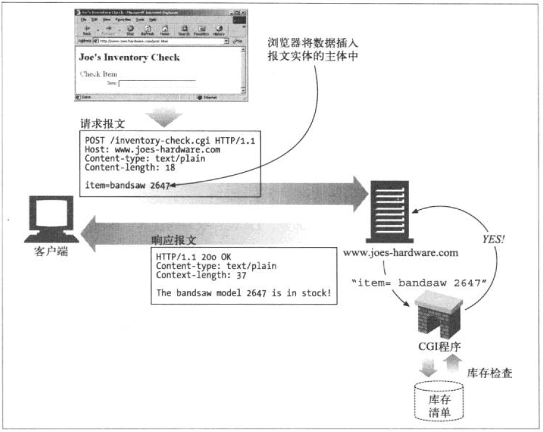
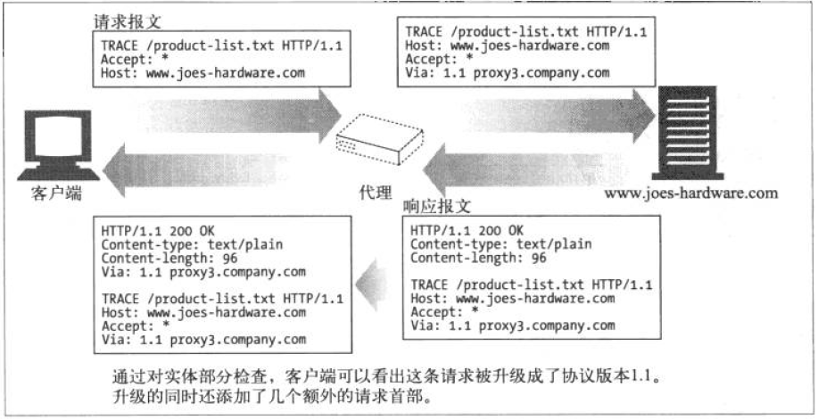
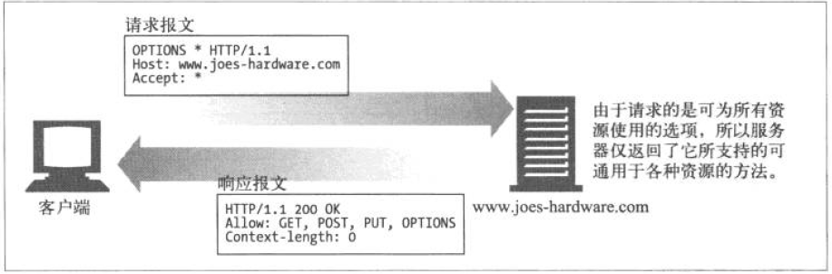
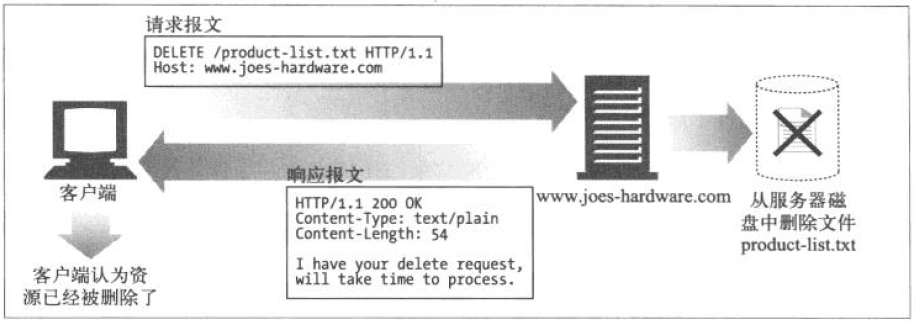

# 1.报文流

`HTTP`报文是在`HTTP`应用之间发送的数据块. 这些数据块以一些文本的形式`元信息`开头, 这些信息描述了报文的内容以及含义, 后面跟着可选的数据部分. 这些报文在`客户端` \ `服务器` \ `代理`之间流动.

术语`流入` \ `流出` \ `上游` \ `下游` ,都是来描述报文的流向的.

## 1.1报文流入远端服务器

HTTP使用术语`流入`和`流出`来描述事务处理的方向.

报文流入源端服务器, 工作完成之后, 回流会用户的`Agent`代理中



## 1.2报文向下流动

HTTP报文会像河水一样流动. 不管是请求报文还是响应报文, 所有的报文都会向`下游`流动, 所有的报文的发送者都在接收者的`上游`. 对请求报文来说, `代理1`位于`代理3`的`上游`, 但对响应报文来说, 它就位于`代理3`的`下游`.


# 2.报文的组成

HTTP报文是简单格式化数据块, 每条报文都包含一个来自客户端的请求, 或者来自服务器的响应. 他们由三个部分组成:

1. 对报文进行描述的`起始行(start line)`
2. 包含属性的`首部(header`
3. 可选的数据`主体(body)`



* 起始行和首部是由行分隔符的`ASCII`文本.
* 每行都以一个有两个字符组成的终止序列作为结束,其中包括一个`回车符(ASCII码13)`和一个`换行符(ASCII码10)`
* 这个行终止序列可以写作`CRLF`.
* 需要指出的是,尽管HTTP规范中说明应该用`CRLF`来表示行终止,但文件的应用程序也应该接受带个换行符作为行终止
* 有的老的,或者不完整的HTTP应用程序并不总是及发送回车符,又发送换行符
* 实体的主体或报文的主体是一个可选的数据块, 与起始行和首部不同的是, 主体可以包含文本或二进制数据, 也可以是空

## 2.1报文的语法

所有HTTP报文都可以分为两类:`请求报文(request message)`和`响应报文(response message)`.

请求报文会向Web服务器请求一个动作. 响应报文会将请求的结果返回给客户端.


这是请求报文的格式

```
<method> <request-URL> <version>
<headers>

<entity-body>
```

这是响应报文

```
<version> <status> <reason-phrase>
<headers>

<entity-body>
```

下面是对各部分的简要概述

* 方法(method)

  客户端希望服务器对资源执行的动作, 是一个单独的词, 比如`get` `head` 或 `post`
* 请求URL(request-URL)

  命名了所有请求资源, 或者URL路径组件的完整URL. 如果直接与服务器进行对话, 只要URL的路径组件是资源的绝对路径, 通常就不会有什么问题--服务器可以假定自己是一个URL的主机/端口
* 版本(version)

  报文所使用的HTTP版本,其格式为:

  ```
  HTTP/<major>.<minor>
  ```

  `magor` 是主要版本

  `minor` 是次要版本
* 状态码(status-code)

  这三位数描述了请求过程中所发生的情况, 每个状态码的第一位数字都用于描述状态的一半类别("成功" / "出错"等)
* 原因短语(reason-phrase)

  数字状态妈的可读版本,包含行终止序列之前所有的文本, 元婴短语只对人类有意义
* 首部(headers)

    * 可以有零个或者多个首部,每个首部都包含一个名字,后面跟着一个冒号(`:`)然后是一个可选的空格,接着是一个值,最后一个是`CRLF`
    * 首部是由一个`CRLF`结束的, 表示首部和实体主体的开始
    * 有些HTTP版本,比如`HTTP/1.1`要求有效的请求或相应报文中必须包含特定的首部
* 实体的主体部分(entity-body)

  实体的主体部分包含一个任意数据组成的数据块.



> 注意:一组HTTP首部总是应该以一个空行(单个CRLF)结束,甚至即使没有首部和实体的主体部分也应该如此. 但由于历史原因, 很多客户端都没在实体的主图部分是,省略了CRLF. 为了与这些流行但不符合规则的实现互通, 客户端和服务器最终都应该接受哪些没有CRLF的报文.

## 2.2起始行

所有的HTTP报文都以一个起始行作为一个开始, 请求报文的起始行说明了要做些什么. 响应报文的起始行说明了发生了什么

### a. 请求行

请求报文请求服务器对资源进行一些操作。请求报文的起始行,或称为请求行,包含了一个方法和一个请求URL,这个方法描述了服务器应该执行的操作,请求URL描述了要对哪个资源执行这个方法。请求行中还包含HTTP的版本,用来告知服务器,客户端使用的是哪种HTTP.

所有这些字段都由空格符分隔。在图3-5a中,请求方法为GET,请求URL为`ltest/hi-there.txt`,版本为`HTTP/1.1`。在`HTTP1.0`之前,并不要求请求行中包含 HTTP版本号。

### b. 响应行

响应报文承载了状态信息和操作产生的所有结果数据,将其返回给客户端。

响应报文的起始行,或称为响应行,包含了响应报文使用的HTTP版本、数字状态码,以及描述操作状态的文本形式的原因短语。

所有这些字段都由空格符进行分隔。

HTTP版本为HTTP/1.0,状态码为200 (表示成功),原因短语为OK,表示文档已经被成功返回了。

在HTTP/1.0之前,并不要求在响应中包含响应行。

### c. 方法

请求的起始行以方法作为开始,方法用来告知服务器要做些什么。比如,在行 `GET /specials/saw-blade.gif HTTP/1.0`中,方法就是GET.

| 方法    | 描述                                             | 是否包含主体 |
| --------- | -------------------------------------------------- | -------------- |
| GET     | 获取文档                                         | 否           |
| HEAD    | 获取文档的首部                                   | 否           |
| POST    | 发送需要处理的数据                               | 是           |
| PUT     | 将请求的主体部分存储在服务器上                   | 是           |
| TRACE   | 对可能经过代理服务器传送到服务器上的报文进行追踪 | 否           |
| OPTIONS | 决定在服务器上执行哪些方法                       | 否           |
| DELETE  | 从服务器上删除一份文档                           | 否           |

由于HTTP设计得易于扩展,所以除了这些方法之外,其他服务器可能还会实现一些自己的请求方法。这些附加的方法是对HTTP规范的扩展,因此被称为扩展方法。

### d. 状态码

方法是用来告诉服务器做什么事情的,状态码则用来告诉客户端,发生了什么事情。

状态码位于响应的起始行中。比如,在行HTTP/1.0 200 OK中,状态码就是200。

| 整体范围 | 已定义范围 | 分类       |
| ---------- | ------------ | ------------ |
| 100~199  | 100~101    | 信息提示   |
| 200~299  | 200~206    | 成功       |
| 300~399  | 300~305    | 重定向     |
| 400~499  | 400~415    | 客户端错误 |
| 500~599  | 500~505    | 服务器错误 |

### e. 短语原因

原因短语是响应起始行中的最后一个组件。它为状态码提供了文本形式的解释。比如,在行HTTP/1.0200 OK中, OK就是原因短语。原因短语和状态码是成对出现的。

原因短语是状态码的可读版本,应用程序开发者将其传送给用户,用以说明在请求期间发生了什么情况。

### f. 版本号

版本号会以HTTP/x.y的形式出现在请求和响应报文的起始行中。为HTTP应用程序 ,提供了一种将自己所遵循的协议版本告知对方的方式。

## 2.4主体部分

# 3.方法

即使服务器实现了所有这些方法,这些方法的使用很可能也是受限的。

## 3.1安全方法

HTTP定义了一组被称为安全方法的方法。GET方法和HEAD方法都被认为是安全的,这就意味着使用GET或HEAD方法的HTTP请求都不会产生什么动作。

不产生动作,在这里意味着HTTP请求不会在服务器上产生什么结果。例如,你在 Joe的五金商店购物时,点击了“提交购买”按钮。点击按钮时会提交一个带有信用卡信息的POST请求(稍后讨论),那么在服务器上,就会为你执行一个动作。在这种情况下,为购买行为支付信用卡就是所执行的动作。

安全方法并不一定是什么动作都不执行的(实际上,这是由Web开发者决定的)。使用安全方法的目的就是允许HTTP应用程序开发者通知用户,什么时候会使用某个可能引发某些动作的不安全方法。在Joe的五金商店的例子中,你的Web浏览器可能会弹出一条警告消息,说明你正在用不安全的方法发起请求,这样可能会在服务器上引发一些事件(比如用你的信用卡支付费用)。

## 3.2 GET

GET是最常用的方法。通常用于请求服务器发送某个资源。HTTP/1.1要求服务器 ,实现此方法。图显示了一个例子,在这个例子中,客户端用GET方法发起了一次HTTP请求。



## 3.3 HEAD

HEAD方法与GET方法的行为很类似,但服务器在响应中只返回首部。不会返回实 ,体的主体部分。这就允许客户端在未获取实际资源的情况下,对资源的首部进行检查。使用HEAD,可以:

* 在不获取资源的情况下了解资源的情况(比如,判断其类型) ;
* 通过查看响应中的状态码,看看某个对象是否存在;
* 通过查看首部,测试资源是否被修改了。

服务器开发者必须确保返回的首部与GET请求所返回的首部完全相同。遵循 HTTP/1.1规范,就必须实现HEAD方法。



## 3.4 PUT

与GET从服务器读取文档相反, PUT方法会向服务器写入文档。有些发布系统允许用户创建Web页面,并用PUT直接将其安装到Web服务器上去。



PUT方法的语义就是让服务器用请求的主体部分来创建一个由所请求的URL命名的新文档,或者,如果那个URL已经存在的话,就用这个主体来替代它。

因为PUT允许用户对内容进行修改,所以很多Web服务器都要求在执行PUT之前,用密码登录。

## 3.5 POST

POST方法起初是用来向服务器输入数据的。实际上,通常会用它来支持HTML的表单。表单中填好的数据通常会被送给服务器,然后由服务器将其发送到它要去的地方(比如,送到一个服务器网关程序中,然后由这个程序对其进行处理)。



## 3.6 TRACE

客户端发起一个请求时,这个请求可能要穿过防火墙、代理、网关或其他一些应用·程序。每个中间节点都可能会修改原始的HTTP请求。TRACE方法允许客户端在最终将请求发送给服务器时,看看它变成了什么样子。

TRACE请求会在目的服务器端发起一个“环回”诊断。行程最后一站的服务器会弹回一条TRACE响应,并在响应主体中携带它收到的原始请求报文。这样客户端就可以查看在所有中间HTTP应用程序组成的请求/响应链上,原始报文是否,以及如何被毁坏或修改过



TRACE方法主要用于诊断;也就是说,用于验证请求是否如愿穿过了请求/响应·链。它也是一种很好的工具,可以用来查看代理和其他应用程序对用户请求所产生效果。

尽管TRACE可以很方便地用于诊断,但它确实也有缺点,它假定中间应用程序对各种不同类型请求(不同的方法-GET, HEAD, POST等)的处理是相同的,很多HTTP应用程序会根据方法的不同做出不同的事情-比如,代理可能会将 POST请求直接发送给服务器,而将GET请求发送给另一个HTTP应用程序(比如 Web缓存),
TRACE并不提供区分这些方法的机制。通常,中间应用程序会自行决定对TRACE请求的处理方式

TRACE请求中不能带有实体的主体部分。TRACE响应的实体主体部分包含了响应服务器收到的请求的精确副本。

## 3.7 OPTIONS

OPTIONS方法请求Web服务器告知其支持的各种功能。可以询问服务器通常支持哪些方法,或者对某些特殊资源支持哪些方法。(有些服务器可能只支持对一些特殊类型的对象使用特定的操作)。



## 3.8 DELELE

顾名思义, DELETE方法所做的事情就是请服务器删除请求URL所指定的资源。但是,客户端应用程序无法保证删除操作一定会被执行。因为HTTP规范允许服务器在不通知客户端的情况下撤销请求。



## 3.9 扩展方法

HTTP被设计成字段可扩展的,这样新的特性就不会使老的软件失效了。扩展方法指的就是没有在HTTP/1.1规范中定义的方法。服务器会为它所管理的资源实现一些HTTP服务,这些方法为开发者提供了一种扩展这些HTTP服务能力的手段。

| 方法  | 描述                          |
| ------- | ------------------------------- |
| LOCK  | 允许用户锁定资源,防止别人修改 |
| MKCOL | 允许用户创建资源              |
| COPY  | 便于在服务器上复制资源        |
| MOVE  | 在服务器上移动资源            |

并不是所有的扩展方法都是在正式规范中定义的,认识到这一点很重要。如果你定义了一个扩展方法,很可能大部分HTTP应用程序都无法理解。同样,你的HTTP应用程序也可能会遇到一些其他应用程序在用的,而它并不理解的扩展方法。

在这些情况下,最好对扩展方法宽容一些。如果能够在不破坏端到端行为的情况下,将带有未知方法的报文传递给下游服务器的话,代理会尝试着传递这些报文的。否则,它们会以501 Not Implemented (无法实现)状态码进行响应。最好按惯例“对所发送的内容要求严一点,对所接收的内容宽容一些”来处理扩展方法(以及一般的HTTP扩展)。

# 4.状态码

## 4.1 100~199 信息性状态码

| 状态码 | 状态码英文名称      | 中文描述                                                                                       |
| -------- | --------------------- | ------------------------------------------------------------------------------------------------ |
| 100    | Continue            | 继续。[客户端](http://www.dreamdu.com/webbuild/client_vs_server/)应继续其请求                  |
| 101    | Switching Protocols | 切换协议。服务器根据客户端的请求切换协议。只能切换到更高级的协议，例如，切换到HTTP的新版本协议 |

## 4.2 200~299 成功状态码

| 状态码 | 状态码英文名称                | 中文描述                                                                                           |
| -------- | ------------------------------- | ---------------------------------------------------------------------------------------------------- |
| 200    | OK                            | 请求成功。一般用于GET与POST请求                                                                    |
| 201    | Created                       | 已创建。成功请求并创建了新的资源                                                                   |
| 202    | Accepted                      | 已接受。已经接受请求，但未处理完成                                                                 |
| 203    | Non-Authoritative Information | 非授权信息。请求成功。但返回的meta信息不在原始的服务器，而是一个副本                               |
| 204    | No Content                    | 无内容。服务器成功处理，但未返回内容。在未更新网页的情况下，可确保浏览器继续显示当前文档           |
| 205    | Reset Content                 | 重置内容。服务器处理成功，用户终端（例如：浏览器）应重置文档视图。可通过此返回码清除浏览器的表单域 |
| 206    | Partial Content               | 部分内容。服务器成功处理了部分GET请求                                                              |

## 4.3 300~399 重定向状态码

| 状态码 | 状态码英文名称     | 中文描述                                                                                                                                                         |
| -------- | -------------------- | ------------------------------------------------------------------------------------------------------------------------------------------------------------------ |
| 300    | Multiple Choices   | 多种选择。请求的资源可包括多个位置，相应可返回一个资源特征与地址的列表用于用户终端（例如：浏览器）选择                                                           |
| 301    | Moved Permanently  | 永久移动。请求的资源已被永久的移动到新URI，返回信息会包括新的URI，浏览器会自动定向到新URI。今后任何新的请求都应使用新的URI代替                                   |
| 302    | Found              | 临时移动。与301类似。但资源只是临时被移动。客户端应继续使用原有URI                                                                                               |
| 303    | See Other          | 查看其它地址。与301类似。使用GET和POST请求查看                                                                                                                   |
| 304    | Not Modified       | 未修改。所请求的资源未修改，服务器返回此状态码时，不会返回任何资源。客户端通常会缓存访问过的资源，通过提供一个头信息指出客户端希望只返回在指定日期之后修改的资源 |
| 305    | Use Proxy          | 使用代理。所请求的资源必须通过代理访问                                                                                                                           |
| 306    | Unused             | 已经被废弃的HTTP状态码                                                                                                                                           |
| 307    | Temporary Redirect | 临时重定向。与302类似。使用GET请求重定向                                                                                                                         |

## 4.4 400~499 客户端错误状态码

| 状态码 | 状态码英文名称                  | 中文描述                                                                                                                                                      |
| -------- | --------------------------------- | --------------------------------------------------------------------------------------------------------------------------------------------------------------- |
| 400    | Bad Request                     | 客户端请求的语法错误，服务器无法理解                                                                                                                          |
| 401    | Unauthorized                    | 请求要求用户的身份认证                                                                                                                                        |
| 402    | Payment Required                | 保留，将来使用                                                                                                                                                |
| 403    | Forbidden                       | 服务器理解请求客户端的请求，但是拒绝执行此请求                                                                                                                |
| 404    | Not Found                       | 服务器无法根据客户端的请求找到资源（网页）。通过此代码，网站设计人员可设置"您所请求的资源无法找到"的个性页面                                                  |
| 405    | Method Not Allowed              | 客户端请求中的方法被禁止                                                                                                                                      |
| 406    | Not Acceptable                  | 服务器无法根据客户端请求的内容特性完成请求                                                                                                                    |
| 407    | Proxy Authentication Required   | 请求要求代理的身份认证，与401类似，但请求者应当使用代理进行授权                                                                                               |
| 408    | Request Time-out                | 服务器等待客户端发送的请求时间过长，超时                                                                                                                      |
| 409    | Conflict                        | 服务器完成客户端的PUT请求是可能返回此代码，服务器处理请求时发生了冲突                                                                                         |
| 410    | Gone                            | 客户端请求的资源已经不存在。410不同于404，如果资源以前有现在被永久删除了可使用410代码，网站设计人员可通过301代码指定资源的新位置                              |
| 411    | Length Required                 | 服务器无法处理客户端发送的不带Content-Length的请求信息                                                                                                        |
| 412    | Precondition Failed             | 客户端请求信息的先决条件错误                                                                                                                                  |
| 413    | Request Entity Too Large        | 由于请求的实体过大，服务器无法处理，因此拒绝请求。为防止客户端的连续请求，服务器可能会关闭连接。如果只是服务器暂时无法处理，则会包含一个Retry-After的响应信息 |
| 414    | Request-URI Too Large           | 请求的URI过长（URI通常为网址），服务器无法处理                                                                                                                |
| 415    | Unsupported Media Type          | 服务器无法处理请求附带的媒体格式                                                                                                                              |
| 416    | Requested range not satisfiable | 客户端请求的范围无效                                                                                                                                          |
| 417    | Expectation Failed              | 服务器无法满足Expect的请求头信息                                                                                                                              |

## 4.5 500~599 服务端错误状态码

| 状态码 | 状态码英文名称             | 中文描述                                                                                            |
| -------- | ---------------------------- | ----------------------------------------------------------------------------------------------------- |
| 500    | Internal Server Error      | 服务器内部错误，无法完成请求                                                                        |
| 501    | Not Implemented            | 服务器不支持请求的功能，无法完成请求                                                                |
| 502    | Bad Gateway                | 作为网关或者代理工作的服务器尝试执行请求时，从远程服务器接收到了一个无效的响应                      |
| 503    | Service Unavailable        | 由于超载或系统维护，服务器暂时的无法处理客户端的请求。延时的长度可包含在服务器的Retry-After头信息中 |
| 504    | Gateway Time-out           | 充当网关或代理的服务器，未及时从远端服务器获取请求                                                  |
| 505    | HTTP Version not supported | 服务器不支持请求的HTTP协议的版本，无法完成处理                                                      |

# 5.首部

首部和方法配合工作,共同决定了客户端和服务器能做什么事情。本节快速介绍了 ,使用标准HTTP首部及一些没有在HTTP/1.1规范(RFC 2616)中明确定义的首部的目的。附录C对所有这些首部进行了更详细的总结。

在请求和响应报文中都可以用首部来提供信息,有些首部是某种报文专用的,有些首部则更通用一些。可以将首部分为五个主要的类型。

## 5.1通用首部

有些首部提供了与报文相关的最基本的信息,它们被称为通用首部。它们像和事佬儿一样,不论报文是何类型,都为其提供一些有用信息。例如,不管是构建请求报文还是响应报文,创建报文的日期和时间都是同一个意思,因此提供这类信息的首部对这两种类型的报文来说也是通用的。表3-11列出了通用的信息性首部。

| 首部              | 描述                                                                                                               |
| ------------------- | -------------------------------------------------------------------------------------------------------------------- |
| Connection        | 允许客户端和服务器指定与请求/响应连接有关的选项                                                                    |
| Date              | 提供日期和时间标志,说明报文是什么时间创建的                                                                        |
| MIME-Version      | 给出发送端使用的MIME版本                                                                                           |
| Trailer           | 如果报文采用了分块传输编码(chunked transfer encoding)方式, 就可以用这个首部列出位于报文拖挂(trailer)部分的首部集合 |
| Transfer-Encoding | 告知接收端为了保证报文的可靠传输, 对报文采用了什么编码方式                                                         |
| Update            | 给出了发送端可能想要"升级"使用的新版本或协议                                                                       |
| Via               | 显示了报文经过的中间点(代理\网关)                                                                                  |

* 通用缓存首部

| 首部          | 描述                                             |
| --------------- | -------------------------------------------------- |
| Cache-Control | 用于追随报文传送缓存指示                         |
| Pragma        | 另一种随报文文件传送指示的方式, 但并不专用于缓存 |

## 5.2请求首部

请求首部是只在请求报文中有意义的首部。用于说明是谁或什么在发送请求、请求源自何处,或者客户端的喜好及能力。服务器可以根据请求首部给出的客户端信息,试着为客户端提供更好的响应。

| 首部       | 描述                                           |
| ------------ | ------------------------------------------------ |
| Client-IP  | 提供了运行客户端的机器的IP地址                 |
| From       | 提供了客户单用户的E-mail地址                   |
| Host       | 给出了接受请求的服务器的主机名和端口           |
| Referer    | 提供了包含当前请求URI的文档的URL               |
| UA-Color   | 提供了与客户端显示器的颜色有关的信息           |
| UA-CPU     | 给出了客户端CPU的类型或制造商                  |
| UA-Disp    | 提供了与客户端显示器能力有关的信息             |
| UA-OS      | 给出了运行在客户端机器上的操作系统名称以及版本 |
| UA-Pixels  | 提供了客户端显示器的像素信息                   |
| User-Agent | 将发起请求的应用程序名称告知服务器             |

### 1. Accept首部

Accept首部为客户端提供了一种将其喜好和能力告知服务器的方式,包括它们想要什么,可以使用什么,以及最重要的,它们不想要什么。这样,服务器就可以根据这些额外信息,对要发送的内容做出更明智的决定.Accept首部会使连接的两端都受益。客户端会得到它们想要的内容,服务器则不会浪费其时间和带宽来发送客户端无法使用的东西。

| 首部            | 描述                               |
| ----------------- | ------------------------------------ |
| Accept          | 告诉服务器能够发送哪些媒体类型     |
| Accept-Charset  | 告诉服务器能够发送哪些字符集       |
| Accept-Encoding | 告诉服务器能够发送哪些编码格式     |
| Accept-Language | 告诉服务器能够发送哪些语言         |
| TE              | 告诉服务器可以使用哪些扩展传输编码 |

### 2. 条件请求首部

有时客户端希望为请求加上某些限制。比如,如果客户端已经有了一份文档副本,就希望只在服务器上的文档与客户端拥有的副本有所区别时,才请求服务器传输文档。通过条件请求首部,客户端就可以为请求加上这种限制,要求服务器在对请求进行响应之前,确保某个条件为真。

| 首部                | 描述                                                     |
| --------------------- | ---------------------------------------------------------- |
| Expect              | 允许客户端列出某请求所要求的服务器行为                   |
| If-Match            | 如果实体标记与文档当前的实体标记相匹配,就获取这份文档    |
| If-Modified-Since   | 除非在某个指定的日期之后资源被修改过, 否则就限制这个请求 |
| If-None-Match       | 如果提供的实体标记与当前文档的实体标记不相符,就获取文档  |
| If-Range            | 允许对文档的某个范围进行条件请求                         |
| If-Unmodified-Since | 除非在某个指定日期之后没有修改过,否则就限制这个请求      |
| Range               | 如果服务器支持请求范围请求,就请求资源指定的范围          |

### 3. 安全请求首部

HTTP本身就支持一种简单的机制,可以对请求进行质询/响应认证。这种机制要求客户端在获取特定的资源之前,先对自身进行认证,这样就可以使事务稍微安全一些。

| 首部          | 描述                                                                                     |
| --------------- | ------------------------------------------------------------------------------------------ |
| Authorization | 包含了客户端提供给服务器,以便对其自身进行认证的数据                                      |
| Cookie        | 客户端用它向服务器传送一个令牌-------他并不是一个真正安全的首部,但是它确实隐含了安全功能 |
| Cookie2       | 用来说明请求端支持Cookie版本                                                             |

### 4. 代理请求首部

随着因特网上代理的普遍应用,人们定义了几个首部来协助其更好地工作。

| 首部                | 描述                                                      |
| --------------------- | ----------------------------------------------------------- |
| Max-Forward         | 在通往源服务器的路径上,将请求转发给其他代理或网关的最大数 |
| Proxy-Authorization | 与Authorization首部相同,但是是在与代理进行认证时使用      |
| Proxy-Connection    | 与Connection首部相同,但这个首部是在与代理建立连接时使用   |

## 5.3响应首部

响应报文有自己的响应首部集。响应首部为客户端提供了一些额外信息,比如谁在·发送响应、响应者的功能,甚至与响应相关的一些特殊指令。这些首部有助于客户端处理响应,并在将来发起更好的请求。

| 首部        | 描述                                        |
| ------------- | --------------------------------------------- |
| Age         | (从最初创建开始)响应持续时间                |
| Public      | 服务器为其资源支持的请求方法列表            |
| Retry-After | 如果资源不可用的话,在此日期或时间重试       |
| Server      | 服务器应用软件的名称和版本                  |
| Title       | 对HTML文档来说,就是HTML文档的源端给出的标题 |
| Warning     | 比原因短语中更加详细一些的警告报文          |

### 1.协商首部

如果资源有多种表示方法-比如,如果服务器上有某文档的法语和德语译稿, HTTP/1.1可以为服务器和客户端提供对资源进行协商的能力。第17章详细讨论了协商。这里列出了几个首部,服务器可以用它们来传递与可协商资源有关的信息

| 首部          | 描述                                                                                                                                    |
| --------------- | ----------------------------------------------------------------------------------------------------------------------------------------- |
| Accept-Ranges | 对此资源来说,服务器可接受的范围类型                                                                                                     |
| Vary          | 服务器查看的其他首部列表,可能会使响应发生变化; 也就是说, 这是一个首部列表, 服务器会根据这些首部的内容挑选出最合适的资源版本发送给客户端 |

### 2.安全响应首部

我们已经看到过安全请求首部了,本质上这里说的就是HTTP的质询/响应认证机制的响应侧。我们会在第14章对安全问题进行详细的讨论。现在这里介绍的是一些基本的质询首部。

| 首部               | 描述                                                                                        |
| -------------------- | --------------------------------------------------------------------------------------------- |
| Proxy-Authenticate | 来自代理的对客户端的质询列表                                                                |
| Set-Cookie         | 不是真正的安全首部, 但隐含有安全的功能; 可以在客户端设置一个令牌,以便服务器对客户端进行标识 |
| Set-Cookie         | 与Set-Coolie类似                                                                            |
| WWW-Authenticate   | 来自服务器对客户端的质询列表                                                                |

## 5.4实体首部

实体首部提供了有关实体及其内容的大量信息,从有关对象类型的信息,到能够对资源使用的各种有效的请求方法。总之,实体首部可以告知报文的接收者它在对什么进行处理。

| 首部     | 描述                                                                |
| ---------- | --------------------------------------------------------------------- |
| Allow    | 列出了可以对此实体执行的请求方法                                    |
| Location | 告知客户端实体实际上位于何处; 用于将接受端定向到资源的位置(URL)上去 |

### 1. 内容首部

内容首部提供了与实体内容有关的特定信息,说明了其类型、尺寸以及处理它所需的其他有用信息。比如, Web浏览器可以通过查看返回的内容类型,得知如何显示对象。表3-22列出了各种内容首部。

| 首部             | 描述                             |
| ------------------ | ---------------------------------- |
| Content-Base     | 解析主体中相对URL是使用的基础URL |
| Content-Encoding | 对主体执行的任意编码方式         |
| Content-Language | 理解主体时最适宜使用的自然语言   |
| Content-Length   | 主体的长度或尺寸                 |
| Content-Location | 资源实际所处的位置               |
| Content-MD5      | 主体的MD5校验和                  |
| Content-Range    | 在整个资源中此实体表示的字节范围 |
| Content-Type     | 这个主体的对象类型               |

### 2. 实体缓存首部

通用的缓存首部说明了如何或什么时候进行缓存。实体的缓存首部提供了与被缓存实体有关的信息-比如,验证已缓存的资源副本是否仍然有效所需的信息,以及更好地估计已缓存资源何时失效所需的线索。

| 首部          | 描述                                                  |
| --------------- | ------------------------------------------------------- |
| ETag          | 与此实体相关的实体标记                                |
| Expires       | 实体不再有效,要从原始的源端再次获取此实体的日期和时间 |
| Ladt-Modified | 这个实体最后一次被修改的日期和时间                    |

# 6.更多信息
