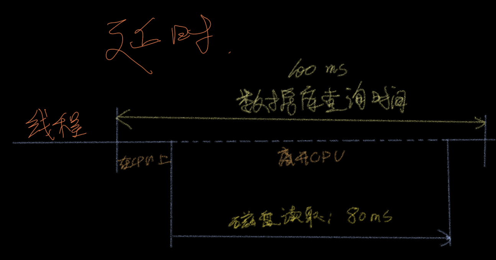

# 第一章 论述

## 1. 系统性能

系统性能是对整个计算机系统的性能的研究，包括主要硬件组件和软件组件。所有数据路径上和存储设备到应用软件上所发生的事情在内。

包括：操作系统（OS）内核、数据库、应用程序层、网站服务器；

**全栈：整个硬件栈、软件栈、系统库、内核、硬件本身；**

<figure><figcaption></figcaption></figure>

## 2. 人员

就是相关参与者：系统管理员、网站可靠性工程师、应用开发工程师、网络工程师、数据库管理员、和其他支持人员；

## 3. 活动

一、开发过程

1. 对未来的产品设置性能目标和建立性能模型;
2. 基于软件或硬件原型进行特征归纳;
3. 在测试环境中对正在开发的产品做性能测试;
4. 对新版本产品做非回归性测试;
5. 针对软件发布版本的基准测试;

二、生产环境

6. 目标生产环境中的概念验证(Proof-of-concept)测试
7. 生产环境中的性能调优;
8. 检测生产环境中的问题性能分析;
9. 生产环境中的问题性能分析;

三、回顾总结

10. 对生产环境中的问题做事件回顾;
11. 开发性能工具以加强生产环境分析;

## 4. 视角

> <mark style="color:purple;">负载视角</mark>
>
> <mark style="color:red;">资源视角</mark>

<figure><figcaption></figcaption></figure>

## 5. 性能的工程是充满挑战的

### 5.1 主观性

系统性能工程往往是<mark style="color:yellow;">**客观**</mark>的，太多的业界人士审视问题都是非白即黑。

于此不同性能往往是<mark style="color:yellow;">**主观**</mark>**的，比如磁盘传输为 1m/s，凭什么说它是好是坏？所以性能分析一定会包含具体的场景，具体的时间。把**<mark style="color:green;">**主观**</mark>**的思考方向转变为**<mark style="color:green;">**客观**</mark>**的思考方向；**

### **5.2 复杂性**

性能问题常常出现在子系统之间复杂的互联上，即便子系统的独立性都很好。也有可能由于<mark style="color:orange;">连锁故障</mark>出现问题；

要理解这些问题，必须要梳理清楚这些子系统之间的关系，了解他们是如何协同工作的；

除了系统的复杂性，生产<mark style="color:orange;">环境负载</mark>的复杂也能导致性能问题；

### 5.3 多个原因

有时候性能问题是由于多个因素导致的，除了多个因素，也有可能是多个性能问题导致的；

### 5.4 多个性能问题

在复杂的软件中通常会有多个问题。而且非常难以寻找；

性能分析的必须<mark style="color:red;">量化问题的程度</mark>。

又一个非常适用于量化性能问题的指标，那就是<mark style="color:orange;">延时</mark>（<mark style="color:orange;">latency</mark>）。

## 6. 延时

延时测量的就是等待时间；

作为一个指标可以估计最大增速（maximum speedup）。

例如：

<figure><figcaption></figcaption></figure>

虽然延时是有个非常有用的指标，但是不是随时都可以得到的。

## 7. 可观测性

可观测性是指通过观测来理解一个系统，并对完成这一任务进行分类。这包括<mark style="color:blue;">计数器</mark>、<mark style="color:blue;">剖析</mark>和<mark style="color:blue;">跟踪</mark>。对于生产环境尽可能的使用可观测性工具，避免实验工具通过争夺资源扰乱负载；

### 7.1 计数器、统计数据和指标

### 7.2 剖析

### 7.3 跟踪

#### 静态检测

#### 动态检测

#### BPF

## 8. 实验

## 9. 云计算

## 10. 方法

###

