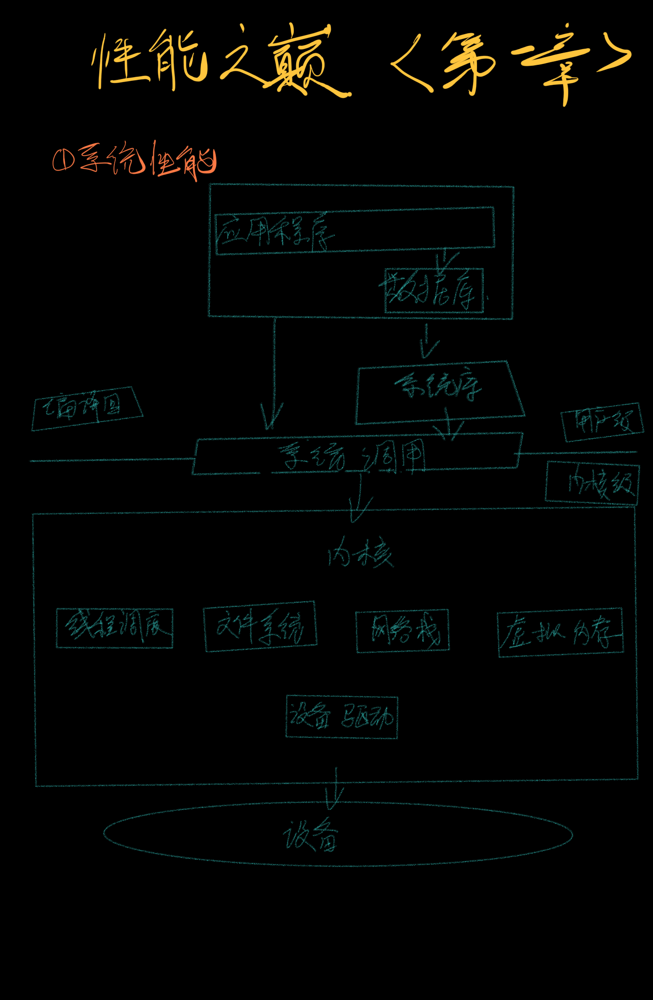
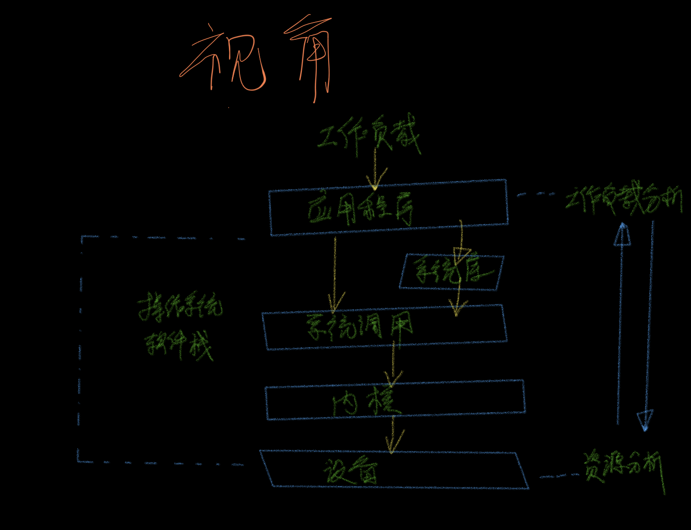

# 第一章 论述

## 1. 系统性能

系统性能是对整个计算机系统的性能的研究，包括主要硬件组件和软件组件。所有数据路径上和存储设备到应用软件上所发生的事情在内。

包括：操作系统（OS）内核、数据库、应用程序层、网站服务器；

**全栈：整个硬件栈、软件栈、系统库、内核、硬件本身；**

<figure><figcaption></figcaption></figure>

## 2. 人员

就是相关参与者：系统管理员、网站可靠性工程师、应用开发工程师、网络工程师、数据库管理员、和其他支持人员；

## 3. 活动

一、开发过程

1. 对未来的产品设置性能目标和建立性能模型;
2. 基于软件或硬件原型进行特征归纳;
3. 在测试环境中对正在开发的产品做性能测试;
4. 对新版本产品做非回归性测试;
5. 针对软件发布版本的基准测试;

二、生产环境

6. 目标生产环境中的概念验证(Proof-of-concept)测试
7. 生产环境中的性能调优;
8. 检测生产环境中的问题性能分析;
9. 生产环境中的问题性能分析;

三、回顾总结

10. 对生产环境中的问题做事件回顾;
11. 开发性能工具以加强生产环境分析;

## 4. 视角

> <mark style="color:purple;">负载视角</mark>
>
> <mark style="color:red;">资源视角</mark>

<figure><figcaption></figcaption></figure>

