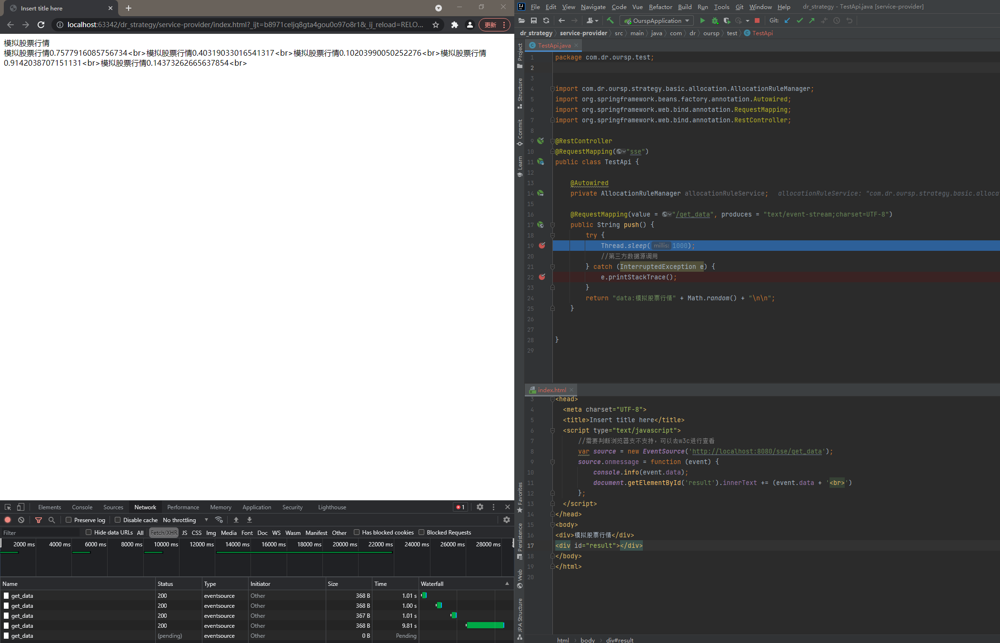

```java
@RestController
@RequestMapping("sse")
public class TestApi {

    @Autowired
    private AllocationRuleManager allocationRuleService;

    @RequestMapping(value = "/get_data", produces = "text/event-stream;charset=UTF-8")
    public String push() {
        try {
            Thread.sleep(1000);
            //第三方数据源调用
        } catch (InterruptedException e) {
            e.printStackTrace();
        }
        return "data:模拟股票行情" + Math.random() + "\n\n";
    }


}
```


```html
<!DOCTYPE html>
<html>
<head>
  <meta charset="UTF-8">
  <title>Insert title here</title>
  <script type="text/javascript">
      //需要判断浏览器支不支持，可以去w3c进行查看
      var source = new EventSource('http://localhost:8080/sse/get_data');
      source.onmessage = function (event) {
          console.info(event.data);
          document.getElementById('result').innerText += (event.data + '<br>')
      };
  </script>
</head>
<body>
<div>模拟股票行情</div>
<div id="result"></div>
</body>
</html>

```


# 测试

