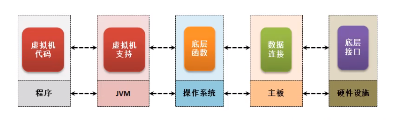

# File

File是java.io中唯一一个和文件本身有关的操作类。

## 1.定义

```java
public class File
extends Object
implements Serializable, Comparable<File>
```

## 2.构造

| 构造函数                            | 描述                                                        |
| :---------------------------------- | :---------------------------------------------------------- |
| `File(File parent, String child)`   | `File`从父抽象路径名和子路径名字符串创建新实例。            |
| `File(String pathname)`             | 设置要操作文件的完整目录                                    |
| `File(String parent, String child)` | 设置要操作文件的父目录和子目录                              |
| `File(URI uri)`                     | `File`通过将给定的`file:`URI转换为抽象路径名来创建新实例 。 |

## 3.方法

| 修饰符和类型   | 方法                                                         | 描述                                                         |
| :------------- | :----------------------------------------------------------- | :----------------------------------------------------------- |
| `boolean`      | `canExecute()`                                               | 测试应用程序是否可以执行此抽象路径名表示的文件。             |
| `boolean`      | `canRead()`                                                  | 测试应用程序是否可以读取此抽象路径名表示的文件。             |
| `boolean`      | `canWrite()`                                                 | 测试应用程序是否可以修改此抽象路径名表示的文件。             |
| `int`          | `compareTo(File pathname)`                                   | 按字典顺序比较两个抽象路径名。                               |
| `boolean`      | `createNewFile()`                                            | 当且仅当具有此名称的文件尚不存在时，以原子方式创建由此抽象路径名命名的新空文件。 |
| `static File`  | `createTempFile(String prefix, String suffix)`               | 在默认临时文件目录中创建一个空文件，使用给定的前缀和后缀生成其名称。 |
| `static File`  | `createTempFile(String prefix, String suffix,File directory)` | 在指定目录中创建一个新的空文件，使用给定的前缀和后缀字符串生成其名称。 |
| `boolean`      | `delete()`                                                   | 删除此抽象路径名表示的文件或目录。                           |
| `void`         | `deleteOnExit()`                                             | 请求在虚拟机终止时删除此抽象路径名表示的文件或目录。         |
| `boolean`      | `equals(Object obj)`                                         | 测试此抽象路径名与给定对象的相等性。                         |
| `boolean`      | `exists()`                                                   | 测试此抽象路径名表示的文件或目录是否存在。                   |
| `File`         | `getAbsoluteFile()`                                          | 返回此抽象路径名的绝对形式。                                 |
| `String`       | `getAbsolutePath()`                                          | 返回此抽象路径名的绝对路径名字符串。                         |
| `File`         | `getCanonicalFile()`                                         | 返回此抽象路径名的规范形式。                                 |
| `String`       | `getCanonicalPath()`                                         | 返回此抽象路径名的规范路径名字符串。                         |
| `long`         | `getFreeSpace()`                                             | 返回此抽象路径名[指定](https://docs.oracle.com/en/java/javase/11/docs/api/java.base/java/io/File.html#partName)的分区中未分配的字节数。 |
| `String`       | `getName()`                                                  | 返回此抽象路径名表示的文件或目录的名称。                     |
| `String`       | `getParent()`                                                | 返回此抽象路径名父项的路径名字符串，或者 `null`此路径名未指定父目录。 |
| `File`         | `getParentFile()`                                            | 返回此抽象路径名的父级的抽象路径名，或者`null`此路径名是否未命名父目录。 |
| `String`       | `getPath()`                                                  | 将此抽象路径名转换为路径名字符串。                           |
| `long`         | `getTotalSpace()`                                            | 返回此抽象路径名[指定](https://docs.oracle.com/en/java/javase/11/docs/api/java.base/java/io/File.html#partName)的分区的大小。 |
| `long`         | `getUsableSpace()`                                           | 返回此抽象路径名[指定](https://docs.oracle.com/en/java/javase/11/docs/api/java.base/java/io/File.html#partName)的分区上此虚拟机可用的字节数。 |
| `int`          | `hashCode()`                                                 | 计算此抽象路径名的哈希码。                                   |
| `boolean`      | `isAbsolute()`                                               | 测试此抽象路径名是否为绝对路径。                             |
| `boolean`      | `isDirectory()`                                              | 测试此抽象路径名表示的文件是否为目录。                       |
| `boolean`      | `isFile()`                                                   | 测试此抽象路径名表示的文件是否为普通文件。                   |
| `boolean`      | `isHidden()`                                                 | 测试此抽象路径名指定的文件是否为隐藏文件。                   |
| `long`         | `lastModified()`                                             | 返回上次修改此抽象路径名表示的文件的时间。                   |
| `long`         | `length()`                                                   | 返回此抽象路径名表示的文件的长度。                           |
| `String[]`     | `list()`                                                     | 返回一个字符串数组，用于命名此抽象路径名表示的目录中的文件和目录。 |
| `String[]`     | `list(FilenameFilter filter)`                                | 返回一个字符串数组，用于命名由此抽象路径名表示的目录中的文件和目录，以满足指定的过滤器。 |
| `File[]`       | `listFiles()`                                                | 返回一个抽象路径名数组，表示此抽象路径名表示的目录中的文件。 |
| `File[]`       | `listFiles(FileFilter filter)`                               | 返回一个抽象路径名数组，表示此抽象路径名表示的目录中满足指定过滤器的文件和目录。 |
| `File[]`       | `listFiles(FilenameFilter filter)`                           | 返回一个抽象路径名数组，表示此抽象路径名表示的目录中满足指定过滤器的文件和目录。 |
| `staticFile[]` | `listRoots()`                                                | 列出可用的文件系统根目录。                                   |
| `boolean`      | `mkdir()`                                                    | 创建此抽象路径名指定的目录。                                 |
| `boolean`      | `mkdirs()`                                                   | 创建此抽象路径名指定的目录，包括任何必需但不存在的父目录。   |
| `boolean`      | `renameTo(File dest)`                                        | 重命名此抽象路径名表示的文件。                               |
| `boolean`      | `setExecutable(boolean executable)`                          | 一种方便的方法，用于设置此抽象路径名的所有者执行权限。       |
| `boolean`      | `setExecutable(boolean executable, boolean ownerOnly)`       | 设置此抽象路径名的所有者或每个人的执行权限。                 |
| `boolean`      | `setLastModified(long time)`                                 | 设置此抽象路径名指定的文件或目录的上次修改时间。             |
| `boolean`      | `setReadable(boolean readable)`                              | 一种方便的方法，用于设置此抽象路径名的所有者读取权限。       |
| `boolean`      | `setReadable(boolean readable, boolean ownerOnly)`           | 设置此抽象路径名的所有者或每个人的读取权限。                 |
| `boolean`      | `setReadOnly()`                                              | 标记此抽象路径名指定的文件或目录，以便仅允许读取操作。       |
| `boolean`      | `setWritable(boolean writable)`                              | 一种方便的方法，用于设置此抽象路径名的所有者写入权限。       |
| `boolean`      | `setWritable(boolean writable, boolean ownerOnly)`           | 设置此抽象路径名的所有者或每个人的写入权限。                 |
| `Path`         | `toPath()`                                                   | 返回[`java.nio.file.Path`](https://docs.oracle.com/en/java/javase/11/docs/api/java.base/java/nio/file/Path.html)从此抽象路径构造的对象。 |
| `String`       | `toString()`                                                 | 返回此抽象路径名的路径名字符串。                             |
| `URI`          | `toURI()`                                                    | 构造一个`file:`表示此抽象路径名的URI。                       |
| `URL`          | `toURL()`                                                    | **已过时。**此方法不会自动转义URL中非法的字符。              |

## 4.操作



> 各个系统的分隔符
>
> * Windows系统路径分隔符`\`
> * Unix 类系统（Unix、Linux、MacOS、AIX）路径分隔符 `/`
>
> > ==File.separator== 表示系统中的文件路径分隔符 , 使用此变量可以根据系统的不同自动转换文件分隔符 
> >
> > 正确的路径编写
> >
> > ```java
> > 	File file = new File("c:" + File.separator + "demo.txt");
> > ```
> >
> > 


### 1. 创建与删除
|  方法  | 描述  |
| :---------- | :------- |
|`boolean`  `createNewFile()` | 创建。|
|`boolean`  `exists()` | 判断是否存在。|
|`boolean`  `delete()` | 删除。|

```java
File file = new File("c:" + File.separator + "demo.txt");
if (!file.exists()){
    file.createNewFile();
}
```

对于性能的优化 , 不能每次进来都判断文件是否存在 , 可以利用静态代码块的特性( 只执行一次 )的特性:

```java
private File file = new File("c:" + File.separator + "demo.txt");
static{
    if (!file.exists()) file.createNewFile(); 
}
```


### 2.获取文件信息

| 方法                          | 描述                         |
| :---------------------------- | :--------------------------- |
| public boolean canExecute()   | 是否能执行                   |
| public boolean canRead()      | 判断是否存在。               |
| public boolean canWrite()     | 是否能写                     |
| public File getAbsoluteFile() | 获取文件绝对路径实例         |
| public String getName()       | 获取文件或目录名称           |
| public boolean isDirectory()  | 当前路径是否为目录           |
| public boolean isFile()       | 当前路径是否为文件           |
| public long lastModified()    | 获取最后一次的修改时间(毫秒) |
| public long length()          | 获取文件的长度(b)            |

### 3.获取文件目录信息

### 

| 方法                     | 描述       |
| :----------------------- | :--------- |
| public String[] list()   | 描述的是子路径的信息 |
| public boolean canRead() | 列出所有的路径信息           |

> list() 列出了当前路径下的所有的子路径信息 , 子路径可能是一个目录 也可能是一个 文件 , 不存在父路径

### 4.文件更名

| 方法                                  | 描述                   |
| :------------------------------------ | :--------------------- |
| public boolean renameTo（File  dest） | 重命名 dest 表示新名称 |

```java
File file = new File("c:" + File.separator + "demo.txt");
if (file.exists()){
    File file1 = new File("c:" + File.separator + "hello.txt");
    file.renameTo(file1);
}else {
    file.createNewFile();
}
```

