一、常用IO流

> File只提供了文件的处理 , 但没有提供内容的修改 , 修改内容就需要使用流 , 所有的流都分为==输入流==和==输出流==

- 字节操作流：OutputStream（字节输出流）、InputStream（字节输入流）；
- 字符操作流：Writer（字符输出流）、Reader（字符输入流）；


## 操作规则

以文件流为例

1. 通过File类设定要操作的文件路径（针对于文件流而言）；
2. 通过字节流或字符流的子类为父类进行实例化处理；
3. 进行读、写的流操作；
4. 流属于宝贵资源，操作完成后必须关闭（`.close()`）


## 1.字节输出流 OutputStream

```java
public abstract class OutputStream
extends Object
implements Closeable, Flushable
```

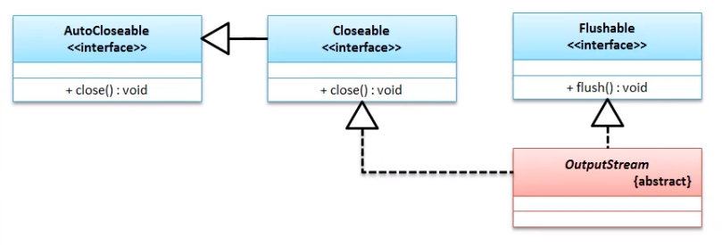

|  方法                                | 描述                                                         |
| :----------------------- | :----------------------------------------------------------- |
| `void write(byte[] b)`                   | 输出字节数据     |
| `void write(byte[] b, int off, int len) | ==输出部分字节数据==       |
| `abstract void write(int b)`                      | 将指定的字节写入此输出流。                                   |

### * FileOutputStream

 由于OutputStream 是一个抽象类 , 于是需要一个实现他的子类 , 下面操作文件就使用 `FileOutputStream`来实现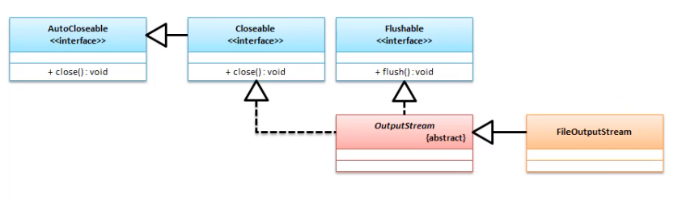

| 构造函数                                      | 描述                                            |
| :-------------------------------------------- | :---------------------------------------------- |
| `FileOutputStream(File file)`                 | 创建文件输出流，每次都对文件内容进行覆盖。      |
| `FileOutputStream(File file, boolean append)` | 创建文件输出流，如果append=true，则对内容为追加 |

范例 : 实现磁盘数据输出

```java
// 1. 定义一个进行磁盘输出的完整路径
File file = new File("c:" + File.separator + "test" + File.separator + "demo.txt");
File parentFile = file.getParentFile();
if (!parentFile.exists()) {
    parentFile.mkdir(); // 创建父路径
}
file.createNewFile();
// 2. OutputStream是抽象类 , 他需要 一个子类的实例化
//OutputStream outputStream = new FileOutputStream(file);
OutputStream fileOutputStream = new FileOutputStream(file, true);// true为追加内容
// 3. 数据的输出,数据的输出需要将内容变为字节数组
// outputStream.write("你好outputStream".getBytes());

fileOutputStream.write("我是追加内容".getBytes());
// 4. 关闭流 ；
//outputStream.close();
fileOutputStream.close();
```


## 2.字节输入流 InputStream

```java
public abstract class InputStream
extends Object
implements Closeable
```

> 输入流不需要清空缓存

| 修饰符和类型 方法                      | 描述                                                         |
| :------------------------------------- | :----------------------------------------------------------- |
| `abstract int read()`                  | 读取单个字节数据，如果没有数据了返回“-1”。                   |
| `int read(byte[] b)`                   | 将内容读取到字节数组中，返回读取个数。如果没有数据返回“-1”； |
| `int read(byte[] b, int off, int len)` | 将内容读取部分到字节数组中，返回读取个数。如果没有数据返回“-1”； |
| `byte[] readAllBytes()`                | 从输入流中读取所有字节。（1.9才出现的，如果请求的内容过大，会造成内存溢出） |

### *FileInputStream


```java
FileInputStream​(File file) // 构造方法
```

范例 : 读取数据

```java
File file = new File("c:" + File.separator + "test" + File.separator + "ddd.mp4");
// 1. 获取流
InputStream inputStream = new FileInputStream(file);
// 2. 开辟存储空间
int len = inputStream.available();
// 3. 获取数据和它的长度
if (len>1024*1024*5)return;//如果大小超过5M就不读取了
byte[] data = new byte[len];
inputStream.read(data);
// 4. 截取并转换为字符串
String s = new String(data,0,len);
System.out.println(s);//答应
```

> `public int available() throws IOException` 获取文件大小

## 3.字符输出流 Writer

```java
public abstract class Writer
extends Object
implements Appendable, Closeable, Flushable
```

​	Writer抽象类与之前的OutputStream类相比，多实现了一个接口Appendable，里面有`Appendable append(CharSequence csq)`方法；


> 在使用Writer类操作输出的时候最大的操作特点就是==在于其可以直接进行字符串的数据处理==；
>
> `public void write(String str)` 
>
> jdk1.4之后添加了 `Appendable` 的实现类有`CharBuffer`, `Segment`, `String`, `StringBuffer`, `StringBuilder`,所以`public Writer append(CharSequence csq) throws IOException`方法可以直接使用其实现类

#### * FileWriter

范例 : FileWriter输出

```java
File file = new File("c:" + File.separator + "test" + File.separator + "demo.txt");
Writer writer = new FileWriter(file);
writer.append("你好");
writer.append("我是");
writer.append("luke");
writer.flush();
writer.close();
```

## 4.字符输入流 Reader

```java
public abstract class Reader
extends Object
implements Readable, Closeable
```

​	在Reader抽象类里面并没有提供像InputStream类那样读取全部内容的方法。

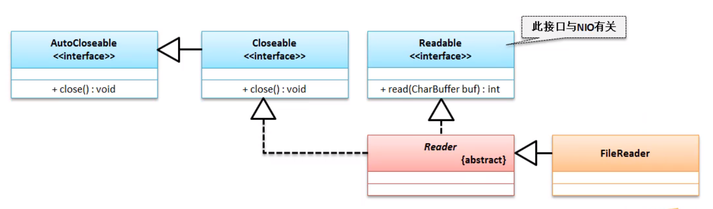

### * FileReader

范例 ： FileReader读取数据

```java
File file = new File("c:" + File.separator + "test" + File.separator + "demo.txt");
Reader reader = new FileReader(file);
char[] data = new char[1024];
int len = reader.read(data);
String s = new String(data, 0, len);
System.out.println(s);
reader.close();
```

> ==因为jdk1.7之后`InputStream``OutputStream``Reader``Writer`都实现了`AutoCloseable` ，而`AutoCloseable`类就可以做到，以上四个操作在`try...`中，就会做到自动关闭；==

# 二、字符流和字节流的区别

- 字节（网络操作，图片，声音…）
- 字符（中文）


> ==如果要观察缓冲区的存在，就在结束的时候不使用 close 或 flush 就会发现 字节流输出可以正常输出，而字节流是不可以正常输出，因为字符流的数据还在缓冲区，要通过flush 或 close 才可以刷新缓冲区。==

# 三、转换流

为了方便字节流和字符流互相的转换，Java提供了2个类：==OutputStreamWriter==、==InputStreamReader==。

## 1. OutputStreamWriter、InputStreamReader


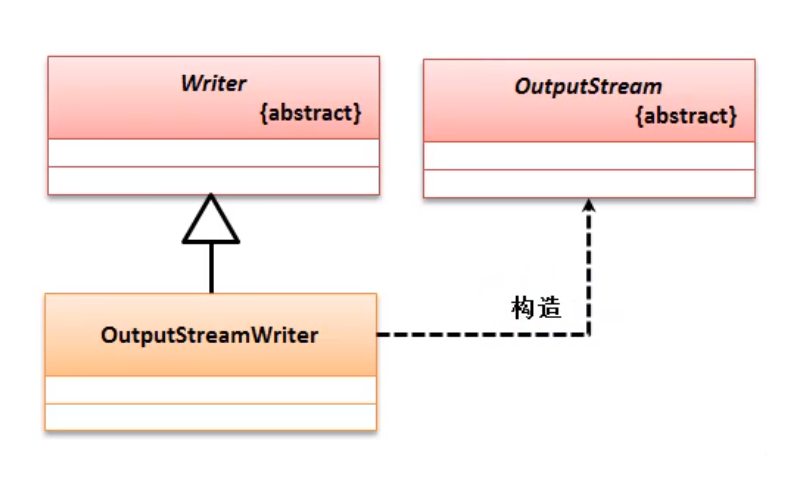

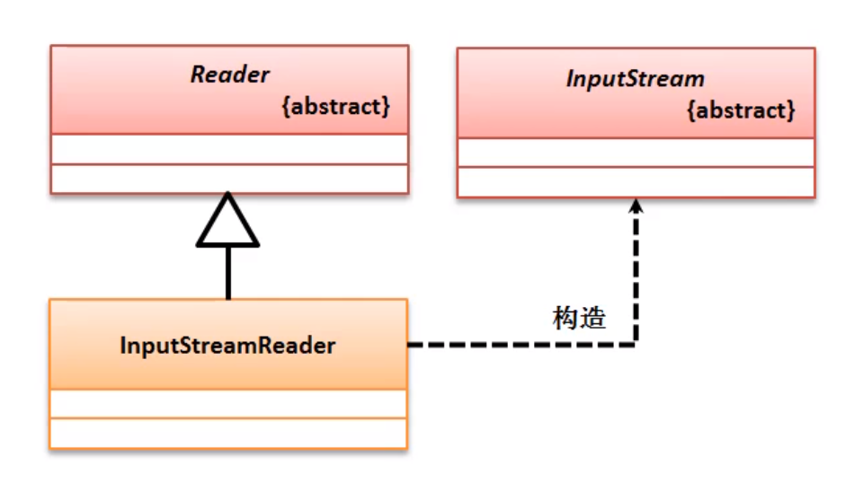

> 通过集成关系可以发现,InputStreamReader、OutputStreamWriter都是字符流的子类，同时构造方法都可以传入InputStream和OutputStream的实例。

## 2. FileWriter、FileReader

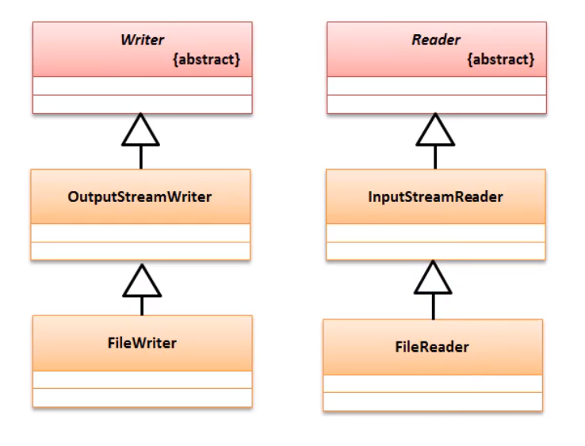


# 四、内存操作流 

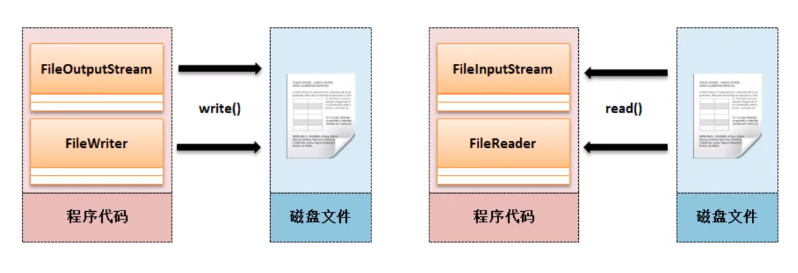

在Java里面对于内存操作流提供了两类支持：

* 字节内存流：`ByteArrayOutputStream`、`ByteArrayInputStream`
* 字符内存流：`CharArrayReader`、`CharArrayWriter`


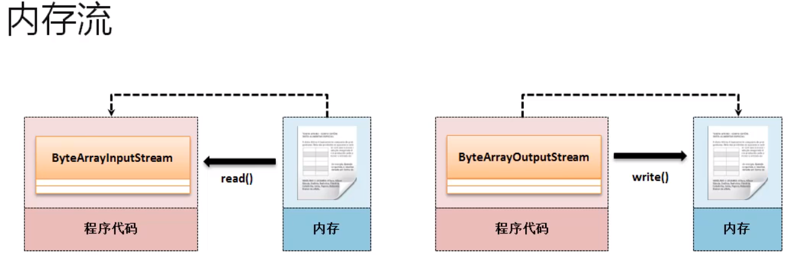

范例：从内存读取，改变为大写，写入内存

```java
InputStream inputStream = new ByteArrayInputStream("hello! memeory-stream".getBytes());
ByteArrayOutputStream outputStream = new ByteArrayOutputStream();
int data = 0;
while ((data=inputStream.read())!=-1){
    outputStream.write(Character.toUpperCase(len));
}
System.out.println(outputStream);
```

结果：

```cmd
HELLO! MEMEORY-STREAM
```

范例：从文件中读取到内存中

```java
File file = new File("c:" + File.separator + "test" + File.separator + "demo3.txt");
if (file.exists()) {
    InputStream input = new FileInputStream(file);
    ByteArrayOutputStream output = new ByteArrayOutputStream();
    int len = 0;
    while ((len = input.read()) != -1) {
        output.write(len);
    }
    System.out.println(output);
}
```

# 五、管道流

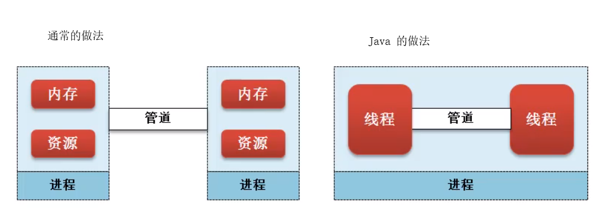

在Java里面对于管道操作流提供了两类支持：

- PipedOutputStream
- PipedInputStream

# 六、RandomAccessFile 存取指定数据

​	RandomAccessFile 的功能是只读取需要的数据，不需要的数据部读取。那么所有的数据==长度一定要统一==，RandomAccessFile本身支持输入与输出两个操作方式。

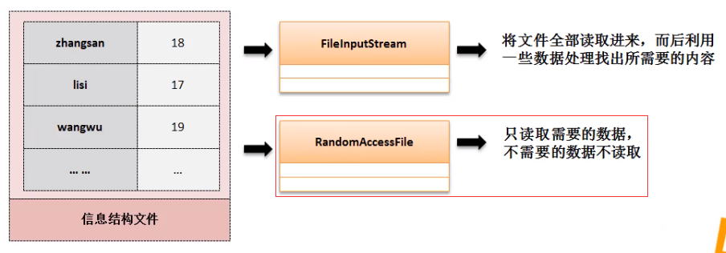

范例：内容的输出

```java
String[] names =new String[]{"zhangsan","lisi    ","wangwu  ","zhaoliu "};
int ages[] = new int[]{17,98,23,89};
File file = new File("c:" + File.separator + "test" + File.separator + "demo4.txt");
RandomAccessFile accessFile = new RandomAccessFile(file, "rw");
for (int i = 0; i <names.length; i++) {
    accessFile.writeBytes(names[i] );
    accessFile.writeInt(ages[i]);
}
accessFile.close();
```

此时输出的文件格式文二进制

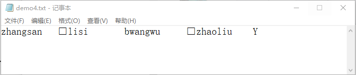

那么对于此时的内容就只能使用RandomAccessFile读取，读取可以使用如下的方法：

- 跳过`n`输入的字节：`public int skipBytes(int n) throws IOException`
- 文件指针偏移量：`public void seek(long pos) throws IOException`

范例：读取lisi

```java
File file = new File("c:" + File.separator + "test" + File.separator + "demo4.txt");
RandomAccessFile accessFile = new RandomAccessFile(file, "r");
byte[] data = new byte[8];
System.out.println("{第二个}");
accessFile.skipBytes(12);//跳后12个字节
{
    accessFile.read(data);
    System.out.println("姓名[" + new String(data) + "]");
    int anInt = accessFile.readInt();
    System.out.println("年龄[" + anInt + "]");
}
System.out.println("{第三个}");
accessFile.skipBytes(12);//跳后12个字节
{
    accessFile.read(data);
    System.out.println("姓名[" + new String(data) + "]");
    int anInt = accessFile.readInt();
    System.out.println("年龄[" + anInt + "]");
}
System.out.println("{第一个}");
accessFile.seek(0);//跳回到第0个字节
{
    accessFile.read(data);
    System.out.println("姓名[" + new String(data) + "]");
    int anInt = accessFile.readInt();
    System.out.println("年龄[" + anInt + "]");
}
accessFile.close();
```

结果：

```java
{第二个}
姓名[lisi    ]
年龄[98]
{第三个}
姓名[zhaoliu ]
年龄[89]
{第一个}
姓名[zhangsan]
年龄[17]
```

> RandomAccessFile 的数据读取核心意义在于，数据保存的长度一定要相；

# 七、打印流的设计

​	在IO包中里面最为原始的输出支持的操作方法是：`OutputStream.writer()`、`Writer.write()`，但是这两个操作方法存在==功能不足的问题==，因为这两个操作只支持字符、字节数组输出。

范例：最初的设计方案

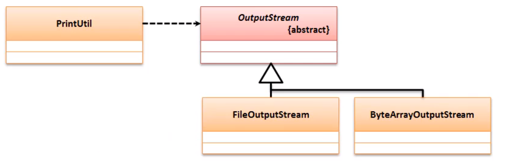

```java
package com.printUtil;

import java.io.File;
import java.io.FileOutputStream;
import java.io.IOException;
import java.io.OutputStream;

public class PrintUtil {
    private OutputStream out;

    PrintUtil(OutputStream out) {
        this.out = out;
    }
    
    public void print(String str) {
        try {
            out.write(str.getBytes());
        } catch (IOException e) {
            e.printStackTrace();
        }
    }

    public void println(String str) {
        this.print(str + "\r\n");
    }

}

```

```java
PrintUtil printUtil = null;
printUtil = new PrintUtil(new FileOutputStream(new File("c:" + File.separator + "test" + File.separator + "demo5.txt")));
printUtil.println("你好:");
printUtil.print("    我是一名程序员");
```

> 此时的代码只是调用形式简化了，但本质没有发生任何改变。那么这种模式就被称之为==装饰设计模式==

## 1.PrintStream

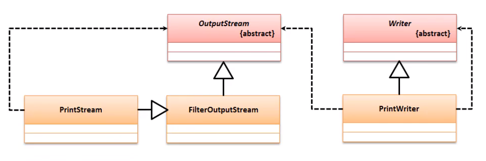

## 2.PrintWriter

范例：使用打印流输出

```java
PrintWriter printWriter = new PrintWriter(new File("c:" + File.separator + "test" + File.separator + "demo5.txt"));
printWriter.println("你好:");
printWriter.println("    这是一个打印流工具...");
printWriter.printf("    日期%1$tF%n",new Date());
printWriter.close();
```

结果：

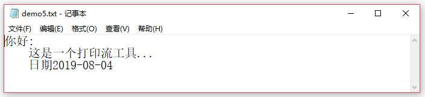

> 在以后程序进行（非二进制数据）内容输出的时候，优先考虑使用打印流完成，如果有中文建议使用==PrintWriter==；
>
> <u>*PrintWriter使用的是装饰设计模式；*</u>

# 八、案例


## 文件拷贝案例

​	在各个操作系统中都有copy命令，该命令基本格式如下：

```cmd
copy 源文件路径 目标文件路径
```

​	现在要求 通过Java的IO包，采用该模式实现该功能。

- 要进行拷贝的文件可能是文本文件或者二进制文件，所以要使用字节流；
- 由于要拷贝的文件会很大，那么肯定不能将源文件全部读进来一次性输出，应该采用边读边写的模式。
- 要拷贝的目标文件有可能要保存在目录之中，那么该目录可能还不存在

范例：

```java
package com.copy;

import java.io.*;

class CopyUtil {
    private File srcFile;
    private File desFile;

    public CopyUtil(String[] args) {
        if (args.length != 2) {
            System.out.println("错误,程序的输入参数不正确;格式为“java CopyFile 源文件路径 目标文件路径”");
            System.exit(1);
        }
        this.srcFile = new File(args[0]);
        this.desFile = new File(args[1]);
    }

    /**
     * @return -1:表示源文件不存在
     * -2:表示目标文件无法拷贝
     */
    public long copy() throws IOException {
        if (!this.srcFile.exists()) {
            throw new FileNotFoundException("源文件不存在");
        }
        if (!this.desFile.exists()) {
            this.desFile.getParentFile().mkdirs();//创建目标父目录
        }
        long start = System.currentTimeMillis();
        InputStream input = null;
        OutputStream output = null;
        try {
            input = new FileInputStream(srcFile);
            output = new FileOutputStream(desFile);
            /*byte[] data = new byte[1024];
            int len = 0;
            *//*do {
                len = input.read(data);
                if (len!=-1){
                    output.write(data);
                }
            } while (len != -1);*//*
             *//*while ((len = input.read(data)) != -1) {
                output.write(data, 0, len);
            }*/
            // 以上的方法是1.9之前常用方法,一下是追加了新的转存方法
            input.transferTo(output);//自动调优的传送方法
        } catch (IOException e) {
            e.printStackTrace();
        } finally {
            if (input != null) {
                try {
                    input.close();
                } catch (IOException e) {
                    //e.printStackTrace();
                }
            }
            if (output != null) {
                try {
                    output.close();
                } catch (IOException e) {
                    //e.printStackTrace();
                }
            }
        }
        long end = System.currentTimeMillis();
        return end - start;
    }
}

public class CopyFile {
    public static void main(String[] args) throws IOException {
        CopyUtil copyUtil = new CopyUtil(args);//实例化对象
        System.out.println(copyUtil.copy());//调用方法进行拷贝操作
    }
}
```

# 九、编码

- GBK/GB2312：进行中文编码定义，其中GBK包含有简体中文和繁体中文，而GB2312只包含简体中文；
- ISO8859-1：是一个国际通用编码标准，可以表示任何文字，但是对于图形文字则需要转码；
- UNICODE：是一个十六进制可以描述世界上各种文字信息，缺点就是占用空间太大；
- UTF编码：IOS8859-1 + Unicode 编码形式，根据需求变换，
  - UTF-8 ；
  - UTF-16；

```java
System.getProperties().list(System.out);
```

```cmd
-- listing properties --
sun.desktop=windows
awt.toolkit=sun.awt.windows.WToolkit
java.specification.version=10
file.encoding.pkg=sun.io
sun.cpu.isalist=amd64
sun.jnu.encoding=GBK
java.class.path=D:\idea-work\filedemo\out\production\...
java.vm.vendor="Oracle Corporation"
sun.arch.data.model=64
user.variant=
java.vendor.url=http://java.oracle.com/
user.timezone=
os.name=Windows 10
java.vm.specification.version=10
sun.java.launcher=SUN_STANDARD
user.country=CN
sun.boot.library.path=C:\Program Files\Java\jdk-10.0.1\bin
sun.java.command=com.copy.CopyFile C:\test\ddd.mp4 C:\...
jdk.debug=release
sun.cpu.endian=little
user.home=C:\Users\Administrator
user.language=zh
java.specification.vendor=Oracle Corporation
java.version.date=2018-04-17
java.home=C:\Program Files\Java\jdk-10.0.1
file.separator=\
java.vm.compressedOopsMode=Zero based
line.separator=

java.specification.name=Java Platform API Specification
java.vm.specification.vendor=Oracle Corporation
java.awt.graphicsenv=sun.awt.Win32GraphicsEnvironment
user.script=
sun.management.compiler=HotSpot 64-Bit Tiered Compilers
java.runtime.version=10.0.1+10
user.name=Administrator
path.separator=;
os.version=10.0
java.runtime.name=Java(TM) SE Runtime Environment
file.encoding=UTF-8
java.vm.name=Java HotSpot(TM) 64-Bit Server VM
java.vendor.version=18.3
java.vendor.url.bug=http://bugreport.java.com/bugreport/
java.io.tmpdir=C:\Users\ADMINI~1\AppData\Local\Temp\
java.version=10.0.1
user.dir=D:\idea-work\filedemo
os.arch=amd64
java.vm.specification.name=Java Virtual Machine Specification
java.awt.printerjob=sun.awt.windows.WPrinterJob
sun.os.patch.level=
java.library.path=C:\Program Files\Java\jdk-10.0.1\bin;...
java.vendor=Oracle Corporation
java.vm.info=mixed mode
java.vm.version=10.0.1+10
sun.io.unicode.encoding=UnicodeLittle
java.class.version=54.0
```

> 在当前环境使用的是UTF-8，如果使用中文保存数据一定是使用UTF-8。

# 十、System类

System类是Java中最常见的程序类：

* 标准输出（显示器）：public static final PrintStream out
* 错误输出（显示器）：public static final PrintStream err
* 标准输入（键盘）：public static final InputStream in

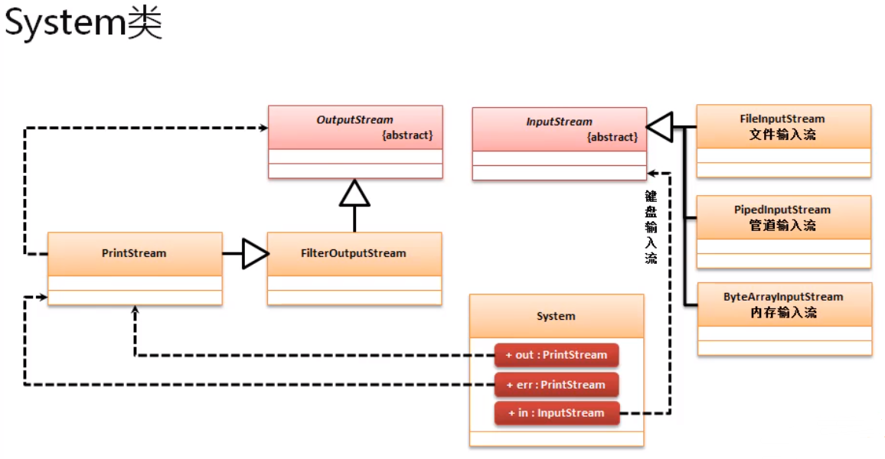

 `System.out`和`System.err`都属于`PrintStream`类的实例，操作`System.out.println`实际上调用IO中的打印流实现的输出。

# 十一、BufferedReader类

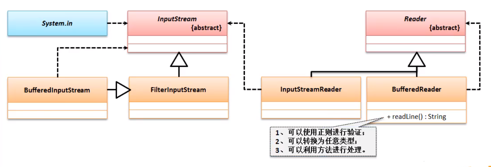

# 十二、Scanner 类（扫描工具类）

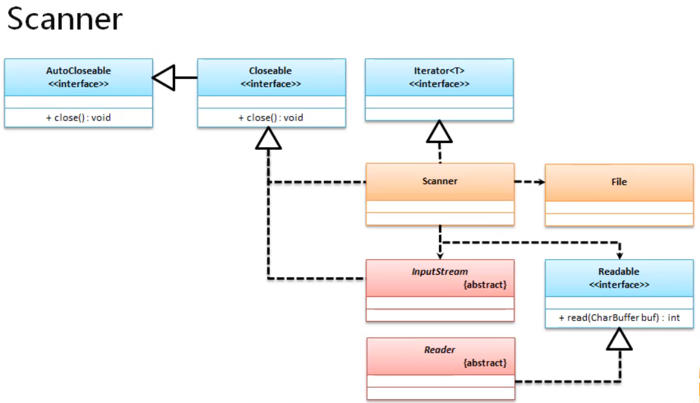

核心处理方法：

* 判断是否有数据：`public boolean hasNextXxx();`
* 获取数据：`public Xxx nextXxx();`

范例：

```java
Scanner scanner = new Scanner(System.in);
if(scanner.hasNext()){
    System.out.println(scanner.next());
}
```

> 如果只是与键盘输入为例，BufferedReader比Scanner更为灵活；

