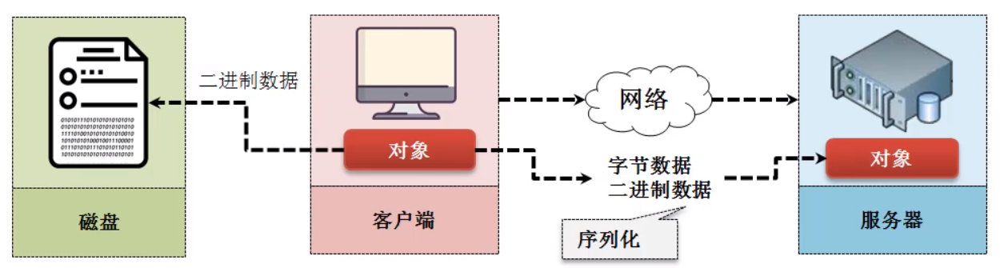
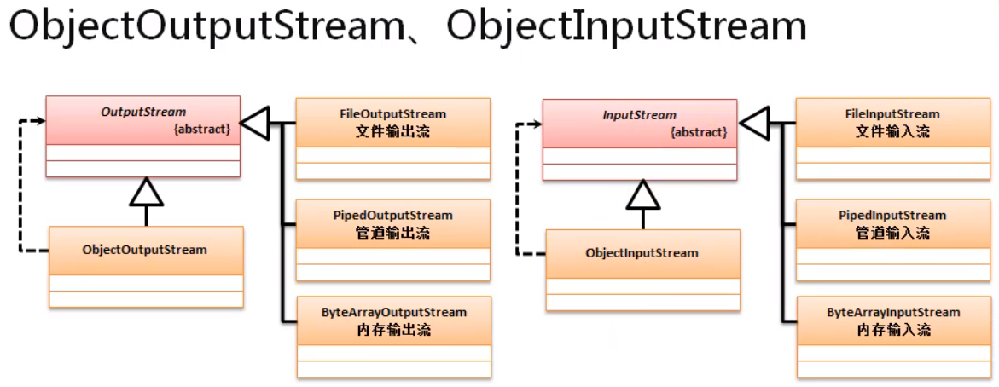

# 序列化

​	序列化 (Serialization)是将对象的状态信息转换为可以存储或传输的形式的过程。在序列化期间，对象将其当前状态写入到临时或持久性存储区。以后，可以通过从存储区中读取或反序列化对象的状态，重新创建该对象。



​	==在Java里面需要序列化，必须实现`java.io.Serializable`接口==

​	在开发中很少定义`private long serialVersionUID = 1L`，因为会造成后期代码维护的困扰。而在Java代码编译的时候，会自动加入该属性，所以没有必要写这样的属性。

# 序列化和反序列化

​	在Java中序列化本身是有自己的标准格式，只有按照这个格式定义序列化，才可以操作我们的反序列化。

​	在实现序列化和反序列化的过程中，最好使用`java.io`中提供的类；

| **【序列】ObjectOutputStream**                               | 【反序列】ObjectInputStream                                  |
| ------------------------------------------------------------ | ------------------------------------------------------------ |
| public class ObjectOutputStream extends <u>OutputStream</u> implements ObjectOutput, ObjectStreamConstants | public class ObjectInputStream extends <u>InputStream</u> implements ObjectInput, ObjectStreamConstants |
| public ObjectOutputStream(**OutputStream** out)                    throws IOException | public ObjectInputStream(InputStream in)                   throws IOException |
| public final void writeObject(Object obj) throws IOException | public final Object readObject() throws IOException, ClassNotFoundException |



范例：

```java
import java.io.*;

class Ball implements Serializable {
    private String name;
    private double price;

    public String getName() {
        return name;
    }

    public void setName(String name) {
        this.name = name;
    }

    public double getPrice() {
        return price;
    }

    public void setPrice(double price) {
        this.price = price;
    }
}

public class TestDemo {
    private static final File BALL_FILE = new File("D:" + File.separator + "ball.ser");

    public static void serial( ) throws Exception {
        Ball ball = new Ball();
        ball.setName("李宁");
        ball.setPrice(22.22);
        ObjectOutputStream oos = new ObjectOutputStream(new FileOutputStream(BALL_FILE));
        oos.writeObject(ball);
        oos.close();
    }
    public static void deserial()throws Exception{
        ObjectInputStream obs = new ObjectInputStream(new FileInputStream(BALL_FILE));
        Ball ball = (Ball)obs.readObject();
        obs.close();
        System.out.println(ball);
    }
    public static void main(String[] args) throws Exception {
        serial();
        deserial();
    }
}

```

> 此时，这是种序列化方法，只能被Java代码读取；
>
> 如果考虑到其他语言，就要使用到第三方提供的Jar支持

# transient 关键字

在我们进行序列化的过程中，所有的属性都会被序列化保存；但是有些数据不需要保存，所有可以用`transient`关键字就可以实现不序列化；

​         