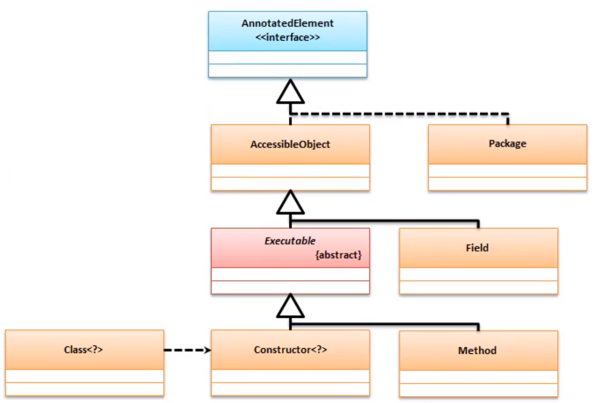

# 1. Class 的 实例化

反射的根源是Class 类，但是他在Java里面对于Class类对象的实例化操作有三类支持：

1. 第一种操作 : 利用Object类中提供的`getClass()`方法,通过实例化对象调用获得;
2. 第二种操作 : 利用`类.class`的Java原生代码操作实现;
3. 第三种操作 : 利用 Class 类中提供的方法`Class.forName("java.util.Date");`进行实例化;

范例 : 

```java
// 第一种
Date date = new Date();
Class class1 = date.getClass;
// 第二种
Class class2 = Date.class;
// 第三种
 Class<?> date = Class.forName("java.util.Date");
```

第二种方法可以在没有指定类的实例化对象的时候 , 可以获取对象的实例化 ; 相比其他的节约了一个实例话对象的操作;

第三种参数需要 类的完整名称 , 如果类不存在 会有 `ClassNotException` 的异常 , 它的最大优势是可以使用字符串实例类;

> 通过这三种形式可以获取 Class类的实例 , 其特点 :
>
> 1. getClass : 需要明确的获得使用类的实例化对象;
> 2. 类.class : 需要明确的获得使用类的实例化对象;
> 3. Class.forName : 可以通过字符串描述使用类的名称

# 2. 反射的使用

通过分析之后可以发现 , 对于Class 类的对象实例有三种方法 , 但是获取Class类的实例化对象不仅仅是只获取它对应类的信息 , 实际上它可以实现更加丰富的信息 ;

## 反射对象实例化

 获取了 Class 类对象之后最大用处在于可以直接用反射提供的方法调用指定类的构造实现对象的实例化处理 , 而此操作的方法为 : 

```java
clazz.newInstance();
```

范例 : 

```java
// 反射定义中的泛型基本上都比较尴尬 , 所以出现的"?"居多
Class<?> clazz = Class.forName("java.util.Date");
Object obj = clazz.newInstance();// 反射实例化对象 , 表示的相当于 new java.util.Date
System.out.println(obj);
```

结果 : 

```cmd
Tue Jul 23 12:09:14 CST 2019
```

本操作最大的特点是 , 代码中没有使用 `import java.util.Date` 的引入

但是 在9中 此方法被弃用要使用如下方法 : 

```java
Object obj = clazz.getDeclaredConstructor().newInstance();
```

如果要深刻的理解反射实际上就需要更加详细的设计 , 此时只是告诉大家对弈类对象的实例化 , 除了`new` 之外 还可以使用反射实现 ; 

# 3. 反射与工厂设计模式

为什么Java 提供了2种实例化对象的方法?

范例 : 定义一个工厂类

```java
interface IMessage{
    public void send(String msg);
}
class NewsPaper implements IMessage{

    @Override
    public void send(String msg) {
        System.out.println("[报纸报道]"+msg);
    }
}
class Factory{
    private Factory(){

    }
    public static IMessage getInstance (String className){
        if ("newspaper".equalsIgnoreCase(className)){
            return new NewsPaper() ;
        }
        return null;
    }

}
public class Main {

    public static void main(String[] args) throws Exception {
        IMessage message = Factory.getInstance("NewsPaper");
        message.send("luke");
    }
}

```

结果 : 

```java
[报纸报道]luke
```

对于此时的代码 , 是属于Java面向对象的基本模型 , 因为只要是获取接口实例 , 都应该通过工厂类来完成,于是类设计结构如下 : 


现在虽然实现了一个基础的工厂设计模式 , 实际上还有一个问题 , 如果此时需要扩充一个新的子类 ?那么此时工厂类一定要发生变更 . 

解决这种问题最好的办法就是使用反射机制 . 


范例 : 使用反射来实例化

```java
interface IMessage {
    public void send(String msg);
}

class NewsPaper implements IMessage {

    @Override
    public void send(String msg) {
        System.out.println("[报纸报道]" + msg);
    }
}

class NetPaper implements IMessage {

    @Override
    public void send(String msg) {
        System.out.println("[网络报道]" + msg);
    }
}

class Factory {
    private Factory() {

    }

    public static IMessage getInstance(String className) {
        IMessage instance = null;
        try {
            instance = (IMessage) Class.forName(className).newInstance();
        } catch (InstantiationException e) {
            e.printStackTrace();
        } catch (IllegalAccessException e) {
            e.printStackTrace();
        } catch (ClassNotFoundException e) {
            e.printStackTrace();
        }
        return instance;
    }

}

public class Main {

    public static void main(String[] args) throws Exception {
        IMessage message1 = Factory.getInstance("NewsPaper");
        IMessage message2 = Factory.getInstance("NetPaper");
        if (message1 != null) message1.send("luke");
        if (message2 != null) message2.send("luke");
    }
}

```

此时 所编写的工厂类可以适用于各种环境 , 都可以获取IMessage接口的实例 .

# 4. 反射与单例设计模式

单例设计模式 : 只允许有一个实例化对象 , 对于单例设计模式它本身考虑到设计情况实际上提供了两种结构 : - 饿汉单例 / 懒汉单例 , 懒汉单例问题比较麻烦 . 

* 范例 : 观察懒汉单例模式的问题

```java
class Singleton{
    private static Singleton instance;
    private Singleton(){
        System.out.println("[实例化]Singleton");
    }
    public static Singleton getInstance(){
        if (instance==null){
            instance = new Singleton();
        }
        return instance;
    }
}

public class Main {

    public static void main(String[] args) throws Exception {
        for (int i = 0; i < 10; i++) {
            new Thread(()->{
                Singleton instance = Singleton.getInstance();
            }).start();
        }
    }
}

```

结果

```cmd
[实例化]Singleton
[实例化]Singleton
[实例化]Singleton
[实例化]Singleton
[实例化]Singleton
[实例化]Singleton
[实例化]Singleton
[实例化]Singleton
[实例化]Singleton
[实例化]Singleton

```


## 当懒汉模式失败

* 需要加同步锁

```java
class Singleton{
    private static Singleton instance;
    private Singleton(){
        System.out.println("[实例化]Singleton");
    }
    public static synchronized Singleton getInstance(){
        if (instance==null){
            instance = new Singleton();
        }
        return instance;
    }
}

public class Main {

    public static void main(String[] args) throws Exception {
        for (int i = 0; i < 10; i++) {
            new Thread(()->{
                Singleton instance = Singleton.getInstance();
            }).start();
        }
    }
}

```

新的问题 : 如果线程多时 , 会发生线程排队访问( 造成拥挤 , 不适合高并发 )


## **解决方案** :

```java
class Singleton {
    private static Singleton instance;

    private Singleton() {
        System.out.println("[实例化]Singleton");
    }

    public static Singleton getInstance() {
        synchronized (Singleton.class) {
            if (instance == null) {
                instance = new Singleton();
            }
            return instance;
        }
    }
}

public class Main {

    public static void main(String[] args) throws Exception {
        for (int i = 0; i < 10; i++) {
            new Thread(() -> {
                Singleton instance = Singleton.getInstance();
            }).start();
        }
    }
}


```

这样线程就不会拥挤


# 5. 反射获取类结构

使用 Class 实现了对象实例化 , 并且通过 Class 类反射实例化对象 , 但是这并不意味着这些全部都属于反射机制的功能 , 如果认真分析的话 , 实际上反射可以完整的实现 Java 允许规定的类的操作模式 . 


如果在日后的开发中发现 , 需要对二进制文件进行更深入分析的时候

* 选择一 : 通过 Oracle 的官方标准进行二进制字节流数据的读取分析 ; 
* 选择二 : 使用第三方工具包 ( Java Relection ) 可以实现 (*.class)文件的分析 ; 

## 获取类的结构信息

Class 作为所有反射操作的源头 , 于是在 Class 类里面就可以获取一些结构上的信息, 例如 : 类所在的包、类所继承的父类、类所实现的相关方法  , 方法如下:

|      | 方法名                            | 类型 | 释义             |
| ---- | --------------------------------- | ---- | ---------------- |
| 1    | public  Package  getPackage（）   | 方法 | 程序所在的包名称 |
| 2    | public  Package  getPackage（）   | 方法 | 获取所继承的父类 |
| 3    | public Class<?>[] getInterfaces() | 方法 | 获取所有的父接口 |


范例 : 获取父结构信息

```java
import java.util.Arrays;

interface IMessage {}

interface IChannel {}

abstract class AbstractChannelMessage implements IMessage, IChannel { }

class CloudMessage extends AbstractChannelMessage implements IMessage, IChannel { }

public class Main {

    public static void main(String[] args) throws Exception {
        Class<?> clazz = CloudMessage.class;
        System.out.println("[获取包的名称]"+clazz.getPackage().getName());
        System.out.println("[获取继承父类]"+clazz.getSuperclass().getName());
        System.out.println("[获取实现接口]"+ Arrays.toString(clazz.getInterfaces()));
    }
}

```

结果

```cmd
[获取包的名称]                            # 我没写在包里 别介意哈 哈哈
[获取继承父类]AbstractChannelMessage
[获取实现接口][interface IMessage, interface IChannel]

```

之所以能获取这些信息 , 是因为 Class 类拥有了获取 `*.class` 二进制的数据分析能力 , 实际上是通过结构文件动态的获取信息 .

# 6. 反射调用构造方法

所有的构造方法都可以通过反射获取 , 在 Class 类里面定义如下


|      | 方法名                                                       | 类型 | 释义                                           |
| ---- | ------------------------------------------------------------ | ---- | ---------------------------------------------- |
| 1    | public Constructor<T> getConstructor(Class<?>... parameterTypes) throws NoSuchMethodException,SecurityException | 方法 | 根据指定的参数类型获取指定的构造方法 -- public |
| 2    | public Constructor<?>[] getConstructors() throws SecurityException | 方法 | 获取所有的构造方法 -- public                   |
| 3    | public Constructor<T> get==Declared==Constructor(Class<?>... parameterTypes)  throws NoSuchMethodException, SecurityException | 方法 | 获取一个类指定的构造方法 -- 所有修饰符         |
| 4    | public Constructor<?>[] get==Declared==Constructors() throws SecurityException | 方法 | 获取一个类中的全部构造方法 -- 所有修饰符       |

```java
        Class<?> clazz = BigDecimal.class;
        Constructor<?>[] declaredConstructors = clazz.getDeclaredConstructors();
        System.out.println(Arrays.toString(declaredConstructors));

```


> 以后编写反射的过程里面 , 构造方法不一定只使用public来定义 , 所以 使用获取的方法应该采用 以上3/4的方法

但是获取构造 , 并不是为了一个简单的输出 , 这种获取方法常用在 代码开发工具中 ;

其实际意义在于可以进行反射构造调用 , 提供如下的方法 :

```java
public T newInstance(Object... initargs)
              throws InstantiationException,
                     IllegalAccessException,
                     IllegalArgumentException,
                     InvocationTargetException

```

这个类提供一个 newInstance() 方法 , 这个方法的主要功能是可以调用指定的构造进行对象实例化处理. 

## 实例化

范例 : 利用反射调用指定参数的构造进行实例化

```java
import java.lang.reflect.Constructor;

class Ball {
    private String brand ;
    private double price ;
    public Ball(String brand,double price){
        this.brand=brand;
        this.price=price;
    }

    @Override
    public String toString() {
        return "生产商:"+this.brand+"\n价格:"+this.price;
    }
}
public class Main {

    public static void main(String[] args) throws Exception {
        Class<?> cl = Ball.class;
        Constructor<?> con = cl.getDeclaredConstructor(String.class,double.class);
        Object nike = con.newInstance("nike", 99.0);
        System.out.println(nike);
    }
}

```

结果 :

```cmd
生产商:nike
价格:99.0

```

> 以上操作是在jdk1.9之后的官方推荐的做法 , 在jdk1.8之前的版本里 , 关于反射对象的实例化操作实际上提供了两个不同的操作方法
>
> * 第一个 : Class类中的 ~~`public T newInstance()`~~ 1.9后不可用
>
>   * 默认调用无参构造 , 如果类中没有无参构造则抛出异常 ; jdk 1.9之后直接修改为 Constructor 类操作
>
> * 第二个 : ==Constructor==类中的`public T newInstance(Object... initargs)`
>
>   > 因为旧的版本中会用public T newInstance()调用无参的构造方法 , 所以java编写类时才会有必须有一个无参构造的规矩 ;

# 7. 反射调用方法

类的实例化之后 , 有了对象之后就可以进行普通方法的调用 , 那么在Class类里面同样定义了可以获取方法实例的操作


|      | 方法名                                                       | 类型 | 释义                                 |
| ---- | ------------------------------------------------------------ | ---- | ------------------------------------ |
| 1    | public Method[] getMethods() throws SecurityException        | 方法 | 获取所有的方法 -- public 和 父类的   |
| 2    | public Method getMethod(**String name**, Class<?>... parameterTypes) throws NoSuchMethodException,SecurityException | 方法 | 获取指定的方法 -- public 和 父类的   |
| 3    | public Method[] get**==Declared==**Methods() throws SecurityException | 方法 | 获取==本类==所有的方法 -- 所有修饰符 |
| 4    | public Method get**==Declared==**Method(**String name**,  Class<?>... parameterTypes)                   throws NoSuchMethodException, SecurityException | 方法 | 获取==本类==指定的方法 -- 所有修饰符 |


在Java 里面可以利用 Method 明确的描述一个可以调用的方法结构 , 于是可以利用此类型实现类中全部方法的

范例 : 获取所有的方法

```java
import java.lang.reflect.Method;

class Ball {
}
public class Main {

    public static void main(String[] args) throws Exception {
        Class<?> cl = Ball.class;
        Method[] declaredMethods = cl.getMethods();
        for (int i = 0; i < declaredMethods.length; i++) {
            System.out.println(declaredMethods[i]);
        }
    }
}


```

结果

```cmd
public final native void java.lang.Object.wait(long) throws java.lang.InterruptedException
public final void java.lang.Object.wait(long,int) throws java.lang.InterruptedException
public final void java.lang.Object.wait() throws java.lang.InterruptedException
public boolean java.lang.Object.equals(java.lang.Object)
public java.lang.String java.lang.Object.toString()
public native int java.lang.Object.hashCode()
public final native java.lang.Class java.lang.Object.getClass()
public final native void java.lang.Object.notify()
public final native void java.lang.Object.notifyAll()

```

此时已经获取了类中的所有public方法 , 但是这些方法是直接通过Method类中的toString方法得到的

## 调用

==public Object invoke(Object obj, Object... args) throws IllegalAccessException, IllegalArgumentException, InvocationTargetException==

* Object obj 实例化对象
* Object... args 方法参数

`invoke()`可以根据Object的实例化对象(不一定是具体类型)实现反射方法的执行 ; 

范例 : 在其他的包定一个Ball类

```java
package test;

public class Ball {
    private String brand;

    public String getBrand() {
        System.out.println("getBrand()");
        return brand;
    }

    public void setBrand(String brand) {
        System.out.println("setBrand("+brand+")");
        this.brand = brand;
    }
}

```

范例 : 调用方法

```java
public static void main(String[] args) throws Exception {
    String fieldName = "brand"; // 描述要操作的属性
    String fieldValue = "李宁"; // 属性的内容
    Class<?> aClass = Class.forName("test.Ball");
    // 不管是使用反射还是具体的类型,对于类中普通方法的调用一定要存在实例化对象
    Object object = aClass.getDeclaredConstructor().newInstance();
    String set = "set" + fieldName.substring(0, 1).toUpperCase() + fieldName.substring(1);
    String get = "get" + fieldName.substring(0, 1).toUpperCase() + fieldName.substring(1);
    Method setBrand = aClass.getDeclaredMethod(set,String.class);
    setBrand.invoke(object,fieldValue); // 等价于 [实例化对象.setBrand(feldValue)]
    Method getBrand = aClass.getDeclaredMethod(get);
    Object invoke = getBrand.invoke(object);
    System.out.println(invoke);
}

```

结果 : 

```cmd
setBrand(李宁)
getBrand()
李宁
```

# 8. 反射属性赋值

## 获取属性


|      | 方法名                                                       | 类型 | 释义                                 |
| ---- | ------------------------------------------------------------ | ---- | ------------------------------------ |
| 1    | public Method getMethod(String name, Class<?>... parameterTypes) throws NoSuchMethodException, SecurityException | 方法 | 获取所有的属性 -- public 和 父类的   |
| 2    | public Method[] getMethods() throws SecurityException        | 方法 | 获取指定的属性 -- public 和 父类的   |
| 3    | public Field get==**Declared**==Field(String name) throws NoSuchFieldException, SecurityException | 方法 | 获取==本类==所有的属性 -- 所有修饰符 |
| 4    | public Field[] get==**Declared**==Fields() throws SecurityException | 方法 | 获取==本类==指定的属性 -- 所有修饰符 |



## Field 属性的方法


|      | 方法名                          | 类型 | 释义                                    |
| ---- | ------------------------------- | ---- | --------------------------------------- |
| 1    | getType()                       | 方法 | 获取属性的类型                          |
| 2    | get(Object obj)                 | 方法 | 获取指定的属性 -- public 和 父类的      |
| 3    | set(Object obj,  Object value)  | 方法 | 设置属性内容                            |
| 4    | ==setAccessible(boolean flag)== | 方法 | ==flag = true (取消封装 , 变为共有的)== |

> * setAccessible(boolean flag)`是从 Accessible中重写的 
> * 如上图所示继承关系 , 得知 
>   * Field
>   * Class
>   * Constructor
>   * method 
> * 都有这个方法 用来取消封装

范例 : 为封装的属性赋值

```java
String fieldName = "brand"; // 描述要操作的属性
String fieldValue = "李宁"; // 属性的内容
Class<?> aClass = Class.forName("test.Ball");
// 不管是使用反射还是具体的类型,对于类中普通方法的调用一定要存在实例化对象
Object object = aClass.getDeclaredConstructor().newInstance();
// 获取属性
Field field = aClass.getDeclaredField(fieldName);
// 解锁封装
field.setAccessible(true);
// 赋值
field.set(object, fieldValue);
// 取值
System.out.println(field.get(object));
```

# 9. Unsafe 工具类

 为了进一步进行发射操作的支持扩充 , 在 sun.misc.Unsafe类 , 这个类的主要内容主要通过反射读取类并会打破JVM固定的读取流程 (因为其使用的是Java底层的C++)

==但是利用Unsafe类可以不用实例化的情况下可以使用类的方法 , 但是所有的代码不受JVM控制 , 这就意味着所有的垃圾回收机制就失效了.==

```java
    public static void main(String[] args) throws Exception {
        Field theUnsafe = Unsafe.class.getDeclaredField("theUnsafe");
        theUnsafe.setAccessible(true);
        Unsafe unsafe = (Unsafe) theUnsafe.get(null);
        Ball ball = (Ball) unsafe.allocateInstance(Ball.class);
        ball.getBrand();
    }
```

> ==不建议开发使用**它会破坏所有的垃圾回收机制**==

