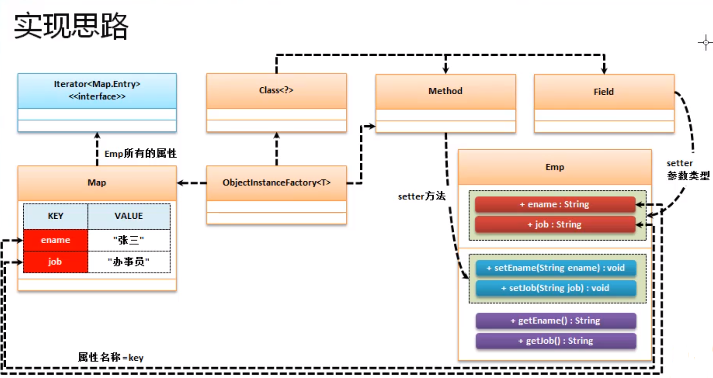
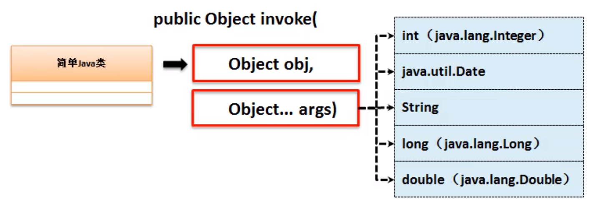
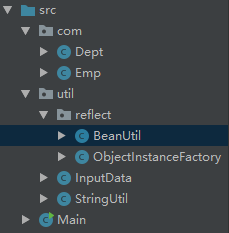

# 1. 单级属性

> 针对反射和简单Java类在实际项目中的设计意义

> 简单Java类最大的特点是只进行数据的存储 , 不对数据做复杂的操作

## a. 实现思路



## b. 代码结构


## c. 数据类型




## d. 代码



1. 主方法

   ```java
   import com.Dept;
   import com.Emp;
   import util.InputData;
   import util.reflect.ObjectInstanceFactory;
   
   public class Main {
   
       public static void main(String[] args) throws Exception {
           Emp emp = ObjectInstanceFactory.create(Emp.class, InputData.input());
           Dept dept = ObjectInstanceFactory.create(Dept.class, InputData.inputDept());
           System.out.println(emp);
           System.out.println(dept);
       }
   }
   
   ```

   

2. ObjectInstanceFactory

   ```java
   package util.reflect;
   
   import java.util.Map;
   
   public class ObjectInstanceFactory {
   
       private ObjectInstanceFactory() {
       }
   
       /**
        * 根据传入的Class类型获取实例化对象,同时可以将传入的属性进行赋值(错误的属性不复制)
        *
        * @param clazz  要进行实例化的简单java类型
        * @param values 包含输入的数据 , key必须和属性名相同
        * @param <T>    带有属性内容的简答java类对象
        * @return
        */
       public static <T> T create(Class<T> clazz, Map<String, String> values) {
           T object = null;
           try {
               // 1. 调用无参构造方法对类实例化
               object = clazz.getDeclaredConstructor().newInstance();
               // 2. 用发射处理内容
               BeanUtil.setValue(object, values);
           } catch (Exception e) {
               e.printStackTrace();
           }
           return object;
       }
   }
   
   ```

   

3. BeanUtil

   ```java
   package util.reflect;
   
   import util.StringUtil;
   
   import java.lang.reflect.Field;
   import java.lang.reflect.Method;
   import java.text.SimpleDateFormat;
   import java.util.Date;
   import java.util.Iterator;
   import java.util.Map;
   
   public class BeanUtil {
   
       private BeanUtil() {
       }
   
       public static void setValue(Object object, Map<String, String> values) {
           Iterator<Map.Entry<String, String>> iterator = values.entrySet().iterator();
           while (iterator.hasNext()) {
               Map.Entry<String, String> entry = iterator.next();//获取每组数据
               try { // 防止某些成员输入错误
                   Field field = object.getClass().getDeclaredField(entry.getKey());
                   Method method = object.
                           getClass().
                           getDeclaredMethod("set" +
                                   StringUtil.initcap(entry.getKey()), field.getType());
                   method.invoke(object, converValue(entry.getValue(), field));
               } catch (Exception e) {
                   e.printStackTrace();
               }
   
           }
       }
   
       /**
        * 实现字符串向指定数据类型转换
        *
        * @param value 接受字符串的数据内容
        * @param field 目标类型
        * @return 结果
        */
       private static Object converValue(String value, Field field) {
           String fieldName = field.getType().getName();
           if (String.class.getName().equalsIgnoreCase(fieldName)) {
               return value;
           }
           if (int.class.getName().equalsIgnoreCase(fieldName) || Integer.class.getName().equalsIgnoreCase(fieldName)) {
               try {
                   return Integer.parseInt(value);
               } catch (Exception e) {
                   return 0;
               }
           }
           if (long.class.getName().equalsIgnoreCase(fieldName) || Long.class.getName().equalsIgnoreCase(fieldName)) {
               try {
                   return Long.parseLong(value);
               } catch (Exception e) {
                   return 0;
               }
           }
   
           if (double.class.getName().equalsIgnoreCase(fieldName) || Double.class.getName().equalsIgnoreCase(fieldName)) {
               try {
                   return Double.parseDouble(value);
               } catch (Exception e) {
                   return 0;
               }
           }
   
           if (Date.class.getName().equalsIgnoreCase(fieldName)) {
               if (value == null || "".equalsIgnoreCase(value)) {
                   return null;
               } else {
                   SimpleDateFormat simpleDateFormat = null;
                   if (value.matches("\\d{4}-\\d{2}-\\d{2}")) {
                       simpleDateFormat = new SimpleDateFormat("yyyy-MM-dd");
                   } else if (value.matches("\\d{4}-\\d{2}-\\d{2} \\d{2}:\\d{2}:\\d{2}")) {
                       simpleDateFormat = new SimpleDateFormat("yyyy-MM-dd HH:mm:ss");
                   }
                   try {
                       return simpleDateFormat.parse(value);
                   } catch (Exception e) {
                       return null;
                   }
               }
           }
   
           return null;
       }
   }
   
   ```

   

4. StringUtil

   ```java
   package util;
   
   public class StringUtil {
       private StringUtil() {
       }
   
       public static String initcap(String name) {
           return name.substring(0, 1).toUpperCase() + name.substring(1);
       }
   }
   
   ```

   

5. Bean

   ```java
   package com;
   
   import java.util.Date;
   
   public class Emp {
       private String name;
       private int age;
       private Integer code;
       private Double sal;
       private Date birthday;
   
       //setter/gettter/toString方法...
   }
   
   ```

   

6. InputData

   ```java
   package util;
   
   import java.util.HashMap;
   import java.util.Map;
   
   public class InputData {
       private InputData() {
       }
   
       public static Map input() {
           Map<String, String> map = new HashMap<>();
           map.put("name", "luke");
           map.put("age", "28");
           map.put("code", "193829");
           map.put("sal", "3900.88");
           map.put("birthday", "1992-05-07 08:30:01");
           return map;
       }
   
       public static Map inputDept() {
           Map<String, String> map = new HashMap<>();
           map.put("name", "luke");
           map.put("office", "28");
           return map;
       }
   }
   
   ```

   

# 2. 多级属性

## a. 关系图

在一些时候也可能类中的属性引用的其他引用类型 , 假设下列关系如下

* Emp : 雇员
  * Dept : 部门
    * Company : 公司


## b. 代码

所以要想完成后续的所有设计 , 那么就必须考虑当前类对象实例化问题 , 级联的对象必须实例化 , 在一个简单Java类复制的过程中只能实例化一次 , 并且要有无参构造方法

修改 : BeanUtil 的 setValue 方法

```java
public static void setValue(Object object, Map<String, String> values) {
    Iterator<Map.Entry<String, String>> iterator = values.entrySet().iterator();
    while (iterator.hasNext()) {

        Map.Entry<String, String> entry = iterator.next();//获取每组数据
        String fieldKey;
        Object currentObject = object;// 设置一个当前的操作对象(后面还会不停的修改其引用)
        try {

            if (entry.getKey().contains(".")) { // 如果有点则表示会出现级联关系

                // 依据"."进行拆分处理, 而后以此判断, 如果发现getter方法调用返回的是null, 则利用setter实例化级联对象
                String[] fieldSplit = entry.getKey().split("\\."); // 特别注意这个转义符
                for (int i = 0; i < fieldSplit.length - 1; i++) { // 循环每一个属性 不看最后一个 因为最后一个不需要实例化
                    // 获取get方法
                    Method getMethod = currentObject.getClass().getDeclaredMethod("get" + StringUtil.initcap(fieldSplit[i]));
                    // 使用get犯法
                    Object tempReturn = getMethod.invoke(currentObject);// 获取返回值
                    // 获取到null对象
                    if (tempReturn == null) {//如果当前的对象没有被实例化,应该调用setter设置内容
                        Class<?> currentType = currentObject.getClass().getDeclaredField(fieldSplit[i]).getType();
                        // 获取set方法
                        Method setMethod = currentObject.getClass().getDeclaredMethod("set" + StringUtil.initcap(fieldSplit[i]), currentType);
                        // 实例化该对象
                        tempReturn = currentType.getDeclaredConstructor().newInstance();
                        // 使用set方法
                        setMethod.invoke(currentObject, tempReturn);
                    }
                    // 切换实例化对象为当前对象
                    currentObject = tempReturn;
                }
                // 获取属性名
                fieldKey = entry.getKey().substring(entry.getKey().lastIndexOf(".") + 1); // 截取属性名 ( 例如 emp.conpany.cname 最后一个cname一定是一个普通数据类型)

            } else { // 如果没有级联属性
                // 获取属性名
                fieldKey = entry.getKey();
            }
            // 获取当前对象需要写入的属性
            Field field = currentObject.getClass().getDeclaredField(fieldKey);
            // 获取当前对象需要写入属性的set方法
            Method setethod = currentObject.getClass().getDeclaredMethod("set" + StringUtil.initcap(fieldKey), field.getType());
            // 使用set方法
            setethod.invoke(currentObject, converValue(entry.getValue(), field));

        } catch (Exception e) {
            e.printStackTrace();
        }
    }
}
```

增加 : 实体类

1. Emp

   ```java
   package com;
   
   import java.util.Date;
   
   public class Emp {
       private String name;
       private int age;
       private Integer code;
       private Double sal;
       private Date birthday;
       private Dept dept;
   
   	//setter/gettter/toString方法...
   }
   ```

   

2. Dept

   ```java
   package com;
   
   public class Dept {
       private String name;
       private String office;
       private Company company;
   
   	//setter/gettter/toString方法...
   }
   ```

   

3. Company

   ```java
   package com;
   
   public class Company {
       private String name ;
       private String loc;
   
       //setter/gettter/toString方法...
   }
   ```

修改输入结构 : InputData

```java
package util;

import java.util.HashMap;
import java.util.Map;

public class InputData {
    private InputData() {
    }

    public static Map input() {
        Map<String, String> map = new HashMap<>();
        map.put("name", "luke");
        map.put("age", "28");
        map.put("code", "193829");
        map.put("sal", "3900.88");
        map.put("dept.office", "7楼办公室");
        map.put("dept.name", "软件部门");
        map.put("dept.company.loc", "火星98号坑");
        map.put("dept.company.name", "火星研究所");
        return map;
    }
}
```

主方法运行 :

```java
import com.Emp;
import util.InputData;
import util.reflect.ObjectInstanceFactory;

public class Main {

    public static void main(String[] args) throws Exception {
        Emp emp = ObjectInstanceFactory.create(Emp.class, InputData.input());
        System.out.println(emp);
        System.out.println(emp.getDept());
        System.out.println(emp.getDept().getCompany());
    }
}
```


运行结构 : 

```cmd
Emp{name='luke', age=28, code=193829, sal=3900.88, birthday=null, dept=Dept{name='软件部门', office='7楼办公室', company=Company{name='火星研究所', loc='火星98号坑'}}}
Dept{name='软件部门', office='7楼办公室', company=Company{name='火星研究所', loc='火星98号坑'}}
Company{name='火星研究所', loc='火星98号坑'}
```

