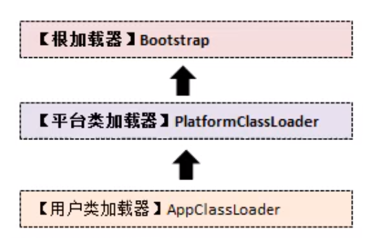
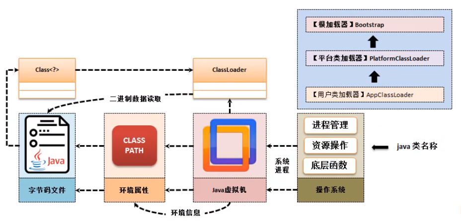
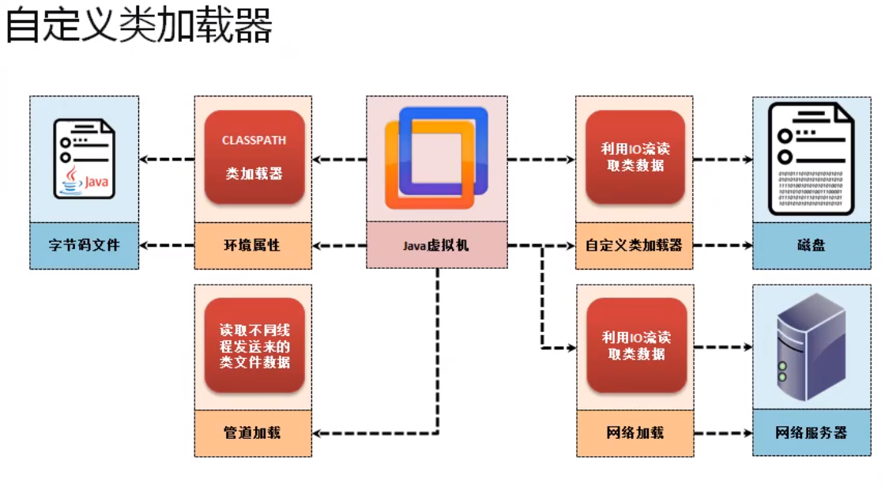

# 1. 类加载器 ClassLoader

## a. Java程序的执行

操作系统操作Java虚拟机 -> java虚拟机获取环境属性(classpath) -> 通过环境信息classpath让 类加载器ClassLoader寻找 *.class字节码文件 -> 获取成功进行操作


## b. ClassLoader 简介

所有`*.class`文件都会在磁盘上以二进制数据进行保存 (反射机制提供的就是二进制文件的解析能力) , 但是如果想要进行解析 , 就要做到类的信息加载 , 于是在JDK中提供了一个ClassLoader加载器 , 如果要想观察ClassLoader可以直接利用Class类的方法来完成 :

| Class 类有一个方法                   |
| ------------------------------------ |
| public ClassLoader getClassLoader(); |

获取ClassLoader就可以继续获取它之上的个各类的加载器 , 也可以依据此 ClassLoader找到对应的二进制字节码对应的信息 , 这个类重要的方法是获取父加载器 : `public final ClassLoader getParent() `

### 范例：观察加载器的不同（通过系统类“Strign”完成）

```java
System.out.println(Ball.class.getClassLoader());
System.out.println(Ball.class.getClassLoader().getParent());
System.out.println(Ball.class.getClassLoader().getParent().getParent();
```

运行结果 : 

```cmd
jdk.internal.loader.ClassLoaders$AppClassLoader@4629104a
jdk.internal.loader.ClassLoaders$PlatformClassLoader@f5f2bb7
null
```

此时已经出现了三个类加载器 : 

- `null` 表示Bootstrap(根加载器)
- `PlatformClassLoader` 表示平台类加载器
- `AppClassLoader` 表示应用加载器





在Java之中为了防止程序可能出现的漏洞,例如:开发者自己定义了一个"ja.lang.String"代码 , 并在其中写入了一些恶意的代码 , 那么请问 , 这个时候如何去防止这个恶性程序类被加载呢 ? 所以在类加载器中提供了一个双亲夹杂器 , 意思就是<u>系统类使用系统的加载器处理</u> , <u>用户类使用用户类的加载器处理</u> , **如果该类已经在系统中加载过了 , 那么用户类就不会再次加载类** . 

在 JDK1.8之前不存在 `PlatformClassLoade` 而是使用 `ExtClassLoader` , 主要是可以加载第三方目录中的JAR里的类 , 而1.9中不会这么加载 , 于是换了一个类 .

> 如果有需要可以自定义一个类加载器 来自定义类的加载位置

# 2. 自定义ClassLoader类

ClassLoader 类定义为抽象类 , 实际上如果需要开发者可以自己来定义专属的ClassLoader , 假设有现在如下程序类 :

1. 定义一个消息处理类

   ```java
   public class Message {
       public void send(String str){
           System.out.println("[消息发送]" +str);
       }
   }
   ```

   

2. 为了更加方便的观察出ClassLoader特点 , 下面将这个类手工编译(不打包) , 将生成的Message.class文件保存在D盘 . 

3. 利用字节流进行二进制数据加载 , 并且将加载道德内容转到ClassLoader中 , 就是自定义类加载器

```java
import java.io.ByteArrayOutputStream;
import java.io.File;
import java.io.FileInputStream;
import java.io.InputStream;
import java.lang.reflect.Method;

class MyClassLoader extends ClassLoader {
    private static final String CLASS_FILE = "D:" + File.separator + "Message.class";

    public Class<?> loadData(String className) throws Exception {
        byte[] bytes = this.loadClassDate();
        if (bytes != null) {
            return super.defineClass(className, bytes, 0, bytes.length);
        }
        return null;
    }

    private byte[] loadClassDate() throws Exception {
        InputStream inputStream = new FileInputStream(new File(CLASS_FILE));
        ByteArrayOutputStream outputStream = new ByteArrayOutputStream();
        inputStream.transferTo(outputStream);
        byte[] bytes = outputStream.toByteArray();
        inputStream.close();
        outputStream.close();
        return bytes; // 类的二进制数据
    }
}

public class Main {

    public static void main(String[] args) throws Exception {
        MyClassLoader classLoader = new MyClassLoader();
        Class<?> message = classLoader.loadData("Message");
        Object o = message.getDeclaredConstructor().newInstance();
        Method send = message.getDeclaredMethod("send", String.class);
        send.invoke(o, "你好啊");
        System.out.println("[类加载器]"+message.getClassLoader());
        System.out.println("[类加载器]"+message.getClassLoader().getParent());
        System.out.println("[类加载器]"+message.getClassLoader().getParent().getParent());
        System.out.println("[类加载器]"+message.getClassLoader().getParent().getParent().getParent());
    }
}

```

结果 : 

```cmd
[消息发送]你好啊
[类加载器]MyClassLoader@735b478
[类加载器]jdk.internal.loader.ClassLoaders$AppClassLoader@4629104a
[类加载器]jdk.internal.loader.ClassLoaders$PlatformClassLoader@2c9f9fb0
[类加载器]null
```

有了自定义类加载器 , 实际就可以操作远程类的操作

- 可以从任何位置进行加载类

