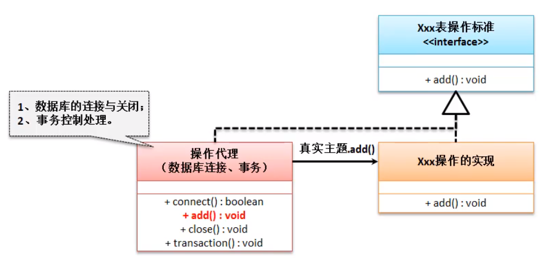
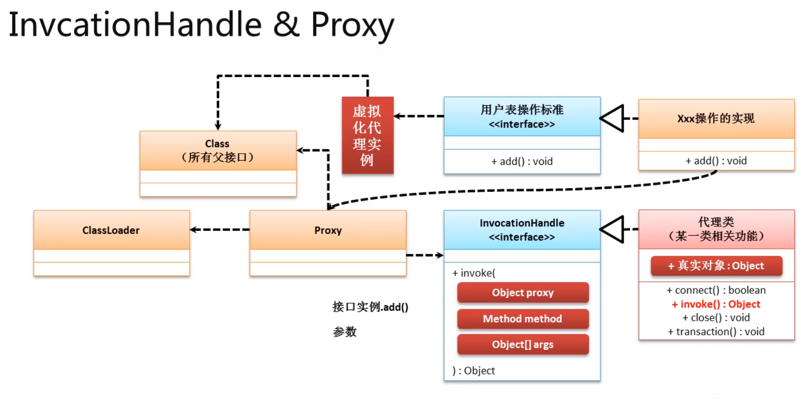
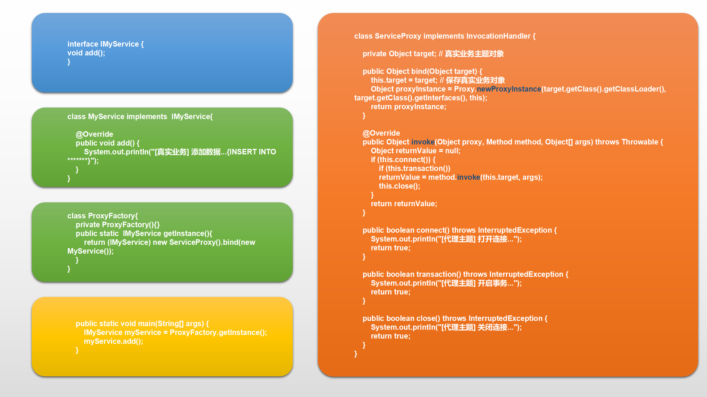
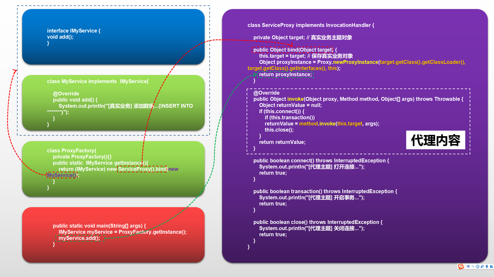

# 代理设计模式
 代理设计模式的最为核心的意义在于 , 所有的操作业务接口丢设置两个子类 , 一个子类负责真是业务处理 , 一个子类负责代理业务处理 , 如果没有这个代理业务 , 真是业务也无法进行处理 . 

 ## 1.静态代理设计模式的缺陷

现在假设说希望可以实现一个数据处理操作 , 在进行数据处理的时候 , 要求进行合理的事务控制 ,  在数据库操作的时候永远都有一个事务的概念 , 利用事务可以保证数据的完整性 .

代理与事务控制


范例 : 传统的代理实现



如图 : 静态代理每种数据操作都需要去实现一个代理来控制 , 如果有大量的操作 , 就会写大量的代理 , 这种设计方式只能瞒住一个操作接口的操作 . 

## 2.动态代理设计模式

### a. JDK -  接口实现

如果要要解决静态代理模式的代码重复操作问题 , 就只能利用动态代理设计模式来解决 . 

 动态代理设计模式 : 指的是一组相关的操作接口的实现 , 我们可以设置统一的代理类 . 


动态代理类是在 JDK1.3的时候添加到项目中的 , 如果要实现动态代理类需要`InvocationHandle`接口和`Proxy`类的支持 

#### java.lang.reflect.InvocationHandle

InvocationHandler是由代理实例的调用处理程序实现的接口。

下面就是处理代理实例上的方法调用并返回结果。

```java
public Object invoke(Object proxy, Method method, Object[] args) throws Throwable;
```

处理代理实例上的方法调用并返回结果。当在与其关联的代理实例上调用方法时，将在调用处理程序上调用此方法。

`proxy` —— 方法所调用的代理实例

`method `—— 对应于在代理实例上调用的接口方法的方法实例。方法对象的声明类将是方法声明所在的接口，它可能是代理类继承方法的代理接口的超接口。

`args`  —— 一个对象数组，包含在代理实例上的方法调用中传递的参数的值，如果接口方法不接受参数，则为null。原始类型的参数被包装在适当的原始包装器类的实例中，例如java.lang。整数或java.lang.Boolean。

对于一个代理设计需要解决的核心问题在于 , 如何可以让 InvocationHandle 的子类 和 业务接口有关联 . 

#### `java.lang.reflect.Proxy`类来进行创建关联  :


```java
public static Object newProxyInstance(ClassLoader loader, Class<?>[] interfaces, InvocationHandler h)
```

`loader` 用来定义代理类的类加载器

`interfaces` 要实现的代理类的接口列表

`h`  用于分派方法调用的调用处理程序

这种代理对象的创建是依据真实主题类的对象的加载器 , 和其实现的父接口动态创建的一个新的子类 , 该子类由JVM在运行的时候由JVM自行负责创建 . 



范例 : 

```java
import java.lang.reflect.InvocationHandler;
import java.lang.reflect.Method;
import java.lang.reflect.Proxy;

interface IMyService { // 用户实现的业务接口
    void add();
}
class MyService implements  IMyService{

    @Override
    public void add() {
        System.out.println("[真实业务] 添加数据...{INSERT INTO *******}");
    }
}
class ProxyFactory{
    private ProxyFactory(){}
    public static  IMyService getInstance(){
        return (IMyService) new ServiceProxy().bind(new MyService());
    }
}
class ServiceProxy implements InvocationHandler {
    private Object target; // 真实业务主题对象

    /**
     * 绑定真实主题对象,同时返回代理实例
     *
     * @param target 真正的接口操作对象,利用反射可以利用烦着追溯其来源
     * @return
     */
    public Object bind(Object target) {
        this.target = target; // 保存真实业务对象
        Object proxyInstance = Proxy.newProxyInstance(target.getClass().getClassLoader(), target.getClass().getInterfaces(), this);
        return proxyInstance;
    }

    @Override
    public Object invoke(Object proxy, Method method, Object[] args) throws Throwable {
        Object returnValue = null;
        if (this.connect()) {
            if (this.transaction())
            returnValue = method.invoke(this.target, args);
            this.close();
        }
        return returnValue;
    }

    public boolean connect() throws InterruptedException {
        System.out.println("[代理主题] 打开连接...");
        return true;
    }

    public boolean transaction() throws InterruptedException {
        System.out.println("[代理主题] 开启事务...");
        return true;
    }

    public boolean close() throws InterruptedException {
        System.out.println("[代理主题] 关闭连接...");
        return true;
    }
}


public class Main {

    public static void main(String[] args) {
        IMyService myService = ProxyFactory.getInstance();
        myService.add();
    }
}
```

结果 :

```cmd
[代理主题] 打开连接...
[代理主题] 开启事务...
[真实业务] 添加数据...{INSERT INTO *******}
[代理主题] 关闭连接...
```

此时的代码利用动态代理设计类动态的构建了接口的实现子类实例 , 并且利用 InvocationHandler.invoke() 实现标准的代码执行调用 , 在里面进行代理控制 .





### b. CGBIL - 类实现

在面向对象的角度来讲 , 不一定就必须使用接口来定义 , 所有就有第三方实现了 代理类 使用的是实现类的方法

Proxy.newProxyInstance(target.getClass().getClassLoader(), ==target.getClass().getInterfaces()==, this);

在使用Proxy的时候必须使用接口 , 于是CGBIL产生了 , 他不用在这里使用接口 的方式 . 

范例 : 

```java
import net.sf.cglib.proxy.Enhancer;
import net.sf.cglib.proxy.MethodInterceptor;
import net.sf.cglib.proxy.MethodProxy;

import java.lang.reflect.Method;

class MessageProxy implements MethodInterceptor { // cglib是基于拦截器实现的
    private Object target; //真实操作对象

    public MessageProxy(Object target) {
        this.target = target;
    }

    @Override
    public Object intercept(Object o, Method method, Object[] objects, MethodProxy methodProxy) throws Throwable {
        Object returnValue = null;
        if (this.connect()) {
            this.transaction();
            returnValue = method.invoke(target, objects);
            this.close();
        }
        return returnValue;
    }

    public boolean connect() throws InterruptedException {
        System.out.println("[代理主题] 打开连接...");
        return true;
    }

    public boolean transaction() throws InterruptedException {
        System.out.println("[代理主题] 开启事务...");
        return true;
    }

    public boolean close() throws InterruptedException {
        System.out.println("[代理主题] 关闭连接...");
        return true;
    }
}

class Message {
    public void send(String msg) {
        System.out.println("[真实业务] 发送消息{" + msg + "}");
    }
}

public class CGBIL {
    public static void main(String[] args) {
        Message realObject = new Message(); // 真实业务
        Enhancer enhancer = new Enhancer(); // 增强类
        enhancer.setSuperclass(realObject.getClass()); // 虚拟基类
        enhancer.setCallback(new MessageProxy(realObject));//将真实业务和代理业务都放入
        Message messageProxy = (Message) enhancer.create();// 生成代理后的实例对象
        messageProxy.send("nihao"); // 使用代理的实例对象
    }
}
```

结果

```cmd
[代理主题] 打开连接...
[代理主题] 开启事务...
[真实业务] 添加数据...{INSERT INTO *******}
[代理主题] 关闭连接...
```

此时的操作代码在没有实现父接口的情况下实现了类的代理设计 , 但是这样的设计只是一种传统JDK中代理操作的补充 , 可以利用其打破原始的设计要求 

但是在大部分情况下还是要考虑JDK原生的方法