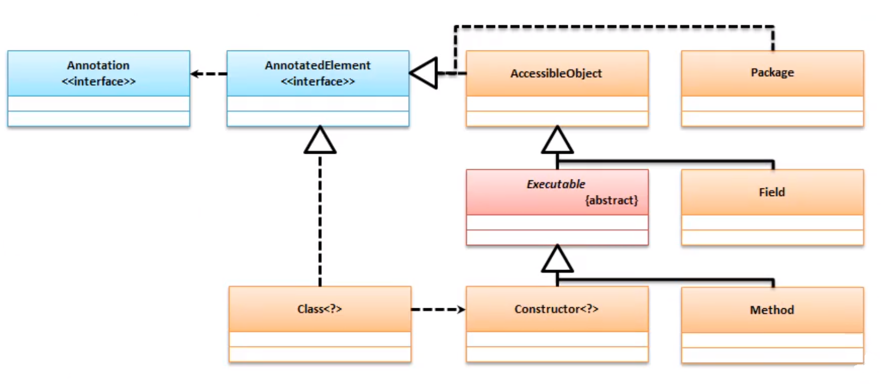

# 一、反射与Annotation

Annotation 是Java1.5之后最为重要的新特性 , 由于Annotation的存在 , 使得项目开发的形式发生了重大的改变.

## 1. 反射获取Annotaion信息

在一个类或者一个方法上有可能会存在大量的Annotation的定义 , 如果要获取这些Annotation 需要使用 反射提供的==AccessibleObject==

```
public Annotation[] getAnnotations()
```

它的接口为 ==AnnotatedElement==

|方法| 描述|
| - | - |
| `<T extends Annotation>T getAnnotation(Class<T> annotationClass)`                  | 返回该元素的，如果这样的注释指定类型的Annotation |
| `Annotation[] getAnnotations()`                                           | 返回此元素上*存在的*Annotation        |
| `default <T extendsAnnotation>T[] getAnnotationsByType(Class<T> annotationClass)`             | 返回与此元素*关联的*Annotation。                         |
| `default <T extendsAnnotation>T getDeclaredAnnotation(Class<T> annotationClass)`            | 如果*直接存在*这样的Annotation，则返回指定类型的此元素的Annotation，否则返回null。 |
| `Annotation[] getDeclaredAnnotations()`                                   | 返回*直接出现*在此元素上的Annotation。 |
| `default <T extendsAnnotation>T[] getDeclaredAnnotationsByType(Class<T> annotationClass)`     | 如果此类Annotation*直接存在*或 *间接存在*，则返回指定类型的此元素的Annotation。 |
| `default boolean isAnnotationPresent(Class<? extendsAnnotation> annotationClass)` | 如果此元素上*存在*指定类型的Annotation，则返回true ，否则返回false。 |

可以发现`Class`、`Constructor`、`Method`、`Field`都可以使用以上的方法通过反射 Annotation



## 2. Annotation 的定义

| 注解的定义                             | 释义             |
| -------------------------------------- | ---------------- |
| @Target(==ElementType.METHOD==)        | 能用在什么位置上 |
| @Retention(==RetentionPolicy.SOURCE==) | 作用域           |

* ElementType

  ```java
  TYPE,//类、接口
  FIELD,//字段声明(包括枚举常量)
  METHOD,//方法声明
  PARAMETER,//参数声明
  CONSTRUCTOR,//构造函数
  LOCAL_VARIABLE,//局部变量
  ANNOTATION_TYPE,//注释类型
  PACKAGE,//包
  TYPE_PARAMETER,//类型参数
  TYPE_USE,//使用类型
  MODULE//模块
  ```

* RetentionPolicy

  ```java
  SOURCE,//被编译器丢弃
  CLASS,//编译器记录在类文件中,但不需要由VM在运行时保留
  RUNTIME//被编译器记录在类文件中,在运行时被VM保留，因此可以使用反射读取它们。
  ```

## 3. 自定义Annotation

如果==Annotation==想要通过反射获取到 , 就必须将其定义在 RUNTIME 范围中

范例 : 实现自定义Annotation

```java
import java.lang.annotation.ElementType;
import java.lang.annotation.Retention;
import java.lang.annotation.RetentionPolicy;
import java.lang.annotation.Target;

@Target({ElementType.METHOD, ElementType.TYPE, ElementType.FIELD})//声明可以定义的位置
@Retention(RetentionPolicy.RUNTIME)//运行时有效
@interface Action { //自定义Annotaiton
    public String value();// 如果只有value()的参数,则可以不指定参数
    public String url() default "www.luke.con";// 默认的数据,可以不设置

}
@Action("我是一个消息")
class Message{
    @Action("你好啊Annotation")
    public void send(String msg){}
}
```

```java
public class Main {

    public static void main(String[] args) throws NoSuchMethodException {
        {// 获取类上定义的Annotation
            Action action = Message.class.getAnnotation(Action.class);
            System.out.println("[Message类上的Annotation的数据] value="+action.value()+",url="+action.url());
        }
        System.out.println("---------------------------------------------------");
        {// 获取方法上的Annotation
            Action send = Message.class.getDeclaredMethod("send", String.class).getAnnotation(Action.class);
            System.out.println("[Message类send方法上的Annotation的数据] value="+send.value()+",url="+send.url());

        }
    }
}
```

结果:

```cmd
[Message类上的Annotation的数据] value=我是一个消息,url=www.luke.con
---------------------------------------------------
[Message类send方法上的Annotation的数据] value=你好啊Annotation,url=www.luke.con
```

# 二、Annotation 整合工厂设计模式


范例 :

```java
import java.lang.annotation.ElementType;
import java.lang.annotation.Retention;
import java.lang.annotation.RetentionPolicy;
import java.lang.annotation.Target;

@Target(ElementType.TYPE)//声明可以定义的位置
@Retention(RetentionPolicy.RUNTIME)//运行时有效
@interface ConnectType { //自定义Annotaiton
    String value();
}
```
```java
interface IConnect {
    boolean build();
}

class DataaseConnect implements IConnect {
    @Override
    public boolean build() {
        System.out.println("[数据库连接]...");
        return true;
    }
}

class CloudConnect implements IConnect {

    @Override
    public boolean build() {
        System.out.println("[云服务连接]...");
        return true;
    }
}
```

```java
@ConnectType("CloudConnect")
class Message {
    private IConnect connect;
    public Message() {
        // 获取注解信息
        ConnectType connectType = getClass().getAnnotation(ConnectType.class);
        // 利用反射获取实例
        try {
            this.connect = (IConnect)Class.forName(connectType.value()).getDeclaredConstructor().newInstance();
        }catch (Exception e){}
    }

    public void send(String msg) {
        if (connect.build())
        System.out.println("[发送消息]" + msg);
    }
}
```

```java
public class Main {

    public static void main(String[] args) throws NoSuchMethodException {
        Message msg = new Message();
        msg.send("hello word");
    }
}
```

结果:

```cmd
[云服务连接]...
[发送消息]hello word
```

