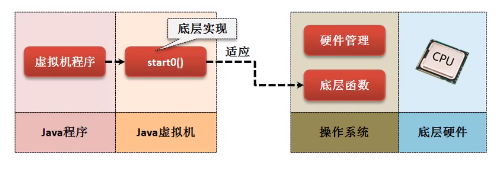
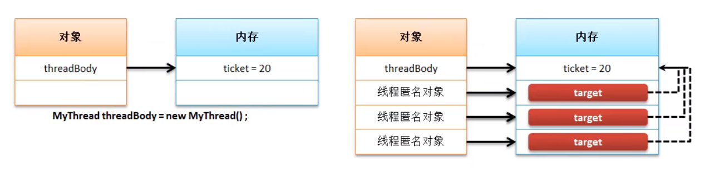
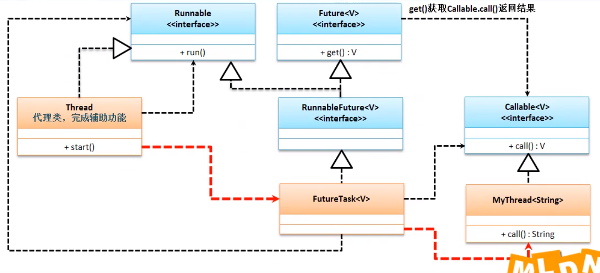

# 继承 Thread

范例 : 使用

```java
class MyThread extends Thread { // 得到一个线程主题类
    private String name;

    public MyThread(String name) {
        this.name = name;
    }

    @Override
    public void run() { // 覆写run()方法
        for (int i = 0; i < 50; i++) {
            System.out.println(this.name+"["+i+"]");
        }
    }
}

public class Main {

    public static void main(String[] args) throws Exception {
        Thread myThreadA = new MyThread("MyThreadA");
        Thread myThreadB = new MyThread("MyThreadB");
        Thread myThreadC = new MyThread("MyThreadC");
        myThreadA.start();
        myThreadB.start();
        myThreadC.start();
    }

}
```

```cmd
MyThreadB[3]
MyThreadA[2]
MyThreadB[4]
MyThreadC[2]
MyThreadB[5]
MyThreadA[3]
MyThreadB[6]
```

## start 方法

```java
    public synchronized void start() {
        
        if (threadStatus != 0)
            throw new IllegalThreadStateException(); // 重复启动线程抛出异常

        group.add(this);

        boolean started = false;
        try {
            start0(); // 关键
            started = true;
        } finally {
            try {
                if (!started) {
                    group.threadStartFailed(this);
                }
            } catch (Throwable ignore) {
                
            }
        }
    }
```

* start0();

```java
private native void start0(); // start0() 没有方法体,此方法交给低层
```



> native (JNI - Java Native Iterface) 利用java调用底层函数 ; 在Android开发中 JNI很常见 ;

# 实现 Runnable

* 函数式接口

```java
@FunctionalInterface 
public interface Runnable
```

* 方法

```java
void run()
```

> 该接口没有 start() 方法 , 只能依靠 Thread.start()方法 ;
>
> Thread 提供了构造方法 `public Thread(Runnable target)` 接受 Runnable 对象

范例 : 

```java
class MyRunnable implements Runnable { // 得到一个线程主题类
    private String name;
    private native void start0();

    public MyRunnable(String name) {
        this.name = name;
    }

    @Override
    public void run() { // 覆写run()方法
        for (int i = 0; i < 50; i++) {
            System.out.println(this.name+"["+i+"]");
        }
    }
}

public class Main {

    public static void main(String[] args) throws Exception {
        Thread thread = new Thread(new MyRunnable("luke"));
        thread.start();
    }

}
```

范例 : lanmbda

```java
String[] threadNames = new String[]{"a", "b", "c"};
for (String name : threadNames) {
    new Thread(()->{
        for (int i = 0; i < 50; i++) {
            System.out.println(name+i);
        }
    }).start();
}
```

## Thread 和 Runnable 的关系

1.0 就出现了 Thread Runnable ;

```java
public class Thread extends Object implements Runnable
```


### 1. Thread 类接收 Runnable 对象的构造方法

```java
public Thread(Runnable target) {
    init(null, target, "Thread-" + nextThreadNum(), 0);
}
```

```java
this.target = target;
```

```java
private Runnable target;
```

> Runnable 接口传递到Thread后 保存了 Runnable

### 2. 观察Thread方法中的run()方法

```java
@Override
public void run() {
    if (target != null) {
        target.run();
    }
}
```

> 在Thread.run() 方法 , 调用的是 target.run();

> Runnable 接口相比较 Thread 而言 , 可以==更加方便==的描述出数据共享的概念 , 即 : 多个线程并行操作同一个资源(方法体);

范例 : 观察资源共享

```java
public class Main {

    public static void main(String[] args) throws Exception {
        MyThread myThread = new MyThread("luke");
        new Thread(myThread).start();
        new Thread(myThread).start();
        new Thread(myThread).start();
    }
}
```

```java
class MyThread implements Runnable {
    private int ticket = 20;
    private String prisonName;

    public MyThread(String prisonName) {
        this.prisonName = prisonName;
    }

    @Override
    public void run() {
        for (int i = 0; i < 50; i++) {
            if (ticket != 0)
                System.out.println(prisonName + "购买 第" + ticket-- + "张票");
        }
    }
}
```

结果 :

```cmd
luke购买 第20张票
luke购买 第18张票
luke购买 第19张票
luke购买 第16张票
luke购买 第14张票
luke购买 第13张票
```



> 这种使用方法的优点 :
>
> 1. 避免了单继承局限造成的困扰
> 2. 继承了Thread类就有了start() , 那为什么还要借用其他类的 start()

> 多线程都是用 Runnable 来实现

# Callable 实现多线程

Runnable的`run()`方法有个缺点  , 没有返回值 ; 

从 jdk 1.5开始 加入了`java.util.concurrent.Callable`

```java
@FunctionalInterface
public interface Callable<V> {
    V call() throws Exception; // 相当于 run();
}
```

> 可以发现在Callable接口中提供的`call()`方法可以定义有返回值 , 即 : 线程结束后可以返回结果 ;

范例 : 

```java
import java.util.concurrent.Callable;
import java.util.concurrent.FutureTask;

public class Main {

    public static void main(String[] args) throws Exception {
        Callable<String> myThreadA = new MyThread("A");
        FutureTask<String> futureA = new FutureTask<String>(myThreadA);
        new Thread(futureA).start();
        System.out.println(futureA.get());
    }
}
```
```java
class MyThread implements Callable<String> {
    private int ticket = 20;
    private String prisonName;

    public MyThread(String prisonName) {
        this.prisonName = prisonName;
    }

    @Override
    public String call() throws Exception {
        for (int i = 0; i < 50; i++) {
            if (ticket != 0)
                System.out.println(prisonName + "购买 第" + ticket-- + "张票");
        }
        return "执行完成";
    }
}
```

### 1. Thread 和 Callable



