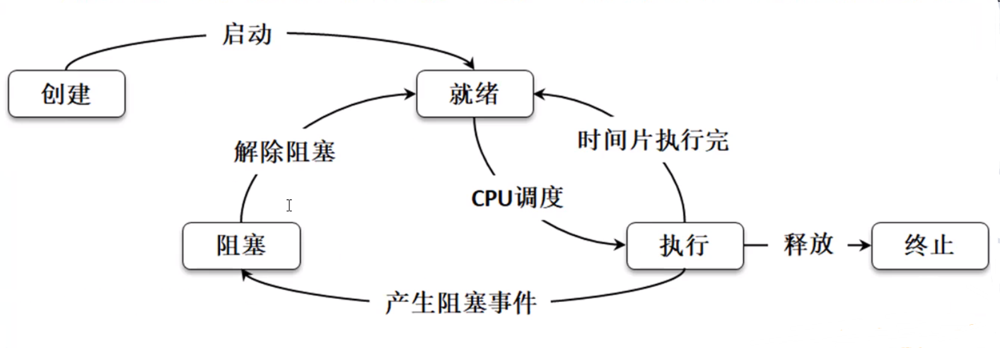
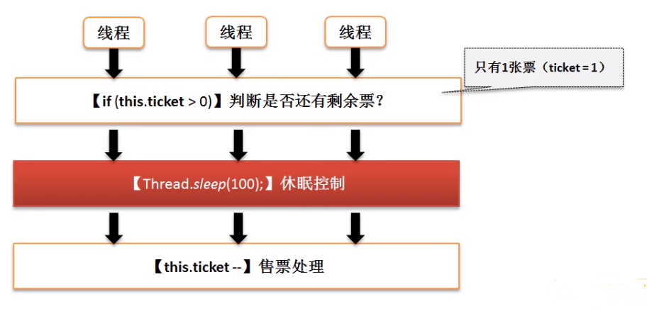
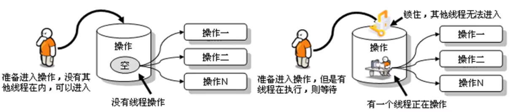

# 状态



- 创建 - 开发者定义好了线程类的对象
- 就绪 - 调用 start() 方法
- 执行 - 在执行一段时间后暂停运行
- 阻塞 - 当某个线程不再执行时 (中断 , 休眠 , 调度失效) , 那么线程进入阻塞状态
- 终止 - 如果线程的执行体执行完成 , 就会进入终止状态

# 操作

## 线程的命名和取得

1. 命名 Thread 类

   | 方法                                          | 释义       |
   | --------------------------------------------- | ---------- |
   | public Thread (Runnable target , String name) | 接受线程名 |
   | public final void setName(String name)        | 修改线程名 |
   | public final void getName()                   | 获取线程名 |

   

2. 取得

   由于所有的线程状态都是不可控的 , 所以只能获取当前运行的线程名称

   ```java
   Thread.currentThread().getName
   ```

   > 即使我们没有给线程名称 , Thread也会给一个默认的名称
   >
   > ```java
   > public Thread() {
   >     init(null, null, "Thread-" + nextThreadNum(), 0);
   > }
   > ```
   >
   > ```java
   > private static int threadInitNumber;
   > private static synchronized int nextThreadNum() {
   >     return threadInitNumber++;
   > }
   > ```

## 线程休眠

默认情况下线程对象只要启动了 , 就会持续运行下去 , 一直到运行完毕为止 , 如何使运行缓慢一些 , 那么就可以使用休眠 , 在 `Thread`类里面提供有休眠的方法:

| 方法                                          | 释义       |
| --------------------------------------------- | ---------- |
| public static void sleep(long ==millis==) throws InterruptedException;|毫秒|
| public static void sleep(long ==millis==, int ==nanos==) throws InterruptedException;|毫秒和纳秒|


## 线程中断

| 方法                          | 释义             |
| ----------------------------- | ---------------- |
| public void interrupt()       | 线程中断         |
| public boolean isIntrrupted() | 判断线程中断状态 |

> 一个线程被另一个线程打断

范例 :

```java
Thread thread = new Thread(() -> {
    try {
        Thread.sleep(2000);
        System.out.println("吃饱睡足,开始学习---");
    } catch (InterruptedException e) {
        System.out.println("被打扰,抓狂");
    }
});
thread.start();
System.out.println("线程中断状态" + thread.isInterrupted());
Thread.sleep(1000);
thread.interrupt();
System.out.println("线程中断状态" + thread.isInterrupted());
```

## 线程强制执行

当程序中存在若干个线程的时候 , 那么这若干个线程之间彼此肯定是相互交替执行的状态 , 但是有一个线程特别急 , 需要优先处理完成 , 则可以使用线程的强制执行

| 方法                                           | 释义                      |
| ---------------------------------------------- | ------------------------- |
| public final void join()                       | 线程强制执行              |
| public final void join(long millis)            | 线程强制执行 毫秒         |
| public final void join(long millis, int nanos) | 线程强制执行 毫秒 和 纳秒 |

范例 : 

```java
public class Main {

    public static void main(String[] args) throws Exception {
        Thread mainThread = Thread.currentThread();
        Thread thread = new Thread(() -> {
            for (int i = 0; i < 1000; i++) {
                if (i==10) {
                    try {
                        i=11;
                        mainThread.join(); // 主线程执行
                    } catch (InterruptedException e) {
                        e.printStackTrace();
                    }
                }
                System.out.println(Thread.currentThread().getName() + "执行,x=" + i);
            }
        },"循环线程");
        thread.start();
        for (int i = 0; i < 50; i++) {
            Thread.sleep(100);
            System.out.println(Thread.currentThread().getName() + "执行,x=" + i);
        }
    }
}
```

> 使用`join()`会将线程强制执行 , 如果没有指定时间 , 那就会等待线程结束后进行运行

## 线程礼让

| 方法                       | 释义     |
| -------------------------- | -------- |
| public static void yield() | 线程礼让 |

范例 :

```java
Thread thread = new Thread(() -> {
    for (int i = 0; i < 1000; i++) {
        if (i%3==0){
            Thread.yield();
            System.out.println("[yield]");
        }
        try {
            Thread.sleep(1000);
        } catch (InterruptedException e) {
            e.printStackTrace();
        }
        System.out.println(Thread.currentThread().getName() + "执行,x=" + i);
    }
},"循环线程");
thread.start();
for (int i = 0; i < 50; i++) {
    Thread.sleep(1000);
    System.out.println(Thread.currentThread().getName() + "执行,x=" + i);
}
```

> 礼让会优先使别的线程运行==一次== , 而后会继续抢占资源

## 线程优先级

> 理论上线程的优先级越高 , 越有可能先执行

| 方法及常量                                     | 释义                   |
| ---------------------------------------------- | ---------------------- |
| public final void setPriority(int newPriority) | 设置优先级             |
| public final int getPriority()                 | 获取优先级             |
| public static final int MIN_PRIORITY           | 最低优先级(数值为"1")  |
| public static final int NORM_PRIORITY          | 中等优先级(数值为"5")  |
| public static final int MAX_PRIORITY           | 最高优先级(数值为"10") |

范例 :

```java
Runnable runnable = () -> {
    for (int i = 0; i < 100; i++) {
        try {
            Thread.sleep(100);
        } catch (InterruptedException e) {
            e.printStackTrace();
        }
        System.out.println(Thread.currentThread().getName() + "[" + i + "]");
    }
};
Thread threadA = new Thread(runnable,"A");
Thread threadB = new Thread(runnable,"B");
Thread threadC = new Thread(runnable,"C");
threadA.setPriority(Thread.MAX_PRIORITY);
threadA.setPriority(Thread.MIN_PRIORITY);
threadA.setPriority(Thread.MIN_PRIORITY);
threadA.start();
threadB.start();
threadC.start();
```

> 线程的默认优先级为 NORM_PRIORITY = 5;

## 线程的同步与死锁

多个线程并发访问时可能会造成不同步

### 不同步分析



```java
class TicketThread implements Runnable {
    private int ticket = 6;

    @Override
    public void run() {
        for (int i = 0; i < 10; i++) {
            if (ticket > 0) {
                ticket--;
                try {
                    Thread.sleep(2000);
                } catch (InterruptedException e) {
                    e.printStackTrace();
                }
                System.out.println("卖出一张票 , 还剩" + ticket + "张票");
            }
        }
    }
}
```
```java
public class Main {
    public static void main(String[] args) throws Exception {
        TicketThread ticketThread = new TicketThread();
        Thread thread1 = new Thread(ticketThread);
        Thread thread2 = new Thread(ticketThread);
        Thread thread3 = new Thread(ticketThread);
        thread1.start();
        thread2.start();
        thread3.start();
    }
}
```

> 多个线程进入到程序中 , 并行执行

### 同步

如果想解决不同步的问题 , 就必须使用同步 , 所谓的同步就是指多个操作在同一个时间段内只能有一个线程进行 , 其他线程要等待此线程完成后才可以继续执行 . 



如果想要实现线程同步处理 , 可以利用==synchronized== 关键字来实现 , 对于synchronize的使用有两种方法  :

1. 同步代码块

   使用==synchronized== 关键字定义的代码块 , 在进行同步的时候一定要有一个同步的对象 , 这个对象往往为当前资源的对象 , 可以使用this描述 

   ``` java
   synchronized (同步对象){
   	所有需要同步处理的操作代码;
   }
   ```

   范例 : 售票同步

   ```java
   class TicketThread implements Runnable {
       private int ticket = 6;
   
       @Override
       public void run() {
           for (int i = 0; i < 10; i++) {
               synchronized (this) { // 添加同步代码块
                   if (ticket > 0) {
                       ticket--;
                       try {
                           Thread.sleep(2000);
                       } catch (InterruptedException e) {
                           e.printStackTrace();
                       }
                       System.out.println("卖出一张票 , 还剩" + ticket + "张票");
                   }
               }
           }
       }
   }
   ```

   

2. 同步方法

   ```java
   synchronized 返回值 方法名(){
       //  方法体
   } 
   ```

   范例 : 

   ```java
   class TicketThread implements Runnable {
       private int ticket = 6;
   
       @Override
       public void run() {
           for (int i = 0; i < 10; i++) {
               this.buy();
           }
       }
   
       synchronized void buy() {
           if (ticket > 0) {
               ticket--;
               try {
                   Thread.sleep(2000);
               } catch (InterruptedException e) {
                   e.printStackTrace();
               }
               System.out.println("卖出一张票 , 还剩" + ticket + "张票");
           }
       }
   }
   ```

### 死锁

> 死锁就是线程互相等待

