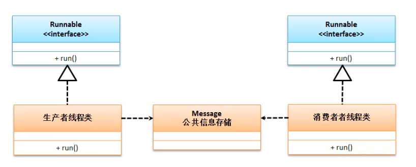

# 经典案例 : 生产者和消费者



## 公共信息存储
```java
class Message {
    private String title;
    private Double price;
    private boolean flag = false;// 标记 false=缺货 true=清货

    public Message() {
    }

    public Message(String title, Double price) {
        this.title = title;
        this.price = price;
    }

    // getter/setter
	// 生产方法
    public synchronized void production(String title, Double price) { // synchronized 同步锁
        if (flag == true) { // 仓库有货,停止生产,进行清货
            try {
                super.wait(); // 等待消费
            } catch (InterruptedException e) {
                e.printStackTrace();
            }
        }
        this.title = title;
        try {
            Thread.sleep(100);
        } catch (InterruptedException e) {
            e.printStackTrace();
        }
        this.price = price;
        this.flag = true; // 可以清货标记
        super.notify(); // 生产完成
    }
	// 消费方法
    public synchronized void consumption() { // synchronized 同步锁
        if (flag == false) {
            try {
                super.wait(); // 等待生产
            } catch (InterruptedException e) {
                e.printStackTrace();
            }
        }
        System.out.println("消费" + this.title + "[价格" + this.price + "]");
        this.flag = false; // 消费完成
        super.notify(); // 去生产
    }
}
```
## 生产者线程
```java
class Producer implements Runnable {
    private Message message;

    public Producer(Message message) {
        this.message = message;

    }

    @Override
    public void run() {
        for (int i = 0; i < 50; i++) {
            synchronized (this){
            if (i % 2 == 0) {
                message.production("鑫少木偶", 111.11);
                System.out.println("生产鑫少木偶");
            } else {
                message.production("中少模型", 66666.11);
                System.out.println("生产中少模型");
            }}
        }
    }

}
```
## 消费者线程
```java
class Consumer implements Runnable {
    private Message message;// 仓库

    public Consumer(Message message) {
        this.message = message;
    }

    @Override
    public void run() {
        for (int i = 0; i < 50; i++) {
            message.consumption();
        }
    }
}
```
## 运行
```java
public class TestDemo {
    public static void main(String[] args) {
        Message message = new Message();
        Producer producer = new Producer(message);
        Consumer consumer = new Consumer(message);
        new Thread(producer).start();
        new Thread(consumer).start();
    }
}
```

