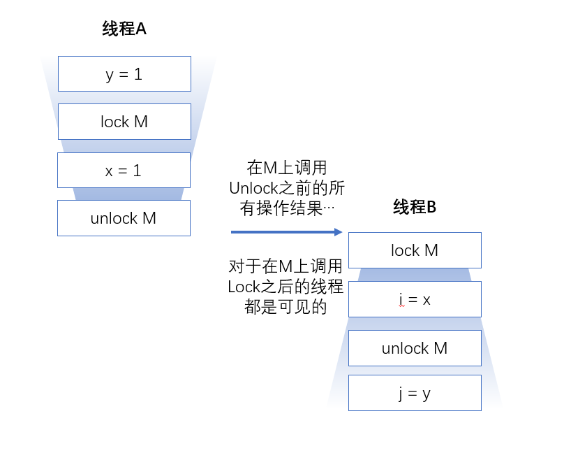

# 对象的共享

​	要编写正确的并发程序，关键问题在于：==在访问共享的可变状态时需要进行正确的管理==

​	我们不仅希望防止某个线程正在使用的对象状态而另一个线程正在修改该状态，而且希望确保一个线程修改了对象状态后，其他线程能够看到发生的变化。如果没有同步，那么这种情况就无法实现。

# 1. 可见性

​	可见性是一个负责的属性，因为可见性的错误总是违背我们的直觉。

​	==在没有同步的情况下，编译器、处理器以及运行时等都可能对操作的执行顺序进行意想不到的调整。在缺乏足够的同步的多线程程序中，要相对内存操作的执行顺序进行判断，几乎无法得到正确的结论。==

​	<u>只要有数据在多个线程之间共享，就可以使用正确的同步</u>

### 1.1 失效数据

​	失效数据可能会导致一些严重的的安全问题或者活跃性问题。

例如 ：

```java
@NotThreadSafe
public class MutableInteger{
    private int value;
    public int get(){return value;}
    public void set(int value){this.value=value;}
}
```

> 如上程序：如果一个线程调用了set方法，另一个线程调用get方法可能会看到更新后的值，也有可能看不到；

然而对get和set方法进行同步锁也会看见失效值；

### 1.2 非原子的64位操作

​	最低安全性适用于大部分变量，但是存在一个例外：非`volatile`类型的64位数值变量（double和long）。

​	Java内存模型要求，变量读取操作和写入操作都必须是原子操作，到时对于非`volatile`类型的long和double变量，JVM允许将64位的读操作或者写操作分解为两个32位操作，读写操作在不同的线程中，很有可能读取到的是某个值的高32位和另一个值得低32位。

​	==即使不考虑失效数据问题，在多线程程序中使用共享且可变的long和double等类型的变量也是不安全的，除非使用`volatile`关键字来声明，或者使用所保护起来。==

### 1.3 加锁与可见性



​	当线程A执行某个同步代码块时，线程B随后进入由同一个所保护的同步代码块，这种情况下可以保证，在所被释放之前，A看到的变量在B获取锁后同样可以由线程B看到，换句话说，当线程B执行有锁保护的同步代码块是，可以看到线程A之前在同一个同步代码块中所有操作结果。如果没有同步，那么就无法实现上述保证。

​	==加锁的含义不仅仅是局限于互斥行为，还包含内存可见性。为了确保所有的线程都能<u>看到最新值</u>，所有执行读操作或者写操作的线程都必须在<u>同一个锁上同步</u>==

### 1.4 Volatile 变量

​	`volatile`相比`synchronized`来说更加轻量级的同步机制。

​	当线程A首先写入一个`volatile`变量并且线程B随后读取该`volatile`变量时，在写入`volatile`变量之前对A可见的所有变量值，在B读取了`volatile`变量后，对B也是可见的。

​	`volatile`==从内存角度来看，写入`volatile`变量相当于退出同步代码块，读取`volatile`变量就相当于进入同步代码块==

> 访问的时候没有同步锁，写入的时候有同步锁；也就说修改默认加锁，读取不加锁；
>
> 然而`volatile`变量只能保证普通的读写安全 ，如果是`count++`则不能保证其安全性，

> ==`volatile`只能保证其可见性，而不能保证其原则性，所以慎用==

​	当满足以下条件可以使用`volatile`：

1. 对变量的写入操作不宜懒变量的当前值；
2. 该变量不会与其他状态变量一起纳入不变性条件中；
3. 在访问变量时不需要加锁；

# 2.发布与逸出

- 发布

  发布（Publish）一个对象的意思是指，==使对象能够在当前作用域之外的代码使用

- 逸出

  当某个不应该发布的内容被发布时，这种情况叫逸出

范例：发布了 messages

```java
public static Set<String> messages;
public void init(){
    messages = new HashSet<String>();
}
```

> 通过static将想要的内容暴露在外

范例：逸出states

```java
class UnsafeStates{
    private String[] states = newString[]{"AK","AD",....}
    public String[] getStates(){return states}
}
```

> 如果states只是UnsafeStatesz特有的状态，而getStates却使用public暴露了它的状态，并且其他类还可以修改，这就叫逸出。

## 安全的对象构造过程

> 不要再构造的过程中使用this引用逸出

​	如果想在构造函数中注册一个启动线程，那么可以使用一个私有的构造函数和一个公共的工厂方法（Factory Method），从而避免不正确的构造过程。

范例 ： 

```java
public class SafeListener{
    private final EventListener listener;
    private SafeListener(){
        listener = new EventListener(){
            public void onEvent(Event e){
                doSomething(e);
            }
        }
    }
    public static SafeListener newInstance(EventSource source){
        SafeListener safeListener = new SafeListener();
        source.registerListener(safeListener.listener);
        return safeListener;
    }
}
```

# 3. 线程封闭

​	==当访问共享的可变数据时，通常需要使用同步。一种避免使用同步的方式就是不共享数据。如果仅在单线程内访问数据，就不需要同步。这种技术被称为**线程封闭（Thread Confinement）**，他是实现线程安全性最简单的方法之一。==

​	线程封闭技术最常见的应用是**JDBC**（Java Database Connectivity）的==Connection==对象。JDBC规范并不要求Connection对象是线程安全的。在典型的服务器应用中，线程从连接池中获得一个Connnection对象，并且用该对象来处理请求，在使用完成后返还给线程池。由于大多数请求都是单个线程采用同步的方式来处理，并且在Connection对象返回之前，连接池不会将它分配给其他线程，因此，这种连接管理模式在处理请求是隐含的将Connection对象封闭在线程中。

​	Java中提供了一些机制来帮助维持线程封闭性，例如**局部变量和****ThreadLocal**类，即便如此，程序员任然需要负责确保封闭在线程中的对象不会逸出

## 3.1栈封闭

​	==栈封闭（也被称为线程内部使用或者线程局部使用，不要与ThreadLocal混淆）。==

​	在维持对象引用的栈封闭性是，程序员需要多做一些工作以确保被引用的对象不会逸出，如果在线程内部使用非线程安全的对象，并且不会发布或逸出，那么这个对象就是线程安全的。

## 3.2ThreadLocal类

​	维持线程封闭性的更规范的方式是使用==ThreadLocal==，==这个类能使线程中的某个值与保存值的对象关联起来。ThreadLocal提供了get与set等访问接口或方法，这些方法为每个使用该变量的线程都有一份独立的副本，一次get总是返回的最新值。==

范例：

```java
public class demo {
    public static void main(String[] args) throws Exception {
        MyThread myThreadA = new MyThread();
        myThreadA.setName("ThreadA");

        MyThread myThreadB = new MyThread();
        myThreadB.setName("ThreadB");

        myThreadA.start();
        myThreadB.start();

    }

    static class MyThread extends Thread {
        private static ThreadLocal<Integer> threadLocal = new ThreadLocal<>();

        @Override
        public void run() {
            super.run();
            for (int i = 0; i < 3; i++) {
                threadLocal.set(i);
                System.out.println(getName() + " threadLocal.get() = " + threadLocal.get());
            }
        }
    }
}

```

> ​	自己的理解：==ThreadLocal 使用set保存了数据并且标记了是哪个线程的，在get时，先验证访问数据的是哪个线程，然后在返回访问线程自己的数据；==

## 3.4.不变性

> ==不可变得对象一定是线程安全的。==

​	满足一下调价是，对象才是不可变的：

- 对象创建后其状态就是不可修改的；
- 对象的所有域都是`final`类型；
- 对象是正确创建的，在创建的过程中没有逸出。

### final域

​	==final==类型的域是不能修改的（但是如果final引用的对象是可变的，那么这个引用对象就是可变的）。然而在Java内存模型中，final域还有这特殊的语义。==final域能确保初始化过程中的安全性，从而可以不受限制的访问不可变对象，并在共享这些对象是无需同步==

> 以上都是如何使对象不被发布，逸出来保证线程安全

## 3.4.安全发布

> 在某些情况下，我们希望对象的内容要被发布，并且还是安全的。

### 安全发布的常用模式：

1. ==在静态初始化函数中初始化一个对象的引用==；
	
2. 将对象引用保存到==volatile==类型的域中；
	
3. 将对象引用保存到某个==正确构造对象的<u>*final*</u>类型域中==；
	
4. 将对像引用保存到一个由锁保护的域中；

   


### Java类库提供了一些容器来保证安全发布：

- Map
  1. Hashtable
  2. synchronizedMap
  3. ConcurrentMap
- List
  1. Vector
  2. CopyOnWriteArrayList
  3. CopyOnWriteArraySet
  4. synchronizedList
  5. synchronizedSet
- Queue
  1. BlockingQueue
  2. ConcurrentLinkedQueue


> 在并发程序中使用和共享对象时，可以使用一些实用策略，包括
>
> - **线程封闭**。线程封闭的对象只能有一个线程拥有，对象被封闭在线程中，并且只能由这个线程修改；
> - **只读共享**。在没有额外的同步下，共享的制度对象可以由多个并发线程访问，但任何线程都不可以修改它。共享对象包括不可变对象和事实不可变对象；
> - **线程安全共享**。线程安全的对象在其内部实现同步，因此多个线程可以通过对象的公共接口来进行访问而不需要进一步的同步；
> - **保护对象**。 被保护的对象只能通过持有特定的锁来访问。保护对象包括封装在其他线程安全对象中的对象，以及已经发布的并且由某个特定锁保护的对象。


