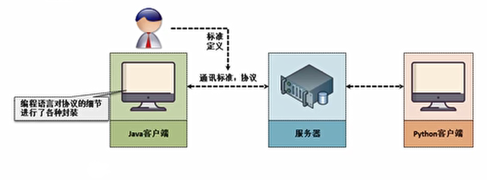
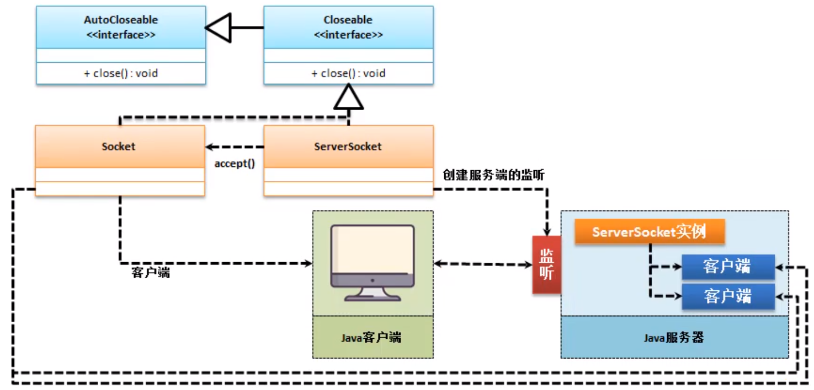
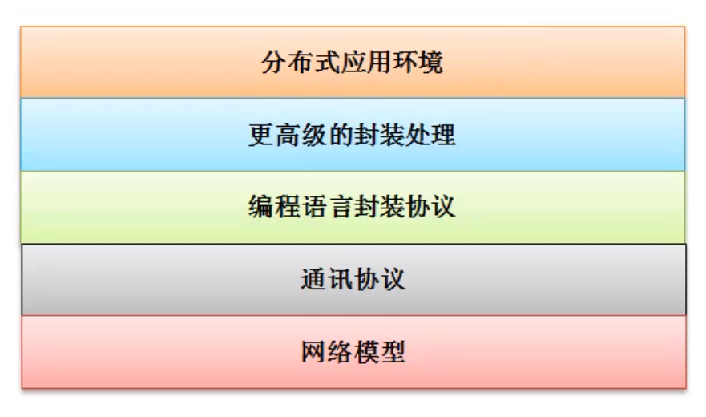
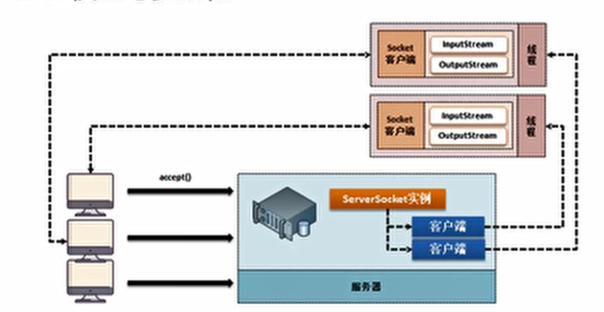
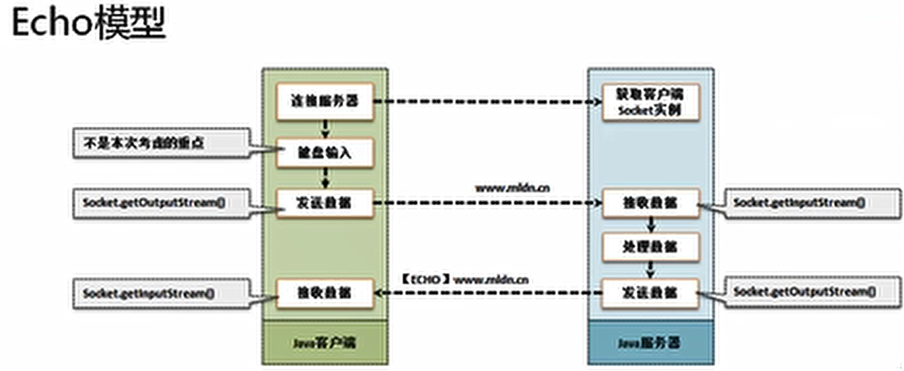

# 网络编程

> Java技术的发挥点就在于网络编程上，Java拥有良好的性能，尤其是其优秀的程序高并发支持能力，更是其他语言所无法达到的一个高度。

- 网络定义：把物理上分离的计算机通过某种路径连接在一起。
- Java中原生支持网络编程有两个主要的协议：TCP（传送控制协议）、UDP（数据包协议）
- 在进行网络开发的过程中，也会分为两种开发模式：
  - C/S：需要开发两套程序，安全性较高
  - B/S：只开发服务器程序，客户端使用浏览器，安全性较差，但是维护成本低；



## TCP

### 1. 开发网络客户端

- 利用Windows提供的`telnet`作为客户端访问
- 服务端使用Java

#### Socket 与 ServerSocket

1. Socket （表示客户端实例）

   ```java
   public Socket(String host,int port)
   ```

   

2. SocketService（表示服务端实例） 




范例：

- 客户端

```java
package tcpDemo;

import java.net.Socket;
import java.util.Scanner;

public class TCPClient {
    public static void main(String[] args)throws Exception {
        Socket socket = new Socket("127.0.0.1", 9999);
        Scanner scanner = new Scanner(socket.getInputStream());
        while (scanner.hasNext()){
            System.out.println(scanner.nextLine());
        }
    }
}
```

- 服务端

```java
package tcpDemo;

import java.io.PrintStream;
import java.net.ServerSocket;
import java.net.Socket;

public class TCPService {
    public static void main(String[] args)throws Exception {
        ServerSocket server = new ServerSocket(9999);
        Socket client = server.accept();
        PrintStream out = new PrintStream(client.getOutputStream());
        out.print("Hello World ...");
        client.close();
        server.close();
    }
}
```

- 执行结果

```cmd
Hello World ...
```




### 2. 服务端与多线程

- 以上的范例客户端是一个单线程案例，不能实现多客户端访问，要想实现多访问只能实现多线程；




范例：

- 服务端

```java
package tcpThread;

import java.io.IOException;
import java.io.PrintStream;
import java.net.ServerSocket;
import java.net.Socket;
import java.util.Scanner;
import java.util.TreeMap;

class ClientThread implements Runnable {
    private Socket socket;

    public ClientThread(Socket socket) {
        this.socket = socket;
    }

    @Override
    public void run() {
        boolean flag = true;//表示持续处理发送的消息
        try {
            PrintStream out = new PrintStream(socket.getOutputStream());//向客户端发送信息
            Scanner scanner = new Scanner(socket.getInputStream());//获取客户端发送过来的信息
            while (flag) {
                if (scanner.hasNext()) {
                    System.out.println("["+Thread.currentThread().getName()+"]获取信息 ...");
                    String line = scanner.nextLine().trim();
                    System.out.println("[client]" + line);
                    if ("886".equals(line)) {
                        out.print("886 ...");
                        flag = false;
                    } else {
                        out.println("[自动回复]" + line);
                    }
                    out.flush();
                }
            }
            out.close();
            socket.close();
        } catch (Exception e) {

        }
    }
}

public class Server {
    public static void main(String[] args) throws IOException {
        System.out.println("打开服务端");
        ServerSocket serverSocket = new ServerSocket(9999);
        boolean flag = true;
        while (flag) {
            System.out.println("等待接受信息....");
            Socket socket = serverSocket.accept();
            new Thread(new ClientThread(socket)).start();
        }
        serverSocket.close();
    }
}
```

- 客户端

```java
package tcpThread;

import java.io.InputStream;
import java.io.OutputStream;
import java.io.PrintStream;
import java.net.Socket;
import java.util.Scanner;

public class Client {
    public static void main(String[] args)throws Exception {
        Socket socket = new Socket("127.0.0.1", 9999);
        Scanner scanner = new Scanner(socket.getInputStream());
        PrintStream printStream = new PrintStream(socket.getOutputStream());
        OutputStream out = socket.getOutputStream();
        Scanner sc = new Scanner(System.in);
        boolean flag =true;
        while (flag){
            System.out.print("输入发送数据>");
            String line = sc.nextLine().trim();
            printStream.println(line);
            if (scanner.hasNext())
            System.out.println("[回复]"+scanner.nextLine().trim());
            if ("886".equals(line)) flag=false;
        }
        socket.close();
    }
}
```

## UDP


> 在以上讲述的是属于TCP程序，所有的TCP程序都是基于三方握手实现的。
>
> 还有一种UDP程序，UDP程序的最大特点在于，所有的消失使用的广播机制来进行传输，这样就会存在可能收不到，它的实现是一种不可靠的连接，但是很明显UDP比TCP节约资源。

- DatagramPacket：数据包
- DatagramSocket：数据包套接字

范例：

- 客户端

  ```java
  package udp;
  
  import java.net.DatagramPacket;
  import java.net.DatagramSocket;
  
  public class Client {
      public static void main(String[] args) throws Exception{
          DatagramSocket socket = new DatagramSocket(9999);
          byte[] data = new byte[1024];
          DatagramPacket packet = new DatagramPacket(data,data.length);
          socket.receive(packet);//等待接收消息
          System.out.println("[UDP客户端]接收到:"+new String(data));
          socket.close();
      }
  }
  ```

  


> 客户端运行后知识进行了一个等待，如果没有消息就会一直等待下去。

- 服务端

  ```java
  package udp;
  
  import java.net.DatagramPacket;
  import java.net.DatagramSocket;
  import java.net.InetAddress;
  
  public class Server {
      public static void main(String[] args) throws Exception{
          DatagramSocket socket = new DatagramSocket(9991);
          String msg = "你好UDP-Client";
          DatagramPacket packet = new DatagramPacket(msg.getBytes(),msg.length(),InetAddress.getLocalHost(),9999);
          socket.send(packet);
          socket.close();
      }
  }
  ```

  