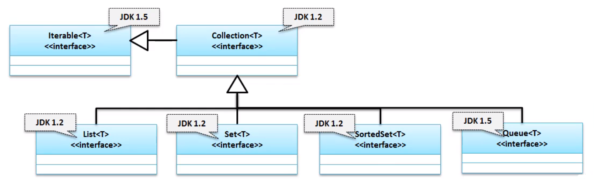
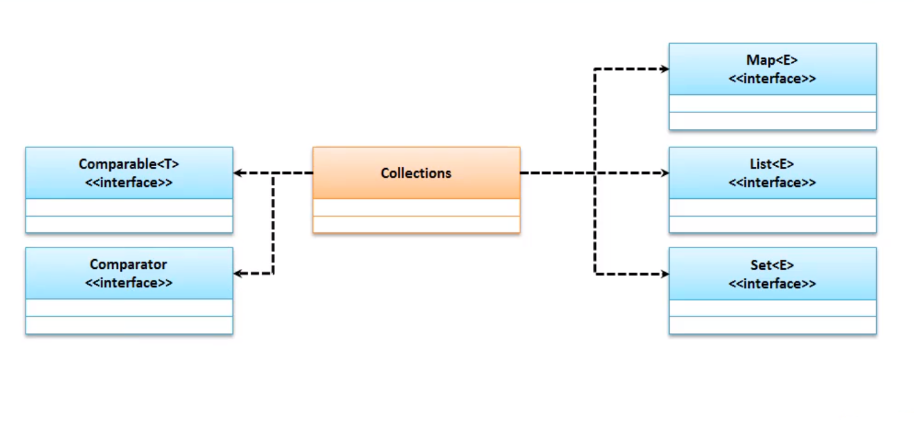

# Collection

Iterable ==JDK1.5== 

```java
Interface Iterable<T>
```

Collection ==JDK1.2== 

```java
public interface Collection<E> extends Iterable<E>
```

List ==JDK1.2==  

- 允许重复

```java
Interface List<E>
```
SortedSet ==JDK1.2== 

- 不允许重复且排序

```java
Interface SortedSet<E>
```
Set ==JDK1.2== 

- 不允许重复

```java
Interface Set<E>
```
Queue ==JDK1.5== 

- 队列(先进先出)

```java
Interface Queue<E>
```




Collection 作为最大的父接口在开发中已经很少使用了 , 最早在被大量的使用在 EJB 中 , 后来由于再设计和开发过程中我们大量的使用了 , Collection 的子接口 . 其接口有一下常用的方法 :

| 方法                                    | 描述                                                         |
| :----------------------- | :-------------------------------------- |
| `boolean add(E e)`                              | 向集合中追加一个数据            |
| `boolean addAll(Collection<? extends E> c)`     | 向集合中追加一组数据                                         |
| `void clear()`                               | 清空集合                    |
| `boolean contains(Object o)`                    | 数据查询 , ==需要 equals 支持== |
| `Iterator<E> iterator()`                            | 返回此集合中元素的迭代器                                   |
| `boolean remove(Object o)`                      | 数据删除 , ==需要 equals 支持== |
| `int size()`                                | 元素数                                       |
| `Object[] toArray()`                             | 返回包含此collection中所有元素的数组。                       |
| `<T> T[] toArray(T[] a)`                        | 返回包含此collection中所有元素的数组; 返回数组的运行时类型是指定数组的运行时类型。 |

# Collections 工具类

| 修饰符和类型  | 领域         | 描述               |
| :------------ | :----------- | :----------------- |
| `static List` | `EMPTY_LIST` | 空列表（不可变）。 |
| `static Map`  | `EMPTY_MAP`  | 空映射（不可变）。 |
| `static Set`  | `EMPTY_SET`  | 空集（不可变）。   |

