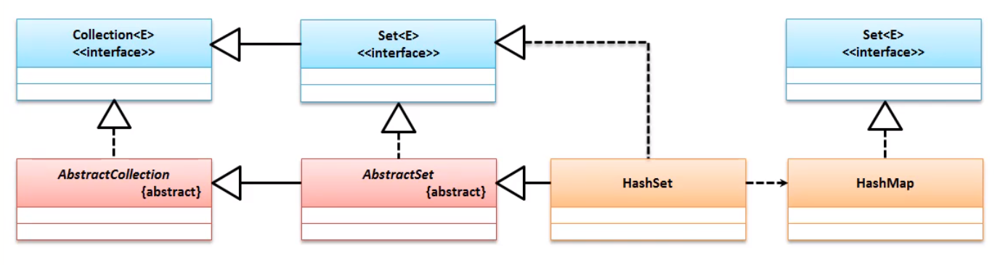
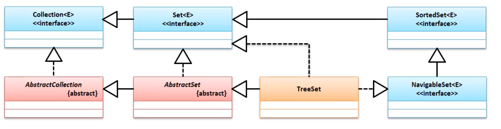

# Set

Set接口和List接口都属于Collection接口 , Set接口的最大特点是元素不能重复 ;

```java
public interface Set<E> extends Collection<E>
```

在jdk1.9之前 , Set接口并没有对Collection接口的方法进行扩充 , 即两个接口的方法是完全一致的(Set接口没有 List 中的`get`方法) , 只不过在1.9之后 添加了 of 等方法 ; 

不可以存储相同的数据 ;

 ```java
Set set = Set.of("Hello","MLXX","Hello");
 ```

结果

```java
Exception in thread "main" java.lang.IllegalArgumentException: duplicate element: Hello
```

存储是 , 增加顺序不是保存顺序

```java
Set set = Set.of("Hello","MLXX");
System.out.println(set);
```

```cmd
[MLXX, Hello]
```


> 此时创建的Set集合不可以 , 进行修改 

## 常用子类

- HashSet - 散列存储
- TreeSet - 有序储存
- LinkedSet - 链表存储


# 一.HashSet( 90%)



## 1. 定义结构

``` java
public HashSet() {
    map = new HashMap<>(); // 默认大小为16 , 增长到75%时扩容
}
```

```java
public HashSet(Collection<? extends E> c) {
    map = new HashMap<>(Math.max((int) (c.size()/.75f) + 1, 16));
    addAll(c);
}
```

``` java
public HashSet(int initialCapacity, float loadFactor) {
    map = new HashMap<>(initialCapacity, loadFactor);
}
```

```java
public HashSet(int initialCapacity) {
    map = new HashMap<>(initialCapacity);
}
```

```java
HashSet(int initialCapacity, float loadFactor, boolean dummy) {
    map = new LinkedHashMap<>(initialCapacity, loadFactor);
}
```

> HashSet 里面 会包含 HashMap (key=value 偶对象)

- HashSet 的特点 :
  - 无序
  - 无重复

# 二.TreeSet

TreeSet 里的数据一定是有序的 ; 



不单单继承了Set , 还集成了各种排序方法 ; 

## 排序

需要使用两个比较器完成 

- Comparable
- Comparator

### 构造

| 方法                                             | 释义               |
| ------------------------------------------------ | ------------------ |
| public TreeSet()                                 | 使用Comparable排序 |
| public TreeSet(Comparator<? super E> comparator) | 使用Comparator排序 |

> 需要开发人员配置一个规定的排序方法
>
> ==但是一旦使用了TreeSet类保存自定义对象 , 就要将全部的属性进行比较 . 如果就比较了部分 , 在存储时 如果部分数据相等就说明 他们是相同的 , 相同的不会重复存在==

### 重复元素判断

TreeSet 依据的排序(Comparator 和 Comparab) 进行排序 ;

真正的排序分为两个部分 :

- 进行对象编码的获取 hashCode ;
- 进行对象内容的获取 equals ;

带有比较功能的集合是依据比较器进行比较 , 不带比较功能的集合是使用HashCode和Equals两个方法配合比较的.

