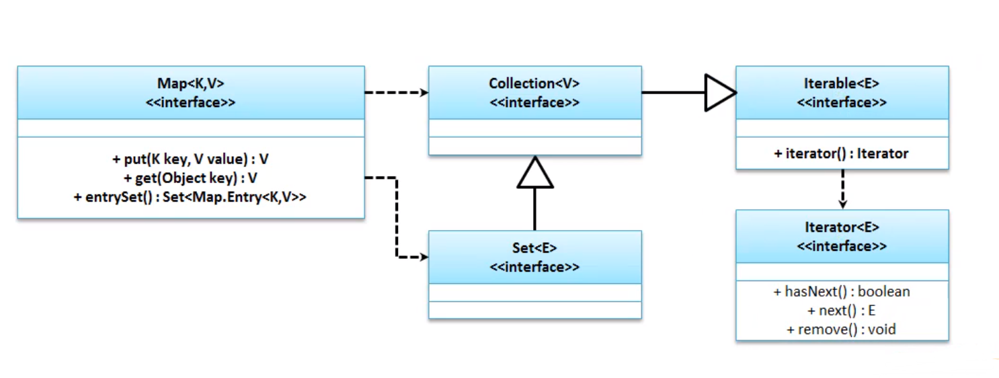
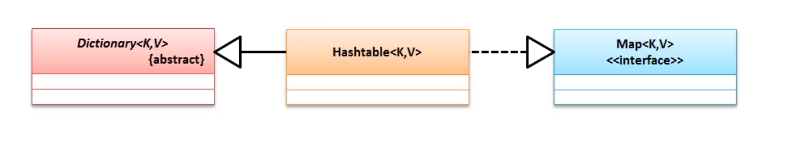
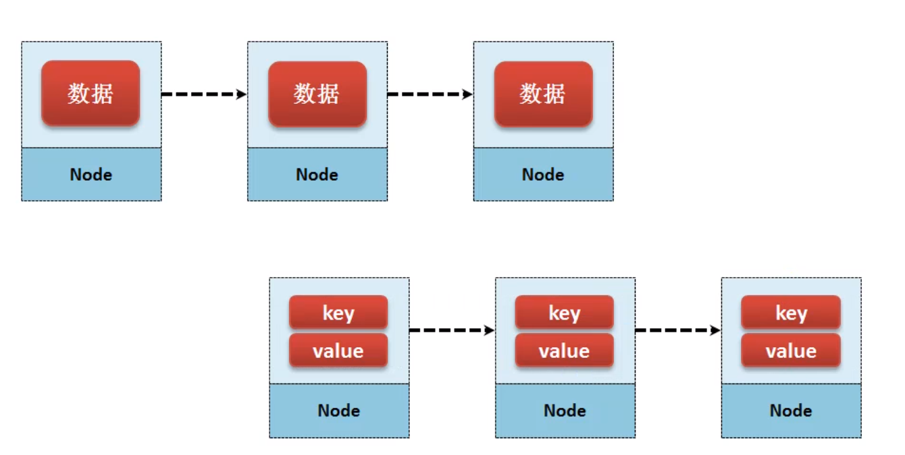
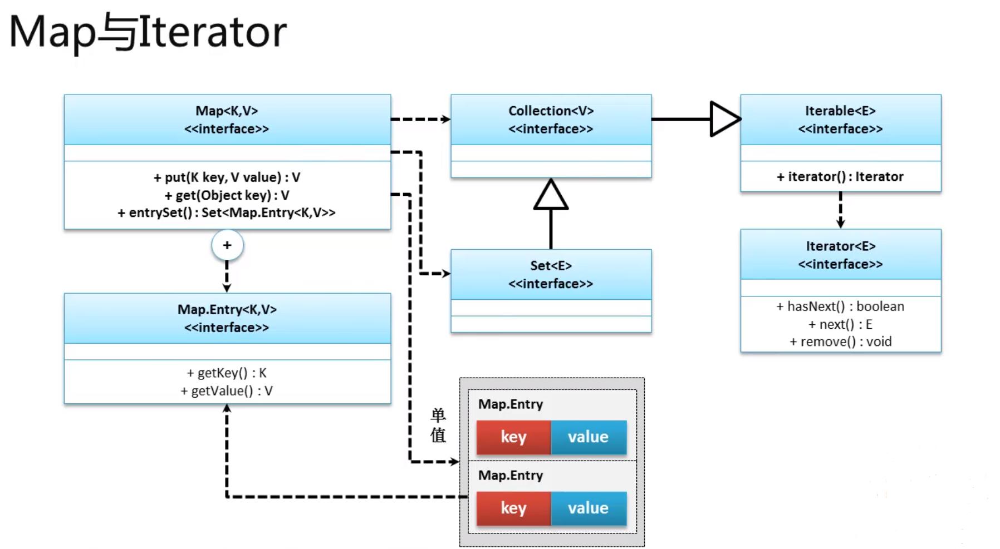
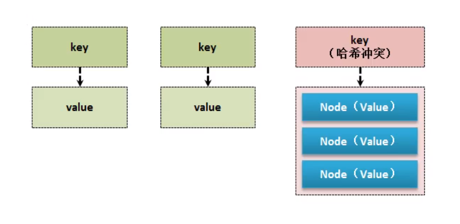

# Map

集合根据数据存储的不同分为两种格式 : 单只集合 、二元偶对象集合 , 在Collection中都是属于单值集合 , 而二元偶对象集合则是使用`key=value`的结构 , 在使用的时候根据 `key`寻找`value`的值 , 所以 Collection 和 Map 存储数据的目的为 : ==Collection 是为了数据的输出而设计的 , Map 是为了数据的查询而存在的== ;


`java.util.Map`是进行二元偶对象数据存储的最大父接口 , 里面的所有存储的数据都会按照`key=value`的形式进行保存 , 所以在数据存放时 需要用到两个内容 ; 

方法如下 :

| 方法                               | 释义                                |
| :--------------------------------- | ----------------------------------- |
| ==V put(K key, V value)==          | ==向集合中保存数据==                |
| ==V get(Object key)==              | ==通过key查询对应内容==             |
| V remove(Object key)               | 根据key删除对应数据                 |
| int size()                         | 获取集合长度                        |
| Collection<V> values()             | 返回所有的内容                      |
| Set<K> keySet()                    | 获取所有的key                       |
| ==Set<Map.Entry<K,V>> entrySet()== | ==将所有的内容以Map.Entry形式返回== |



在jdk1.9之后 , 在MAP接口中有`of`方法 , 他可以创建一个Map集合 ;

范例 :

```java
Map<String, Integer> map = Map.of("one", 1, "two", 2, "three", 3);
        System.out.println(map);
```

结果 :

```cmd
{three=3, two=2, one=1}
```

> 如果 `key`重复则会抛出异常 `Exception in thread "main" java.lang.IllegalArgumentException: duplicate key: three`

因为`key`作为Map操作的核心控制点 , 所以这个内容的重复实际上对于整个的Map==而言就需要进行更新== ; 如果想正确使用MAP的接口 , 就要使用Map的子类 :

- HashMap
- LinkedHashMap
- TreeMap
- HashTable

## 1. HashMap

HashMap 是 Map 接口中最为常见的一个子类 , 也是主要是用的一个子类 , 此类采用Hash的方式进行存储 , 所以存储的时候都是无序的 . 


> null 可以为 `key` 也可以为 `value` , put时返回被替换的值 ;

HashMap 在 1.8 之后有了重大的变更

- 默认阈值 : `static final float DEFAULT_LOAD_FACTOR = 0.75f;`

- 默认大小 : `static final int DEFAULT_INITIAL_CAPACITY = 1 << 4; // aka 16`

- 最大存储 : `static final int MAXIMUM_CAPACITY = 1 << 30;`

- 扩容 : ==每次扩容1倍== `newCap = oldCap << 1`

- 扩容时机 : 当前的存储容量达到了75%(75%是阈值)

- 性能保证 : ==树状阈值==`static final int TREEIFY_THRESHOLD = 8;`

  ```java
  if (binCount >= TREEIFY_THRESHOLD - 1) // -1 for 1st
      treeifyBin(tab, hash);
  break;
  ```

  如果在1.8之后 , HashMap的数据存储容量达到了8位 , HashMap会将链表的存储结构改为红黑树结构 , 可以利用红黑树的特点做到查询的性能最优

## 2. LinkedHashMap

HashMap之中进行数据存储的时候并不会进行顺序的定义 , 如果现在想要实现顺序的存储 , 就可以利用 LinkedHashMap 来完成 ; 


```java
Map map = new LinkedHashMap();
map.put("one","1");
map.put("four","4");
map.put("two","2");
map.put("five","5");
map.put("three","3");
System.out.println(map);
```

结果

```cmd
{one=1, four=4, two=2, five=5, three=3}
```

> 除了存入的内容的顺序排序之外 , 与HashMap并没有太大的区别


## 3. TreeMap

`java.util.TreeMap` 依据了`key`的自然排序 , 进行排序


> - 因为排序和Comparable有联系 , 所以 你懂得! 元素要实现 Comparable 接口 并实现方法
>
> - key 值 不能为空 , 会有异常 `Exception in thread "main" java.lang.NullPointerException`

## 4. Hashtable



- Dictionary<K,V> 古老的字典结构

> 同样 key 不能为空

#### * HashMap 和 Hashtable 的区别

| HashMap            | Hashtable         |
| ------------------ | ----------------- |
| 默认大小 16        | 默认大小 11       |
| 有树状转换(红黑树) | 没有树状转换      |
| 非线程安全         | 线程安全 (同步锁) |

## 5. Properties

- Properties 是 Hashtable的子类
  - 在继承Hashtable时 , 泛型设置为Object
  - Properties 的数据类型必须是 String
- 和`*.properties`一致
- 可以方便读取和写入`*.properties`
- 可以理解为文件输入输出了流

| 方法                                                         | 释义                                      |
| ------------------------------------------------------------ | ----------------------------------------- |
| public Propertise()                                          | 构造方法                                  |
| public Object setProperty(String key , String value)         | 设置属性                                  |
| public String getProperty(String key)                        | 获取属性, 属性不存在得到null              |
| public String getProperty(String key , String defaultValue)  | 获取属性如果不存在,返回默认的defaultValue |
| public void list(PrintStream out)                            | 列出全部的属性                            |
| public void list(PrintWriter out)                            | 列出全部的属性                            |
| public void store(**OutputStream** **out** , String comments) throws IOException | 向输出流输出内容                          |
| public void load(**InputStream** **inStream**) throws IOException | 从输入流读取数据                          |

> 可以从任意的地方进行属性的读取和写入

范例 : set & get

```java
Properties properties = new Properties();
properties.setProperty("XA","西安");
properties.setProperty("WN","渭南");
properties.setProperty("BJ","宝鸡");
properties.setProperty("AK","安康");
properties.setProperty("YL","杨凌");
System.out.println(properties.get("XA"));
```

结果 :

```cmd
System.out.println(properties.get("XA"));
```

范例 : 保存文件为`area.properties`

```java
Properties properties = new Properties();
properties.setProperty("XA","西安");
properties.setProperty("WN","渭南");
properties.setProperty("BJ","宝鸡");
properties.setProperty("AK","安康");
properties.setProperty("YL","杨凌");
properties.store(new FileOutputStream(new File("C:" + File.separator + "area.properties")), "Area Info");
```

结果 : 


```properties
#Area Info
#Mon Jul 29 10:08:08 CST 2019
YL=\u6768\u51CC
WN=\u6E2D\u5357
BJ=\u5B9D\u9E21
XA=\u897F\u5B89
AK=\u5B89\u5EB7
```

范例 : 从文件中获取数据

```java
Properties properties = new Properties();
properties.load(new FileInputStream(new File("C:" + File.separator + "area.properties")));
System.out.println(properties);
```

结果 :

```cmd
{YL=杨凌, WN=渭南, BJ=宝鸡, XA=西安, AK=安康}
```


## 6. Map.Entry (数据存储)

Collection 和 Map 的数据存储结构



Map.Entry 子类

- 可以包装 key和vallue

```java
public static interface Map.Entry<K,​V>
```

方法 : 

``` java
`getKey()`
```

在 Map中有个 `Entry`方法 , 此方法可以快速的创建  `Map.Entry`对象

范例 :

```java
Map.Entry<String,String> entry = Map.entry("luke","leiming");
System.out.println("[key]"+entry.getKey());
System.out.println("[value]"+entry.getValue());
```

结果

```cmd
[key]luke
[value]leiming
```

> 这种方法在jdk1.9才出现

Map.Entry 实质上是定义了一个 map 二元偶对象的存储对象标准 , 所有Map接口的子类 其节点 都实现了 Map.Entry ;

# Iterator 输出 



在Map接口中并没有Iterator的获取方法 , 所有需要一系列的转换方法才可以使用 ; 

Map因为存储时是偶对象 , 因此输出流程如下 :

1. 通过Map接口中的entrySet()方法 , 获取Set集合

   ```java
   public Set<Map.Entry<K,V>> entrySet();
   ```

2. 获取了Set集合之后就可以调用iterator()方法获取Iterator接口实例 , 泛型类型为Map.Entry

3. 通过Iterator进行迭代操作 

```java
Map<String, String> map = new HashMap<>();
map.put("1","1");
map.put("2","2");
map.put("3","3");
map.put("4","4");
map.put("5","5");
map.put("6","6");
Set<Map.Entry<String, String>> entries = map.entrySet();
Iterator<Map.Entry<String, String>> iterator = entries.iterator();
while (iterator.hasNext()){
    Map.Entry<String, String> entry = iterator.next();
    System.out.print("[key]"+entry.getKey()+","+"[value]"+entry.getValue());
}
}
```

结果

```java
[key]1,[value]1
[key]2,[value]2
[key]3,[value]3
[key]4,[value]4
[key]5,[value]5
[key]6,[value]6
```

从jdk1.5之后Map集合也可以使用foreach进行输出 , 因为其内部实现了Iterator接口 :

范例 :

```java
Map<String, String> map = new HashMap<>();
map.put("1", "1");
map.put("2", "2");
map.put("3", "3");
map.put("4", "4");
map.put("5", "5");
map.put("6", "6");
for (Map.Entry<String,String> entry: map.entrySet()) {
    System.out.println(entry);
}
```

结果 :

```java
1=1
2=2
3=3
4=4
5=5
6=6
```

# 自定义 Key 类型

1. 利用重写`hashCode()`和`equals()`生成结果进行比较
2. 如果发现哈希码相同才会进行内容比较

# Hash冲突

1. 开放定址法
2. 链地址法
3. 再哈希法
4. 建立公共溢出区

> Java使用的链地址法


