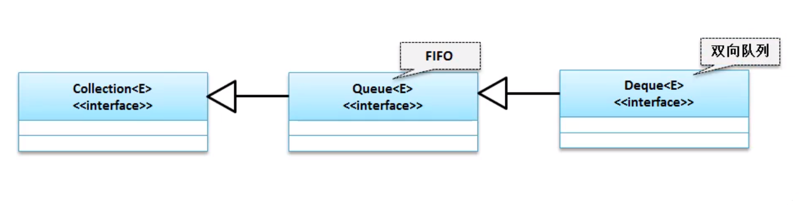
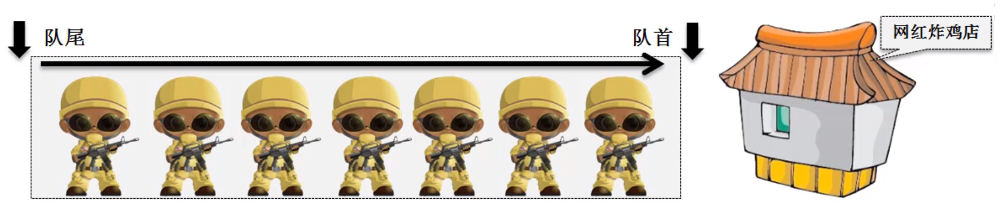
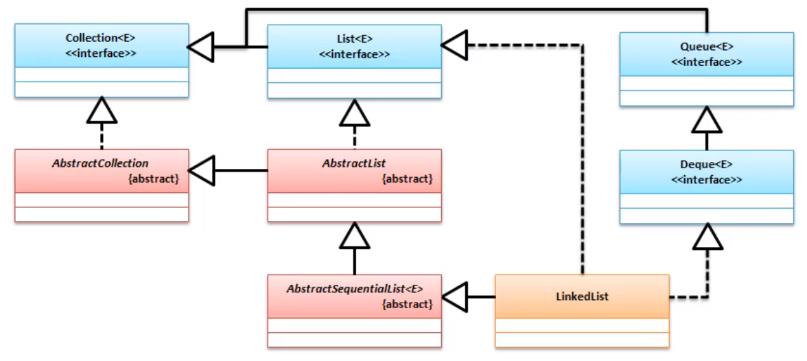
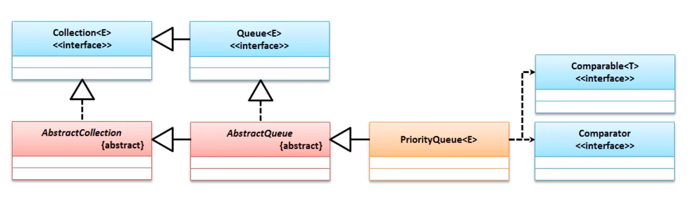
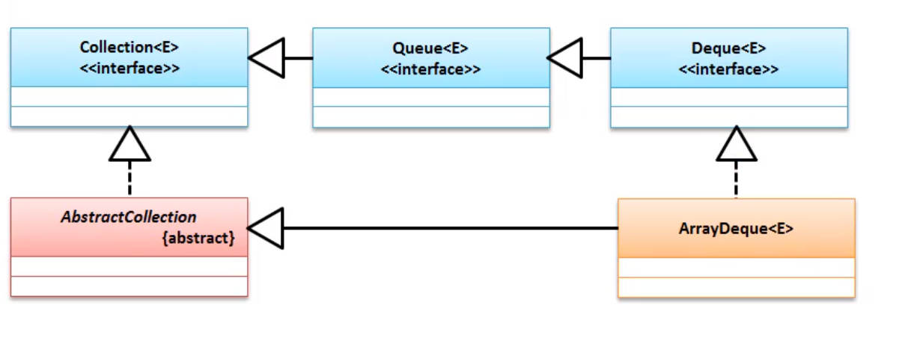

# 队列



> 先进先出 ;



> 队列的出现是为了解决资源紧张的问题 ;
>
> 解决的是数据缓冲的问题 ;

### Queue 接口

Queue 是队列实现的标准的操作接口 , 在这个接口里面提供有如下的队列操作方法 . 

| 方法             | 释义                                     |
| ---------------- | ---------------------------------------- |
| boolean add(e)   | 增加队列数据 , 会抛出异常 : 非法状态异常 |
| boolean offer(e) | 追加成功返回`true`                       |
| E remove()       | 抛出异常                                 |
| E poll()         | 返回指定内容                             |

##实现类

### LinkedList



范例 : 

``` java
Queue<String> queue = new LinkedList<>();
queue.offer("j");
queue.offer("a");
queue.offer("v");
queue.offer("a");
while (!queue.isEmpty()){
    System.out.print(queue.poll());
}
```

结果 : 

```cmd
java
```

> 由此发现 , 先进先出

### PriorityQueue



范例 :

```java
Queue<String> queue = new PriorityQueue<>();
queue.offer("j");
queue.offer("a");
queue.offer("v");
queue.offer("a");
while (!queue.isEmpty()){
    System.out.print(queue.poll());
}
```

结果 :

```java
aajv
```

> 此时的数据将进行排序 , 将排序的内容依次输出

## Deque 接口

它实现的数据 , 是一个双向操作 , 可以从队首添加获取 , 也可以从队尾添加获取

### LinkedList

见上

### ArrayDeque



使用Deque的时候肯定有 Queue的方法 , 还增加了如下方法 :

上述十二种方法总结在下表中：

|      | 第一元素（头）                                               | 第一元素（头）                                               | 最后元素（尾巴）                                             | 最后元素（尾巴）                                             |
| ---- | ------------------------------------------------------------ | ------------------------------------------------------------ | ------------------------------------------------------------ | ------------------------------------------------------------ |
|      | 引发异常                                                     | 特殊价值                                                     | 引发异常                                                     | 特殊价值                                                     |
| 插入 | [`addFirst(e)`](https://docs.oracle.com/en/java/javase/11/docs/api/java.base/java/util/Deque.html#addFirst(E)) | [`offerFirst(e)`](https://docs.oracle.com/en/java/javase/11/docs/api/java.base/java/util/Deque.html#offerFirst(E)) | [`addLast(e)`](https://docs.oracle.com/en/java/javase/11/docs/api/java.base/java/util/Deque.html#addLast(E)) | [`offerLast(e)`](https://docs.oracle.com/en/java/javase/11/docs/api/java.base/java/util/Deque.html#offerLast(E)) |
| 去掉 | [`removeFirst()`](https://docs.oracle.com/en/java/javase/11/docs/api/java.base/java/util/Deque.html#removeFirst()) | [`pollFirst()`](https://docs.oracle.com/en/java/javase/11/docs/api/java.base/java/util/Deque.html#pollFirst()) | [`removeLast()`](https://docs.oracle.com/en/java/javase/11/docs/api/java.base/java/util/Deque.html#removeLast()) | [`pollLast()`](https://docs.oracle.com/en/java/javase/11/docs/api/java.base/java/util/Deque.html#pollLast()) |
| 检查 | [`getFirst()`](https://docs.oracle.com/en/java/javase/11/docs/api/java.base/java/util/Deque.html#getFirst()) | [`peekFirst()`](https://docs.oracle.com/en/java/javase/11/docs/api/java.base/java/util/Deque.html#peekFirst()) | [`getLast()`](https://docs.oracle.com/en/java/javase/11/docs/api/java.base/java/util/Deque.html#getLast()) | [`peekLast()`](https://docs.oracle.com/en/java/javase/11/docs/api/java.base/java/util/Deque.html#peekLast()) |


该接口扩展了[`Queue`](https://docs.oracle.com/en/java/javase/11/docs/api/java.base/java/util/Queue.html)接口。当deque用作队列时，会产生FIFO（先进先出）行为。元素在双端队列的末尾添加并从头开始删除。从`Queue`接口继承的`Deque`方法与下表中指示的方法完全等效 ：

| `Queue` 方法                                                 | 等效`Deque`方法                                              |
| ------------------------------------------------------------ | ------------------------------------------------------------ |
| [`add(e)`](https://docs.oracle.com/en/java/javase/11/docs/api/java.base/java/util/Deque.html#add(E)) | [`addLast(e)`](https://docs.oracle.com/en/java/javase/11/docs/api/java.base/java/util/Deque.html#addLast(E)) |
| [`offer(e)`](https://docs.oracle.com/en/java/javase/11/docs/api/java.base/java/util/Deque.html#offer(E)) | [`offerLast(e)`](https://docs.oracle.com/en/java/javase/11/docs/api/java.base/java/util/Deque.html#offerLast(E)) |
| [`remove()`](https://docs.oracle.com/en/java/javase/11/docs/api/java.base/java/util/Deque.html#remove()) | [`removeFirst()`](https://docs.oracle.com/en/java/javase/11/docs/api/java.base/java/util/Deque.html#removeFirst()) |
| [`poll()`](https://docs.oracle.com/en/java/javase/11/docs/api/java.base/java/util/Deque.html#poll()) | [`pollFirst()`](https://docs.oracle.com/en/java/javase/11/docs/api/java.base/java/util/Deque.html#pollFirst()) |
| [`element()`](https://docs.oracle.com/en/java/javase/11/docs/api/java.base/java/util/Deque.html#element()) | [`getFirst()`](https://docs.oracle.com/en/java/javase/11/docs/api/java.base/java/util/Deque.html#getFirst()) |
| [`peek()`](https://docs.oracle.com/en/java/javase/11/docs/api/java.base/java/util/Deque.html#peek()) | [`peekFirst()`](https://docs.oracle.com/en/java/javase/11/docs/api/java.base/java/util/Deque.html#peekFirst()) |


Deques也可以用作LIFO（后进先出）堆栈。应优先使用此接口，而不是遗留[`Stack`](https://docs.oracle.com/en/java/javase/11/docs/api/java.base/java/util/Stack.html)类。当deque用作堆栈时，元素将从双端队列的开头推出并弹出。堆栈方法等同`Deque` 于下表中指示的方法：

| 堆栈方法                                                     | 等效`Deque`方法                                              |
| ------------------------------------------------------------ | ------------------------------------------------------------ |
| [`push(e)`](https://docs.oracle.com/en/java/javase/11/docs/api/java.base/java/util/Deque.html#push(E)) | [`addFirst(e)`](https://docs.oracle.com/en/java/javase/11/docs/api/java.base/java/util/Deque.html#addFirst(E)) |
| [`pop()`](https://docs.oracle.com/en/java/javase/11/docs/api/java.base/java/util/Deque.html#pop()) | [`removeFirst()`](https://docs.oracle.com/en/java/javase/11/docs/api/java.base/java/util/Deque.html#removeFirst()) |
| [`peek()`](https://docs.oracle.com/en/java/javase/11/docs/api/java.base/java/util/Deque.html#peek()) | [`getFirst()`](https://docs.oracle.com/en/java/javase/11/docs/api/java.base/java/util/Deque.html#getFirst()) |


注意，[`peek`](https://docs.oracle.com/en/java/javase/11/docs/api/java.base/java/util/Deque.html#peek())当deque用作队列或堆栈时，该方法同样有效; 在任何一种情况下，元素都是从双端队列的开头绘制的。

```java
Deque deque = new ArrayDeque();
deque.offerFirst("first");
deque.offerLast("last");
deque.offerLast("lastEnd");
while (!deque.isEmpty()){
    System.out.println(deque.poll());
}
```

结果

```cmd
first
last
lastEnd
```

> 以上利用了 poll 对数据进行取出 , 实际上就是从头开始进行消费处理