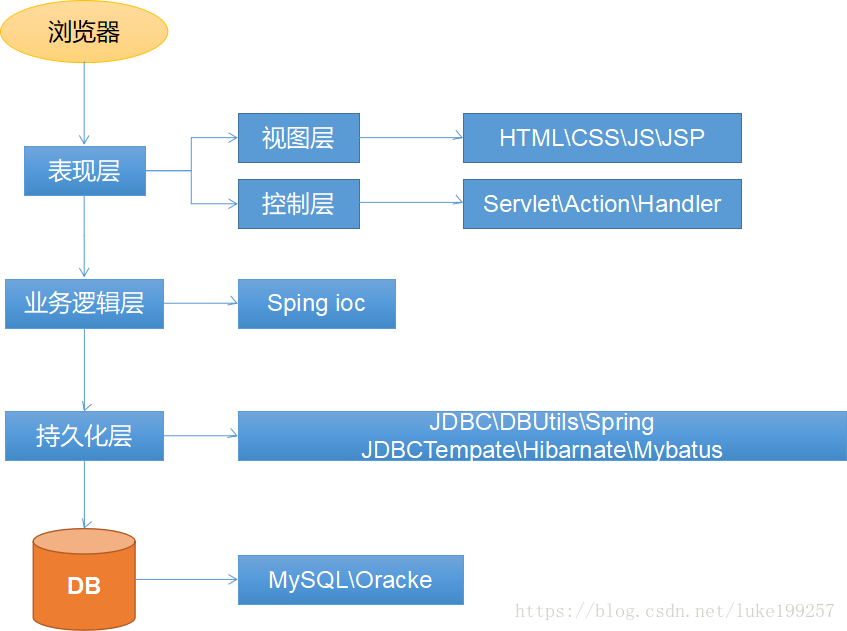

# 什么是Maven

1. Maven是一款服务于Java平台的自动化共建构建工具
2. 构建
	通过各种代码图片等素材 > 编译 > 构建
3. 构建的各个环节
	4. 清理 : 将以前的. class文件删除;
	5. 编译 : 将.java编译为.class字节码文件;
	6. 测试 : 自动测试,自动调用JUnitl;
	7. 报告 : 测试程序执行结果;
	8. 打包 : 动态Web工程打war包,java工程打为jar包;
	9. 安装 : Maven特定的概念--将打包的文件复制到"仓库"中指定的位置;
	10. 部署 : 将动态Web工程生成的war包复制到Servlet容器的指定目录下,使其可以运行;


-------------------------------------

#安装Maven核心程序
## 1. 下载Maven
[maven下载](http://maven.apache.org/docs/history.html)
##2. Maven环境变量配置

* `MAVEN_HOME`
	* 解压后的文件路径
	例 : `C:\Program Files\Java\apache-maven-x.x.x `
* `path`
	* 在原有的path中添加
	例 : `%MAVEN_HOME%\bin\`
* 验证
	* CMD:`mvn -v`
配置成功时,会返回如下(因电脑差异,会有细微区别)
```
Apache Maven 3.5.4 (1edded0938998edf8bf061f1ceb3cfdeccf443fe; 2018-06-18T02:33:14+08:00)
Maven home: C:\Program Files\Java\apache-maven-3.5.4\bin\..
Java version: 1.8.0_102, vendor: Oracle Corporation, runtime: C:\Program Files\Java\jdk1.8.0_102\jre
Default locale: zh_CN, platform encoding: GBK
OS name: "windows 10", version: "10.0", arch: "amd64", family: "windows"
```

