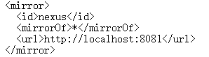
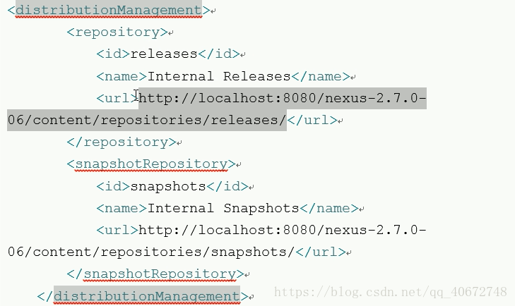

# Maven核心概念

- maven MavenMaven 能够 实现自动化构建 实现自动化构建 实现自动化构建 实现自动化构建 实现自动化构建 是和它的内部原理 和它的内部原理 和它的内部原理 和它的内部原理 分不开 分不开 的， 这里 我们 从 MavenMavenMavenMaven 的九个核心概念入手， 个核心概念入手， 个核心概念入手， 个核心概念入手， 个核心概念入手， 看 MavenMavenMavenMaven 是如何实现自动化构建的 是如何实现自动化构建的 是如何实现自动化构建的 是如何实现自动化构建的 是如何实现自动化构建的 是如何实现自动化构建的

## 1.POM

Project Object Model : 项目对象模型。将Java工程的相关信息封装为对象作为便于操作和管理的模型。可以说Maven就是学习pom.xml的配置；

## 2.约定的目录结构

- 项目名称
  - src - 源码目录
    - main - 主程序目录
      - java - 主程序的Java源文件目录
      - resources - 主程序的资源目录
    - test - 测试程序目录
      - java - 测试程序的Java源文件目录
      - resources - 测试程序的资源目录
  - target - 编译结果

约定目录结构对于Maven实现自动化构建而言是必不可少的一环；

## 3.坐标

使用如下三个向量在Maven的仓库中唯一的确定一个Maven工程。

1. groupId：公司或组织的域名倒序+当前项目名称
2. artifactId：当前项目模块名称
3. version：当前模块的版本

```xaml
<dependency>
    <groupId>com.aliyun</groupId>
    <artifactId>aliyun-java-sdk-core</artifactId>
    <version>4.1.0</version>
</dependency>
```

- 将三个坐标连接起来就可以就是在仓库中存放路径

  com/aliyun/aliyun-java-sdk-core/4.1.0/aliyun-java-sdk-core-4.1.0.jar

## 4.依赖管理

### 4.1 依赖传递机制

* 依赖多版本处理(**Dependency mediation**)：当项目遇到多个版本的依赖时，maven 会选取依赖树中最浅层次的版本。如果版本在同一层次，取先声明的
* 依赖版本管理(**Dependency management**)：通过 dependencyManagement，可同一管理依赖版本
* 依赖作用域(**Dependency scope**)：可为每个依赖设置特定的生命周期(生效时期)
* 依赖排除(**Excluded dependencies**)：通过 exclusion 元素排除依赖
* 依赖传递可选(**Optional dependencies**)：使用 optional 元素可使得 A->(optional)B C->A 的情形下，C 不会继承 B
* **注：** 虽然依赖传递可以使你从依赖的项目中得到其它依赖，但是仍然建议在本项目中显示的依赖其它依赖
* **注：** [excluded 与 optional 官方文档](https://maven.apache.org/guides/introduction/introduction-to-optional-and-excludes-dependencies.html)

### 4.2 *Dependency scope* 依赖作用域

* 依赖作用域用于限制依赖传递，并且会影响项目的各个 maven 任务的执行

* 共有 6 个 scope

  * **complie**：依赖被传递，(默认)

  * **provided**：提示需要 JDK 或容器(tomcat)在运行时提供此依赖。被此 scope 修饰的依赖，只在编译和测试时有效，依赖不被传递

  * **runtime**：此依赖只在运行或测试时有效，不参与编译，依赖被传递

  * **test**：此依赖只在测试的编译和运行期时有效，依赖不被传递

  * **system**：system 和provide相同，不过被依赖项不会从maven仓库抓，而是从本地系统文件拿，一定要配合systemPath使用

    * 当maven依赖本地而非repository中的jar包，sytemPath指明本地jar包路径

      ```xml
      <dependency>
          <groupId>org.hamcrest</groupId>
          <artifactId>hamcrest-core</artifactId>
          <version>1.5</version>
          <scope>system</scope>
          <systemPath>${basedir}/WebContent/WEB-INF/lib/hamcrest-core-1.3.jar</systemPath>
      </dependency>
      ```

      

  * **import**：此 scope 只用于 packaging 为 pom 的 dependencyManagement 节点下，用于伪实现 多父项目继承(maven 只支持单父项目)

* 以下表格，左边列表是当前项目的依赖，上面行是当前依赖所依赖的依赖

|          | compile  | provided | runtime  | test |
| -------- | -------- | -------- | -------- | ---- |
| compile  | compile  | -        | runtime  | -    |
| provided | provided | -        | provided | -    |
| runtime  | runtime  | -        | runtime  | -    |
| test     | test     | -        | test     | -    |

* 有上表可以得出以下结论
  * 被传递的依赖如果是 complie 类型，它会随着本项目的依赖的 scope 而相应变化（取最小作用域的那个 scope）
  * provided、test 不会被传递
  * 被传递的依赖如果是 runtime 类型，会综合本项目依赖的 scope 取最小作用域的那个 scope

### 4.3 *Dependency Management*

* 依赖项管理是一种集中依赖项信息的机制
* 如果有很多项目继承与一个共同的父项目，可以将所有依赖信息放入父 pom，并且在子 pom 中简单的引用父 pom
* dependencyManagement 中的依赖优先于 依赖就近原则

#### 4.3.1 示例1 —— 依赖版本选择

* Project A

```xml
<project>
 <modelVersion>4.0.0</modelVersion>
 <groupId>maven</groupId>
 <artifactId>A</artifactId>
 <packaging>pom</packaging>
 <name>A</name>
 <version>1.0</version>
 <dependencyManagement>
   <dependencies>
     <dependency>
       <groupId>test</groupId>
       <artifactId>a</artifactId>
       <version>1.2</version>
     </dependency>
     <dependency>
       <groupId>test</groupId>
       <artifactId>b</artifactId>
       <version>1.0</version>
       <scope>compile</scope>
     </dependency>
     <dependency>
       <groupId>test</groupId>
       <artifactId>c</artifactId>
       <version>1.0</version>
       <scope>compile</scope>
     </dependency>
     <dependency>
       <groupId>test</groupId>
       <artifactId>d</artifactId>
       <version>1.2</version>
     </dependency>
   </dependencies>
 </dependencyManagement>
</project>
```

* Project B

```xml
<project>
  <parent>
    <artifactId>A</artifactId>
    <groupId>maven</groupId>
    <version>1.0</version>
  </parent>
  <modelVersion>4.0.0</modelVersion>
  <groupId>maven</groupId>
  <artifactId>B</artifactId>
  <packaging>pom</packaging>
  <name>B</name>
  <version>1.0</version>
 
  <dependencyManagement>
    <dependencies>
      <dependency>
        <groupId>test</groupId>
        <artifactId>d</artifactId>
        <version>1.0</version>
      </dependency>
    </dependencies>
  </dependencyManagement>
 
  <dependencies>
    <dependency>
      <groupId>test</groupId>
      <artifactId>a</artifactId>
      <version>1.0</version>
      <scope>runtime</scope>
    </dependency>
    <dependency>
      <groupId>test</groupId>
      <artifactId>c</artifactId>
      <scope>runtime</scope>
    </dependency>
  </dependencies>
</project>
```

* b 为 1.0：b 在其父模块中的 management 中定义了，并且 **management 优先于就近原则**（即使 a、c 中依赖了 b，也不会被使用）
* d 为 1.0：d 在本项目中定义了，并且**本项目定义优先于父项目定义**
* [dependencyManagement 中可用的 element、tag](https://maven.apache.org/ref/3.6.2/maven-model/maven.html#class_DependencyManagement)

#### 4.3.2 示例 2 —— BOM

* 根项目为 BOM pom 项目，通过它统一指定需要被创建的子项目的版本，构成了一个统一版本库
* 其它项目使用这个统一版本库时，通过在 dependencyManagement 中 import 此 BOM

##### 4.3.2.1 BOM 项目

* 它定义了一个项目库

```xml
<project xmlns="http://maven.apache.org/POM/4.0.0" xmlns:xsi="http://www.w3.org/2001/XMLSchema-instance"
    xsi:schemaLocation="http://maven.apache.org/POM/4.0.0 http://maven.apache.org/xsd/maven-4.0.0.xsd">
  <modelVersion>4.0.0</modelVersion>
  <groupId>com.test</groupId>
  <artifactId>bom</artifactId>
  <version>1.0.0</version>
  <packaging>pom</packaging>
  <properties>
    <project1Version>1.0.0</project1Version>
    <project2Version>1.0.0</project2Version>
  </properties>
  <dependencyManagement>
    <dependencies>
      <dependency>
        <groupId>com.test</groupId>
        <artifactId>project1</artifactId>
        <version>${project1Version}</version>
      </dependency>
      <dependency>
        <groupId>com.test</groupId>
        <artifactId>project2</artifactId>
        <version>${project1Version}</version>
      </dependency>
    </dependencies>
  </dependencyManagement>
  <modules>
    <module>parent</module>
  </modules>
</project>
1234567891011121314151617181920212223242526272829
```

##### 4.3.2.2 正常的父项目

* 此项目为其他项目的父项目
* 此项目继承 BOM 项目

```xml
<project xmlns="http://maven.apache.org/POM/4.0.0" xmlns:xsi="http://www.w3.org/2001/XMLSchema-instance"
     xsi:schemaLocation="http://maven.apache.org/POM/4.0.0 http://maven.apache.org/xsd/maven-4.0.0.xsd">
  <modelVersion>4.0.0</modelVersion>
  <parent>
    <groupId>com.test</groupId>
    <version>1.0.0</version>
    <artifactId>bom</artifactId>
  </parent>
  <groupId>com.test</groupId>
  <artifactId>parent</artifactId>
  <version>1.0.0</version>
  <packaging>pom</packaging>
  <dependencyManagement>
    <dependencies>
      <dependency>
        <groupId>log4j</groupId>
        <artifactId>log4j</artifactId>
        <version>1.2.12</version>
      </dependency>
      <dependency>
        <groupId>commons-logging</groupId>
        <artifactId>commons-logging</artifactId>
        <version>1.1.1</version>
      </dependency>
    </dependencies>
  </dependencyManagement>
  <modules>
    <module>project1</module>
    <module>project2</module>
  </modules>
</project>
12345678910111213141516171819202122232425262728293031
```

##### 4.3.2.3 其它子项目引入 bom

* 依赖了 bom 中定义的版本号

```xml
<project xmlns="http://maven.apache.org/POM/4.0.0" xmlns:xsi="http://www.w3.org/2001/XMLSchema-instance"
     xsi:schemaLocation="http://maven.apache.org/POM/4.0.0 http://maven.apache.org/xsd/maven-4.0.0.xsd">
  <modelVersion>4.0.0</modelVersion>
  <groupId>com.test</groupId>
  <artifactId>use</artifactId>
  <version>1.0.0</version>
  <packaging>jar</packaging>
  <dependencyManagement>
    <dependencies>
      <dependency>
        <groupId>com.test</groupId>
        <artifactId>bom</artifactId>
        <version>1.0.0</version>
        <type>pom</type>
        <scope>import</scope>
      </dependency>
    </dependencies>
  </dependencyManagement>
  <dependencies>
    <dependency>
      <groupId>com.test</groupId>
      <artifactId>project1</artifactId>
    </dependency>
    <dependency>
      <groupId>com.test</groupId>
      <artifactId>project2</artifactId>
    </dependency>
  </dependencies>
</project>
1234567891011121314151617181920212223242526272829
```

### 4.4 system scope

* 在当前系统路径中找依赖(而不是在仓库中)。一般为 JDK 或 VM 提供的依赖

```xml
<project>
  ...
  <dependencies>
    <dependency>
      <groupId>javax.sql</groupId>
      <artifactId>jdbc-stdext</artifactId>
      <version>2.0</version>
      <scope>system</scope>
      <systemPath>${java.home}/lib/rt.jar</systemPath>
    </dependency>
    <dependency>
      <groupId>sun.jdk</groupId>
      <artifactId>tools</artifactId>
      <version>1.5.0</version>
      <scope>system</scope>
      <systemPath>${java.home}/../lib/tools.jar</systemPath>
    </dependency>
  </dependencies>
  ...
</project>
```

## 5.仓库管理

### 5.1什么是仓库

用来统一存储所有Maven共享构建的位置就是仓库。根据GAV坐标定义每个构建在仓库中的存储路径大致为：groupId/artifactId/version/artifacted-version.packaging。

### 5.2仓库的分类

#### 5.2.1本地仓库

默认在~/.m2/repository，如果在用户配置中有配置（settings.xml），则以用户配置的地址为准。

#### 5.2.2远程仓库

a）中央仓库（不包含有版权的jar包），地址为：<http://repo1.maven.org/maven2>

b）私服：用于连接本地机器和中央仓库，形成中间人，如果所有的人都向中央仓库下载，会造成中央仓库带宽拥堵，通过我们去访问私服，然后再让私服去访问中央仓库，可以缓解压力。

### 5.3Maven私服的安装

#### 5.3.1安装Nexus

Nexus为所有来自中央仓库的构建安装提供本地缓存。
下载网站：<http://nexus.sonatype.org/>
安装版本：nexus-3.13.0-01.zip
第一步：将下载的zip包解压会有两个文件一个是nexus-3.13.0-01和sonatype-work。
第二步：在nexus的bin文件夹中打开命令行cmd，执行命令nexus.exe  /run，等待执行后，使用浏览器访问http://localhost:8081即可打开nexus    
第三步：在右上角有sign in登录，默认账号：admin，默认密码：admin123。

#### 5.3.2仓库的分类

group:仓库组，主要是可以将其他的仓库中的构建一起放到这里选择调用。

hosted:主机仓库，主要是存储本机的构建和第三方构建。

proxy:代理仓库，主要是可以访问中央仓库，从中央仓库下载构建。
virtual：虚拟构建，用于适配 Maven 1。

#### 5.3.3配置所有构建均从私服下载

在settings.xml中添加以下代码

​         

#### 5.5.4将构建部署到nexus中

在要部署的项目的pom.xml中添加



## 6.生命周期

### 6.1Clean生命周期（Clean Lifecycle）

Clean Lifecycle 在进行真正的构建之前进行一些清理工作。Clean生命周期一共包含了三个阶段：

- pre-clean 执行一些需要在clean之前完成的工作

- clean 移除所有上一次构建生成的文件

- post-clean 执行一些需要在clean之后立刻完成的工作

### 6.2Default生命周期（Default Lifecycle）

Default Lifecycle是构建的核心部分，编译，测试，打包，部署等等，Default生命周期是Maven生命周期中最重要的一个，绝大部分工作都发生在这个生命周期中。

一些比较重要和常用的阶段：

- compile 编译项目的源代码

- install 将包安装至本地仓库，以让其它项目依赖。

- deploy 将最终的包复制到远程的仓库，以让其它开发人员与项目共享

- process-test-resources 复制并处理资源文件，至目标测试目录

- process-resources 复制并处理资源文件，至目标目录，准备打包

- test-compile 编译测试源代码

- test 使用合适的单元测试框架运行测试。这些测试代码不会被打包或部署

- package 接受编译好的代码，打包成可发布的格式，如 JAR

- validate

- generate-sources

- process-sources

- generate-resources

- process-classes

- generate-test-sources

- process-test-sources

- generate-test-resources

- process-test-classes

- prepare-package

- pre-integration-test

- integration-test

- post-integration-test

- verify

- install 将包安装至本地仓库，让其他项目依赖

- deploy 将最终的包复制到远程的仓库，以让其他开发人员与项目共享或者部署到服务器上运行；

  > 运行任何一个阶段的时候，它前面的所有阶段都会被运行；

### 6.3Site生命周期（Site Lifecycle）

Site Lifecycle 生成项目报告，站点，发布站点，站点的文档（站点信息，依赖..）。Site生命周期，生成站点信息四个阶段：

pre-site 执行一些需要在生成站点文档之前完成的工作

site 生成项目的站点文档

post-site 执行一些需要在生成站点文档之后完成的工作，并且为部署做准备

site-deploy 将生成的站点文档部署到特定的服务器上
## 7.插件和目标

Maven 生命周期的每一个阶段的具体实现都是由 Maven 插件实现的。

### 插件类型

Maven 提供了下面两种类型的插件：

| 类型              | 描述                                               |
| :---------------- | :------------------------------------------------- |
| Build plugins     | 在构建时执行，并在 pom.xml 的 元素中配置。         |
| Reporting plugins | 在网站生成过程中执行，并在 pom.xml 的 元素中配置。 |

下面是一些常用插件的列表：

| 插件     | 描述                                                |
| :------- | :-------------------------------------------------- |
| clean    | 构建之后清理目标文件。删除目标目录。                |
| compiler | 编译 Java 源文件。                                  |
| surefile | 运行 JUnit 单元测试。创建测试报告。                 |
| jar      | 从当前工程中构建 JAR 文件。                         |
| war      | 从当前工程中构建 WAR 文件。                         |
| javadoc  | 为工程生成 Javadoc。                                |
| antrun   | 从构建过程的任意一个阶段中运行一个 ant 任务的集合。 |

### 实例

我们已经在我们的例子中大量使用了 **maven-antrun-plugin** 来输出数据到控制台上。请查看 [**Maven - 构建配置文件**](https://www.runoob.com/maven/maven-build-profiles.html) 章节。让我们用一种更好的方式理解这部分内容，在 C:\MVN\project 目录下创建一个 pom.xml 文件。
```xml
<project xmlns="http://maven.apache.org/POM/4.0.0"
    xmlns:xsi="http://www.w3.org/2001/XMLSchema-instance"
    xsi:schemaLocation="http://maven.apache.org/POM/4.0.0
    http://maven.apache.org/xsd/maven-4.0.0.xsd">
<modelVersion>4.0.0</modelVersion>
<groupId>com.companyname.projectgroup</groupId>
<artifactId>project</artifactId>
<version>1.0</version>
<build>
<plugins>
   <plugin>
   <groupId>org.apache.maven.plugins</groupId>
   <artifactId>maven-antrun-plugin</artifactId>
   <version>1.1</version>
   <executions>
      <execution>
         <id>id.clean</id>
         <phase>clean</phase>
         <goals>
            <goal>run</goal>
         </goals>
         <configuration>
            <tasks>
               <echo>clean phase</echo>
            </tasks>
         </configuration>
      </execution>     
   </executions>
   </plugin>
</plugins>
</build>
</project>
```
接下来，打开命令终端跳转到 pom.xml 所在的目录，并执行下面的 mvn 命令。

```
mvn clean
```

Maven 将开始处理并显示 clean 生命周期的 clean 阶段。

```
[INFO] Scanning for projects...
[INFO] ------------------------------------------------------------------
[INFO] Building Unnamed - com.companyname.projectgroup:project:jar:1.0
[INFO]    task-segment: [post-clean]
[INFO] ------------------------------------------------------------------
[INFO] [clean:clean {execution: default-clean}]
[INFO] [antrun:run {execution: id.clean}]
[INFO] Executing tasks
     [echo] clean phase
[INFO] Executed tasks
[INFO] ------------------------------------------------------------------
[INFO] BUILD SUCCESSFUL
[INFO] ------------------------------------------------------------------
[INFO] Total time: < 1 second
[INFO] Finished at: Sat Jul 07 13:38:59 IST 2012
[INFO] Final Memory: 4M/44M
[INFO] ------------------------------------------------------------------
```

上面的例子展示了以下关键概念：

* 插件是在 pom.xml 中使用 plugins 元素定义的。
* 每个插件可以有多个目标。
* 你可以定义阶段，插件会使用它的 phase 元素开始处理。我们已经使用了 **clean** 阶段。
* 你可以通过绑定到插件的目标的方式来配置要执行的任务。我们已经绑定了 **echo** 任务到 maven-antrun-plugin 的 **run** 目标。
* 就是这样，Maven 将处理剩下的事情。它将下载本地仓库中获取不到的插件，并开始处理。

## 8.继承

消除多模块依赖配置重复，我们知道依赖是可以继承的，既父模块中定义的依赖，子模块可自动继承，但是有些子模块需要，有些不需要的情况下该怎么办呢？那就必须用 <dependencyManagement> 标签了;

声明那些可以继承

```xml
<dependencyManagement>
    <dependencies>
        <dependency>
            <groupId>log4j</groupId>
            <artifactId>log4j</artifactId>
            <version>1.2.12</version>
        </dependency>
    </dependencies>
</dependencyManagement>
```

声明父类POM

```xml
<parent>
	<groupId>com.nchu.maven</groupId>
	<artifactId>Parent</artifactId>	
	<version>0.0.1-SNAPSHOT</version>
</parent>
```

## 9.聚合

Maven聚合的概念主要是方便开发人员对多模块项目的多个模块，对于Maven不要只停留在会用的阶段。理解Maven中插件、依赖的解析规则，坐标和布局、聚合与继承的概念和使用方式，是深入理解Maven的基石。

```xml
<modules>
    <module>../HelloMaven</module>
    <module>../MavenLearn</module>
    <module>../WebProject</module>
    <module>FirstModel</module>
    <module>SecondModel</module>
</modules>
```

