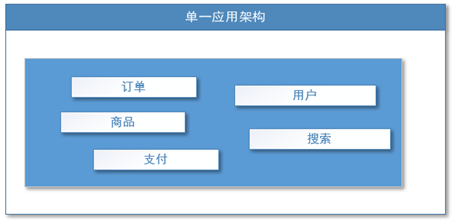
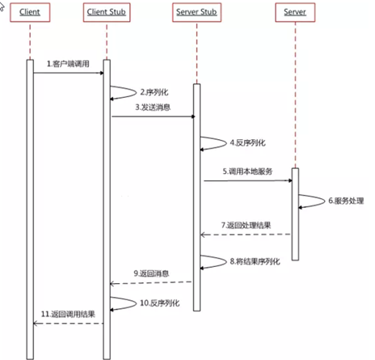
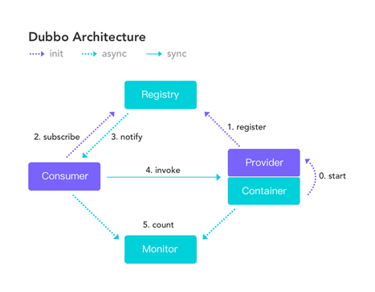
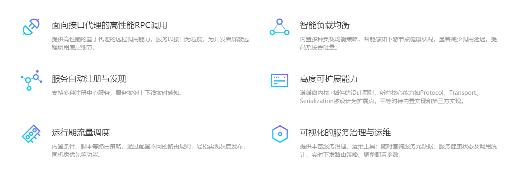
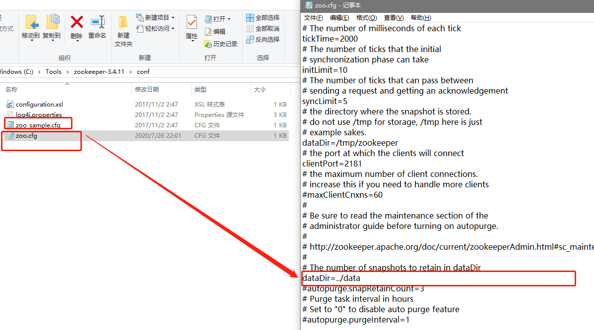

# 一、基础知识

## 1、分布式基础理论

### 1.1、什么是分布式系统

《分布式系统原理与范型》定义：

`"分布式系统是若干独立计算机的集合，这些计算机对于用户来说就像单个相关系统"`

分布式系统（distributed system）是建立在网络之上的软件系统。

随着互联网的发展，网站应用的规模不断扩大，常规的垂直应用架构已无法应对，分布式服务架构以及流动计算机架构势在必行，但是需要一个**治理系统**确保架构有条不絮的演进。

### 1.2、发展演变

#### 单一应用架构

当网站流量很小时，只需一个应用，将所有功能都部署在一起，以减少部署节点和成本。此时，用于简化增删改查工作量的数据访问框架（ORM）是关键。

适用于小型网站，小型管理系统，将所有功能都能部署到一个功能里，简单易用。

缺点：

1. 扩展性比较难
2. 协同开发问题
3. 不利于升级维护

#### 垂直应用架构

当访问量逐渐增大，单一应用增加机器带来的加速度越来越小，将应用拆成互不相干的几个应用，以提升效率。此时，用于加速前端页面开发的Web框架（MVC）是关键。

​	通过切分业务来实现各个模块独立部署，降低了维护和部署的难度，团队各司其职更易管理，性能扩展页更方便，更有针对性。

​	缺点：公共模块无法重复利用，开发性的浪费

#### 分布式服务框架

当垂直应用越来越多,应用只见交互不可避免,将核心业务抽取出来，作为独立的服务,逐渐形成稳定的服务中心，使前端应用能够快速的响应多变的市场需求。此时，由于提高业务复用以及整合的**分布式框架（RPC）**是关键

#### 流动计算架构

当服务越来越多，容量的评估，小服务的浪费等问题逐渐显现，此时需增加一个调度中心基于访问压力实时管理集群容量，提高群利用率。此时，用于**提高机器利用率的资源调度器和治理中心*（soa）【service oriented architecture】**

## 1.3、RPC

#### 什么叫RPC

RPC【remote procedure call】是指远程过程调用，是一种进程间通信方式，他是一种技术的思想，而不是规范。它允许程序调用一个地址空间（通常是共享网络的另一台机器上）的过程或函数，而不是程序员显式编码这个远程调用的细节。即程序员无论是调用本地的还是远程的函数，本质上编写的调用代码基本相同。

#### RPC基本原理

> 两个核心模块：
>
> 1. 通讯
> 2. 序列化

RPC框架有很多如：

1. dubbo
2. gRPC
3. Thrift
4. HSF（High Speed Service Framework）

## 2、dubbo核心概念

### 2.1、简介

Apache Dubbo 是一款高性能、轻量级的开源 Java RPC框架。

它提供了三大核心能力：

1. 面向接口的远程方法调用
2. 智能容错和负载均衡
3. 服务自动注册和发现

官网：

[http://dubbo.apache.org/](http://dubbo.apache.org/)

### 2.2、基本概念

​	**服务提供者（provider）：**暴露服务的提供方，服务提供者在启动时，向注册中心注册自己提供的服务。

​	**服务消费者（Consumer）：**调用远程服务的服务消费方，服务消费者再启动是，向注册中心订阅自己所需的服务，服务消费者，从提供者地址列表中，基于软负载均衡算法，选一台提供者进行调用，如果调用失败，再选另一台调用。

​	**注册中心（Registry）：**注册中心返回服务提供者地址列表给消费者，如果有变更，注册中心将基于长连接推送变更数据给消费者

​	**监控中心（Monitor）：**服务消费者和提供者，在内存中累计调用次数和调用时间，定时每分钟发送一次统计数据到监控中心

> 调用关系说明
>
> - 服务容器负责启动,加载,运行服务提供者。
> - 服务提供者在启动时,向注册中心注册自己提供的服务。
> - 服务消费者再启动是，向注册中心订阅自己所需的服务。
> - 注册中心返回服务提供者地址列表给消费者，如果有变更，注册中心将基于长连接推送变更数据给消费者。
> - 服务消费者，从提供者地址列表中，基于软负载均衡算法，选一台提供者进行调用，如果调用失败，再选另一台调用
> - 服务消费者和提供者，在内存中累计调用次数和调用时间，定时每分钟发送一次统计数据到监控中心。

### 2.3、dubbo支持的注册中心

> 　推荐使用　**<u>*Zookeeper*</u>**

* [Multicast 注册中心](http://dubbo.apache.org/zh-cn/docs/user/references/registry/multicast.html)
* [Zookeeper 注册中心](http://dubbo.apache.org/zh-cn/docs/user/references/registry/zookeeper.html)
* [Nacos 注册中心](http://dubbo.apache.org/zh-cn/docs/user/references/registry/nacos.html)
* [Redis 注册中心](http://dubbo.apache.org/zh-cn/docs/user/references/registry/redis.html)
* [Simple 注册中心](http://dubbo.apache.org/zh-cn/docs/user/references/registry/simple.html)

#### Zookeeper

[Zookeeper下载](zookeeper.apache.org)

 [提前准备好的zookeeper-3.4.11.tar.gz](./zookeeper-3.4.11.tar.gz)

1. 解压

2. 配置本地目录

   

3. 复制配置实例配置，编写自己的配置

   

4. 创建响应的目录

   

5. 启动zookeeper ：zkServer.cmd

   

6. 启动控制台 ：zkCli.cmd

   

   