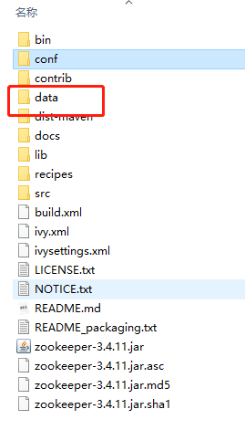
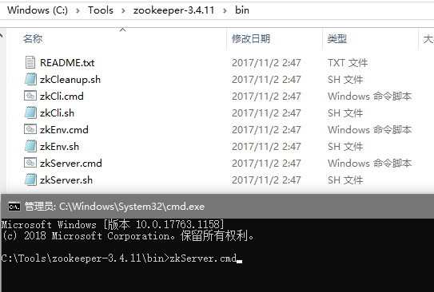
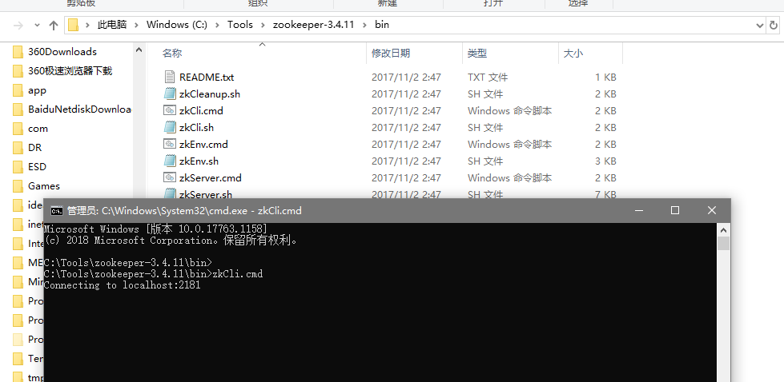
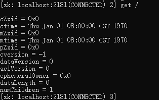
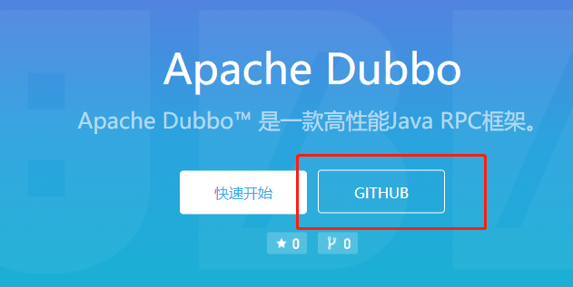
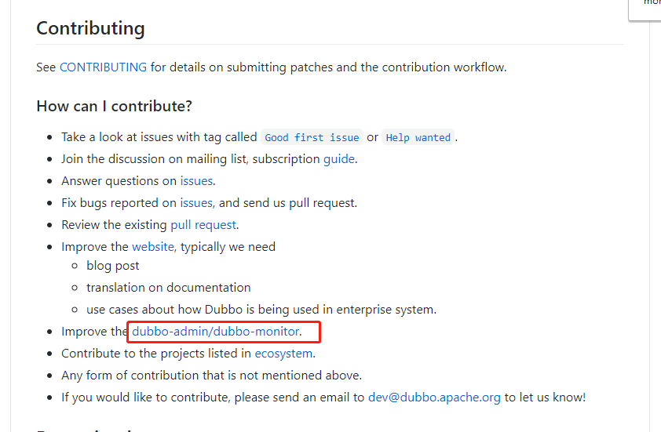

#  Zookeeper 注册中心

## [Zookeeper下载](zookeeper.apache.org)


 [提前准备好的zookeeper-3.4.11.tar.gz](./zookeeper-3.4.11.tar.gz)

## 启动

1. 解压

2. 配置本地目录

   

3. 复制配置实例配置，编写自己的配置

   

4. 创建响应的目录

   

5. 启动zookeeper ：zkServer.cmd

   

6. 启动控制台 ：zkCli.cmd

   


## 测试

1. 打开zkCli.cmd

2. 测试根节点内容

   ```cmd
   [zk: localhost:2181(CONNECTED) 2] get /
   
   cZxid = 0x0
   ctime = Thu Jan 01 08:00:00 CST 1970
   mZxid = 0x0
   mtime = Thu Jan 01 08:00:00 CST 1970
   pZxid = 0x0
   cversion = -1
   dataVersion = 0
   aclVersion = 0
   ephemeralOwner = 0x0
   dataLength = 0
   numChildren = 1
   ```

   

   

   ```cmd
   [zk: localhost:2181(CONNECTED) 3] ls /
   [zookeeper]
   ```

3. 创建节点 `fomalhaut` 值为 `luke`

   ```cmd
   [zk: localhost:2181(CONNECTED) 4] create -e /fomalhaut luke
   Created /fomalhaut
   ```

4. 查看临时节点

   ```cmd
   [zk: localhost:2181(CONNECTED) 6] ls /
   [fomalhaut, zookeeper]
   ```

   ```cmd
   [zk: localhost:2181(CONNECTED) 7] get /fomalhaut
   luke
   cZxid = 0x4
   ctime = Sun Jul 26 22:19:07 CST 2020
   mZxid = 0x4
   mtime = Sun Jul 26 22:19:07 CST 2020
   pZxid = 0x4
   cversion = 0
   dataVersion = 0
   aclVersion = 0
   ephemeralOwner = 0x10077153da60000
   dataLength = 4
   numChildren = 0
   ```

# 监控中心

## 下载






下载地址

https://github.com/apache/dubbo-admin

git `https://github.com/apache/dubbo-admin.git`

https://github.com/apache/dubbo-admin/blob/develop/README_ZH.md


### 前端部分

* 使用[Vue.js](https://vuejs.org/)作为javascript框架
* [dubbo-admin-ui/README.md](https://github.com/apache/dubbo-admin/blob/develop/dubbo-admin-ui/README.md)中有更详细的介绍
* 设置 npm **代理镜像** : 如果遇到了网络问题，可以设置npm代理镜像来加速npm install的过程：在~/.npmrc中增加 `registry =https://registry.npm.taobao.org`

### 后端部分

* 标准spring boot工程
* [application.properties配置说明](https://github.com/apache/dubbo-admin/wiki/Dubbo-Admin配置说明)

### 生产环境配置

1. 下载代码: `git clone https://github.com/apache/dubbo-admin.git`

2. 在 `dubbo-admin-server/src/main/resources/application.properties`中指定注册中心地址

3. 构建

   > * `mvn clean package`

4. 启动

   * `mvn --projects dubbo-admin-server spring-boot:run`
     或者
   * `cd dubbo-admin-distribution/target; java -jar dubbo-admin-0.1.jar`

5. 访问 `http://localhost:8080`

------

### 开发环境配置

* 运行`dubbo admin server` `dubbo admin server`是一个标准的spring boot项目, 可以在任何java IDE中运行它
* 运行`dubbo admin ui` `dubbo admin ui`由npm管理和构建，在开发环境中，可以单独运行: `npm run dev`
* 页面访问 访问 `http://localhost:8081`, 由于前后端分开部署，前端支持热加载，任何页面的修改都可以实时反馈，不需要重启应用。