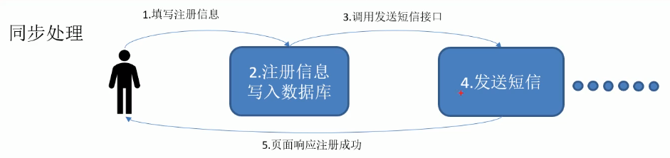
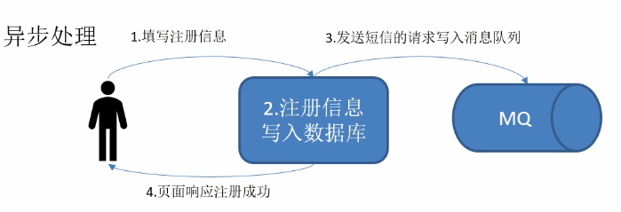
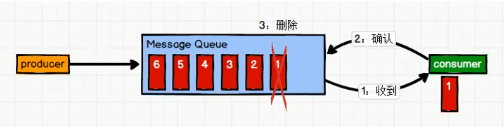
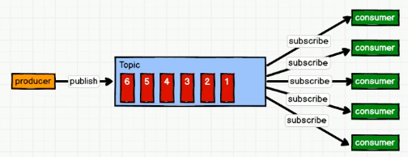
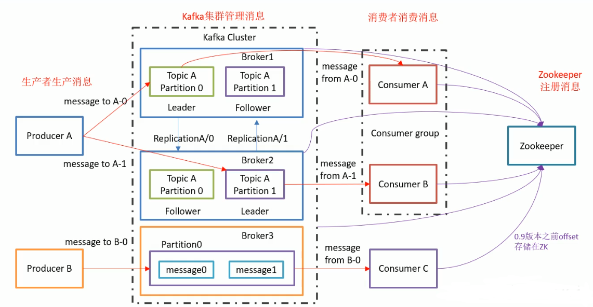

# Kafka概述

## 定义

Kafka是一个**分布式**的基于**发布/订阅模式**的**消息队列**(Message Queue) , 主要用于大数据实时处理领域 .

## 消息队列

### 传统消息队列的应用场景

#### 使用消息对列的好处

1. 解耦

   允许你独立扩展或修改两边的处理过程 , 只要确保它们遵守同样的接口约束

2. 可恢复性

   系统的一部分组件失效时 , 不会影响到整个系统 . 消息队列降低了进程间的耦合程度 , 所以即使一个处理消息的进程挂掉 , 加入队列中的消息任然可以在系统恢复后被处理 .

3. 缓冲

   有助于控制和优化数据流经过系统的速度 , 解决生产消息和消费消息的处理速度不一致的情况 .

4. 灵活性 & 峰值处理能力

   在访问量剧增的情况下 , 应用仍然需要继续发挥作用 , 单是这样的突发流量并不常见 . 如果为以能处理这类峰值风味为目标来投入资源随时待命无疑是巨大的浪费 . 使用消息队列能够使关键组件顶住突发的访问压力 , 而不会因为突发的超负荷请求而完全崩溃 .

5. 异步通信

   很多时候 , 用户不想也不需要立即处理消息 . 消息队列提供了异步处理机制 , 允许用户把一个消息放入队列 , 但并不立即处理它 . 想向队列中放入多少消息就放入多少消息 , 然后在需要的时候再去处理它们.

### 消息队列的两种模式

#### 1. 点对点模式

消息生产者生产消息发送到Queue中 , 然后消息消费者从 Queue 中取出并消费消息 . 消息被消费后 , Queue 中不再有存储 , 所以消息消费者不可能消费到已经被消费的消息 . Queue 支持存在多个消费者 , 但是对一个消息而言 , 只会有一个消息消费者可以消费.

#### 2. 发布/订阅模式

消息生产者(发布)将消息发布到Topic中 , 同时有对个消息消费者(订阅)消费该消息 . 和点对点方式不同 , 发布到 topic 的消息会被所有订阅者消费 . 

## Kafka的基础架构

1. Producer : 消息生产者 , 就是向kafka broker 发送消息的客户端 ;
2. Consumer : 消息消费者 , 向kafka broker 取消息的客户端 ; 
3. Consumer Group (CG) : 消费者组 , 由多个consumer组成 . **消费者组内每个消费者负责消息不同分区的数据 , 一个分区只能有一个组内消费者消费 ; 消费者组之间互不影响 .**所有的消费者都属于某个消费者组 , 即 **消费者组是逻辑上的一个订阅者**
4. Kafka Cluser : kafuka 集群
5. Broker : 每个代理(节点) , 一台Kafka服务器就是一broker . 一个集群由多个broker组成 . 一个broker 可以容纳多个 topic
6. Topic : 数据写入操作的基本单元 , 可以理解为一个队列 , **生产者和消费者面向的都是一个topic**
7. Partition : 为了实现扩展性 , 一个非常大的 topic 可以分布到多个 broker(即服务器上) , **一个Topic可以分为多个partition** 每个partition是一个有序的队列 .
8. Leader : 每个分区对个副本的**"主" **, 生产者发送数据消息 , 以及消费者数据对应的对象就是 leader
9. Follower : 追随着 , 每个分区多个副本中的**"从"** , 实时从leader中同步数据 , 保持leader数据的同步 . leader发生故障时 , 某个 follower 会成为新的follower . 
10. Zookeeper : 注册消息 帮kafka 和 消费者 存储信息
    - 0.9 版本之前offset存储在Zookeeper 中
    - 0.9 版本以及之后offset存储在本地 防止挂了后信息丢失

> 　Ｋａｆｋａ消息默认存储在磁盘中　，　存７天　（１６８个小时） 

> 由于需要Zookeeper知识 , 先看Zookeeper去