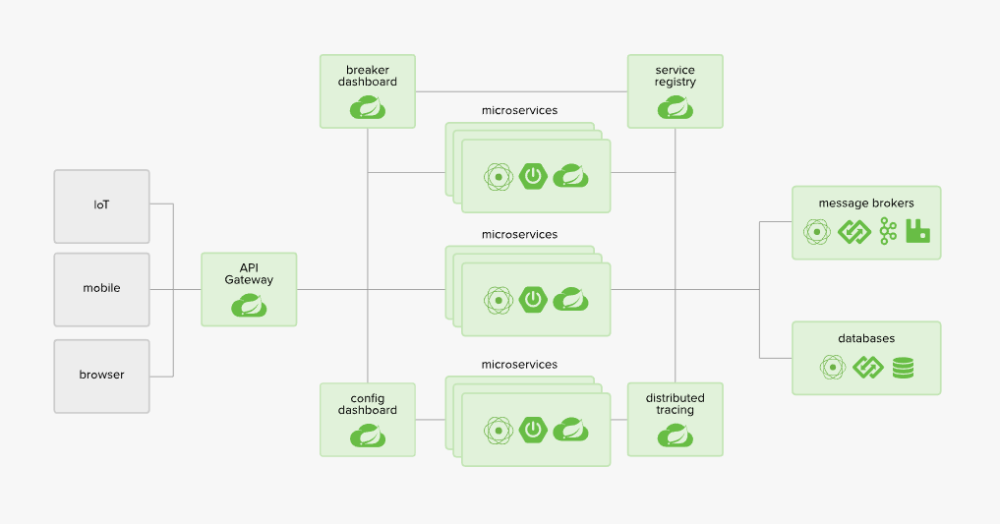
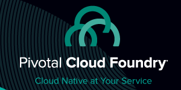
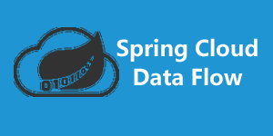
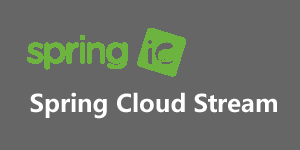

# 概述

## 一、微服务

> [微服务](https://martinfowler.com/articles/microservices.html)

​    **"微服务架构是一种架构模式，它提倡将单一应用程序划分成一组小的服务，服务之间相互协调、互相配合，为用户提供最终价值。每个服务运行在其独立的进程中，服务和服务之间采用轻量级的通信机制相互沟通（通常是基于HTTP的Restful API).每个服务都围绕着具体的业务进行构建，并且能够被独立的部署到生产环境、类生产环境等。另外，应尽量避免统一的、集中的服务管理机制，对具体的一个服务而言，应根据业务上下文，选择合适的语言、工具对其进行构"**---- Martin Fowler的博客

### 1.特征 

- 小（Small services）
  - 粒度小，专注一件事
- 独（Own process）
  - 单独的进程
- 轻（Lightweight mechanisms）
  - 轻量级通信机制，通常是HTTP/REST接口
- 松（Independently deployable）
  - 松耦合，可独立部署

### 2.优点

1. 提升开发交流，每个服务足够内聚，足够小，代码容易理解；
2. 服务独立测试、部署、升级、发布；
3. 安装需求定制DFX，资源利用率，每个服务都可以各自进行x扩展和z扩展，而且，每个服务都可以根据自己的需要部署到合适的硬件服务器上；
4. 每个服务按需求选择HA模式，选择接受服务的实例个数；
5. 容易扩大开发团队，可以针对每个服务（service）组建开发团队；
6. 提高容错性（fault isolation），一个服务的内存泄漏并不会让整个系统瘫痪；
7. 新技术的应用，系统不会长期限制在某个技术栈上；

### 3.缺点

>  服务提高了系统的复杂度；

- 开发人员需要处理分布式系统的复杂性；
- 服务之间的通信问题；
- 服务的注册于发现问题；
- 服务之间的分布式事务问题；
- 数据隔离的报表处理问题；
- 服务之间的分布式一致性问题；
- 服务管理的复杂性，服务的编排；
- 不同服务的实例管理；

### 4.常见的微服务组件

1. 服务注册：

   ​	服务提供方将自己调用地址注册到服务注册中心，让服务调用方能够方便地找到自己；

2. 服务发现：

   ​	服务调用方从服务注册中心找到自己需要调用的服务地址；

3. 负载均衡：

   ​	服务提供方一般以多实例的形式提供服务，负载均衡功能能够让服务调用方连接到合适的服务节点。并且选择的工作对服务调用方来说是透明的；

4. 服务网关：

   ​	服务网关是服务调用的唯一入口，可以在这个组件是 实现用户鉴权、动态路由、灰度发布、A/B测试、负载限流等；

5. 配置中心：

   ​	将本地化的配置信息（properties、xml、yaml等）注册到配置中心，实现程序包在开发、测试、生产环境的无差别性，方便程序包的迁移；

6. API管理：

   ​	以方便的形式编写及更新API文档，并以方便的形式供调用者查看和测试；

7. 集成框架：

   ​	微服务组件都以职责单一的程序包对外提供服务，集成框架以配置的形式将所有微服务（特别是管理端组件）集成到统一的界面框架下，让用户在统一的界面中使用系统；

8. 分布式事务：

   ​	对于重要的业务，需要通过分布式事务技术（TCC、高可用消息服务、最大努力通知）保证数据的一致性。具有代表性的有 `Spring Transation`

9. 调用链：

   ​	记录完成一个业务逻辑时调用到的微服务，并将这种串行或并行的调用关系展示出来。在系统错误时，可以方便找到错误。具有代表性的有`pinpoint`

10. 支撑平台：

    ​	系统为服务化后，系统变得碎片化，系统的部署、运维、监控等都比单体架构更加复杂，那么，就需要将大部分工作自动化；

    ​	现在可以通过Docker等工具类中和这些微服务架构带来的弊端。例如：持续集成、健康检查、性能健康等等。

    ​	如果没有合适的支撑平台或工具，就不要使用微服务架构

> 一般情况下，如果想快速体会到微服务架构带来的好处，使用SpringCloud提供的**服务注册（Eureka）、服务发现（Ribbon）、服务网关（Zuul）**三个组件即可快速入门。

### 5.九大特性

**特性一：“组件化”与“多服务”**

**特性二：围绕“业务功能”组织团队**

**特性三：“做产品”而不是“做项目”**

**特性四：“智能端点”与“傻瓜管道”**

**特性五：“去中心化”地治理技术**

**特性六：“去中心化”地管理数据**

**特性七：“基础设施”自动化**

**特性八：“容错”设计**

**特性九：“演进式”设计**

### 6.微服务技术栈

| 微服务组件                             | 落地技术                                                     |
| -------------------------------------- | ------------------------------------------------------------ |
| 服务开发                               | Springboot、Spring、SpringMVC                                |
| 服务配置与管理                         | Netflix公的的Archaius、阿里的Diamond等                       |
| 服务注册与发现                         | Eureka、Consul、Zookeeper等                                  |
| 服务调用                               | Rest、RPC、gRPC                                              |
| 服务熔断器                             | Hystrix、Envoy等                                             |
| 负载均衡                               | Ribbon、Nginx等                                              |
| 服务接口调用(客户端调用服务的简化工具) | Feign等                                                      |
| 消息队列                               | Kafka、RabbitMQ、ActiveMQ等                                  |
| 服务配置中心管理                       | SpringCloudConfig、Chef等                                    |
| 服务路由(API网关)                      | Zuul等                                                       |
| 服务监控                               | Zabbix、Nagios、Metrics、Spectator等                         |
| 全链路追踪                             | Zipkin、Brave、Dapper等                                      |
| 服务部署                               | Docker、OpenStack、Kubernetes等                              |
| 数据流操作开发包                       | SpringCloud Stream（封装与Redis、Rabbit、Kafka等发送接收消息） |
| 事件消息总线                           | SpringCloud Bus                                              |

## 二、SpringCloud 微服务框架

### 1. 介绍

​	SpringCloud，基于SpringBoot提供了一条为服务解决方案，包括服务注册与发现，配置中心，全链路监控，服务网关，负载均衡，熔断器等组件，除了基于NetFlix的开源组件做高度抽象封装之外，还有一些选型中立的开源组件。

​	SpringCloud利用SpringBoot的开发遍历性巧妙的简化了分布式系统基础设施的开发，SpringCloud为开发人员提供了快速构建分布式系统的一些工具，包括**配置管理、服务发现、断路器、路由、微代理、事件总线、全局锁、决策竞选、分布式会话**等等，他们都可以用SpringBoot的开发风格做到一键启动和部署。

​	SpringBoot并没有重复制造轮子，他只是将各家公司开发的比较成熟、经得起实际考研的服务框架组合起来，通过SpringBoot风格进行在封装屏蔽掉了复杂的配置和实现原理，最终给开发者留出了一套简单易懂、易部署易维护的分布式系统开发工具包；

#### a.SpringCloud和SpringBoot的关系

​	SpringBoot专注于快速方便的开发单个个体微服务；

​	SpringCloud是关注全局的微服务协调整理治理框架，他将SpringBoot开发的一个个单体微服务整合并管理起来，为各个微服务之间提供，配置管理、服务发现、断路器、路由、微代理、事件总线、全局锁、决策竞选、分布式会话等集成服务。

​	SpringBoot可以离开SpringCloud独立使用开发项目，但是SpringCloud离不开SpringBoot，纯属于以来关系；

​	SpringBoot专注于快速、方便的开发单个微服务个体，SpringCloud关注全局的服务治理框架；

#### b.SpringCloud和Dubbo对比

| -            | SpringCloud                 | Dubbo         |
| ------------ | --------------------------- | ------------- |
| 服务注册中心 | SpringCloud NetFlix Eureka  | Zookeeper     |
| 服务调用方式 | REST API                    | RPC           |
| 服务监控     | SpringBoot Admin            | Dubbo-monitor |
| 断路器       | SpringCloud Netflix Hystrix | 不完善        |
| 服务网关     | SpringCloud Netflix Zuul    | 无            |
| 分布式配置   | SpringCloud Config          | 无            |
| 服务跟踪     | SpringCloud Sleuth          | 无            |
| 消息总线     | SpringCloud Bus             | 无            |
| 数据流       | SpringCloud Stream          | 无            |
| 批量任务     | SpringCloud Task            | 无            |

- 最大的区别：SpringCloud抛弃了Dubbo的RPC通信，采用的是基于HTTP的REST方式。

  严格来说，这两种方式各有优势。 HTTP的REST牺牲了服务调用的性能，但是比RPC更为灵活，不存在代码级别的强依赖，这在强调快速演化的微服务环境下，显得更加灵活；

## 2. SpringCloud 集成

#### 1.[Spring Cloud Config 【Spring】](https://springcloud.cc/spring-cloud-config.html)

配置管理工具包，让你可以把配置放到远程服务器，集中化管理集群配置，目前支持本地存储、Git以及Subversion。

#### 2.[Spring Cloud Bus 【Spring】](https://springcloud.cc/spring-cloud-bus.html)

事件、消息总线，用于在集群（例如，配置变化事件）中传播状态变化，可与Spring Cloud Config联合实现热部署。

#### 3.[Eureka 【Netflix】](https://github.com/Netflix/eureka)

云端服务发现，一个基于 REST 的服务，用于定位服务，以实现云端中间层服务发现和故障转移。

#### 4.[Hystrix 【Netflix】](https://github.com/Netflix/hystrix)

熔断器，容错管理工具，旨在通过熔断机制控制服务和第三方库的节点,从而对延迟和故障提供更强大的容错能力。

#### 5.[Zuul 【Netflix】](https://github.com/Netflix/zuul)

Zuul 是在云平台上提供动态路由,监控,弹性,安全等边缘服务的框架。Zuul 相当于是设备和 Netflix 流应用的 Web 网站后端所有请求的前门。

#### 6.[Archaius 【Netflix】](https://github.com/Netflix/archaius)

配置管理API，包含一系列配置管理API，提供动态类型化属性、线程安全配置操作、轮询框架、回调机制等功能。

#### 7.[Consul 【HashiCorp】](https://github.com/HashiCorp/consul)

封装了Consul操作，consul是一个服务发现与配置工具，与Docker容器可以无缝集成。

#### 8.[Spring Cloud for Cloud Foundry 【Pivotal】](https://github.com/spring-cloud/spring-cloud-cloudfoundry)

通过Oauth2协议绑定服务到CloudFoundry，CloudFoundry是VMware推出的开源PaaS云平台。

#### 9.[Spring Cloud Sleuth 【Spring】](https://github.com/spring-cloud/spring-cloud-sleuth)

日志收集工具包，封装了Dapper和log-based追踪以及Zipkin和HTrace操作，为SpringCloud应用实现了一种分布式追踪解决方案。

#### 10.[Spring Cloud Data Flow 【Pivotal】](https://springcloud.cc/spring-cloud-dataflow.html)

大数据操作工具，作为Spring XD的替代产品，它是一个混合计算模型，结合了流数据与批量数据的处理方式。

#### 11.[Spring Cloud Security 【Spring】](https://github.com/spring-cloud/spring-cloud-security)

基于spring security的安全工具包，为你的应用程序添加安全控制。

#### 12.[Spring Cloud Zookeeper 【Spring】](https://github.com/spring-cloud/spring-cloud-zookeeper)

操作Zookeeper的工具包，用于使用zookeeper方式的服务发现和配置管理。

#### 13.[Spring Cloud Stream 【Spring】](https://github.com/spring-cloud/spring-cloud-stream)

数据流操作开发包，封装了与Redis,Rabbit、Kafka等发送接收消息。

#### 14.[Spring Cloud CLI 【Spring】](https://springcloud.cc/spring-cloud-cli.html)

基于 Spring Boot CLI，可以让你以命令行方式快速建立云组件。

#### 15.[Ribbon 【Netflix】](https://github.com/Netflix/ribbon)

提供云端负载均衡，有多种负载均衡策略可供选择，可配合服务发现和断路器使用。

#### 16.[Turbine 【Netflix】](https://github.com/Netflix/turbine)

Turbine是聚合服务器发送事件流数据的一个工具，用来监控集群下hystrix的metrics情况。

#### 17.[Feign 【OpenFeign】](https://github.com/OpenFeign/feign)

Feign是一种声明式、模板化的HTTP客户端。

#### 18.[Spring Cloud Task 【Spring】](https://github.com/spring-cloud/spring-cloud-task)

提供云端计划任务管理、任务调度。

#### 19.[Spring Cloud Connectors 【Spring】](https://springcloud.cc/spring-cloud-connectors.html)

便于云端应用程序在各种PaaS平台连接到后端，如：数据库和消息代理服务。

#### 20.[Spring Cloud Cluster 【Spring】](https://github.com/spring-cloud/spring-cloud-cluster)

提供Leadership选举，如：Zookeeper, Redis, Hazelcast, Consul等常见状态模式的抽象和实现。

#### 21.[Spring Cloud Starters 【Pivotal】](https://github.com/spring-cloud/spring-cloud-stream-starters)

Spring Boot式的启动项目，为Spring Cloud提供开箱即用的依赖管理。